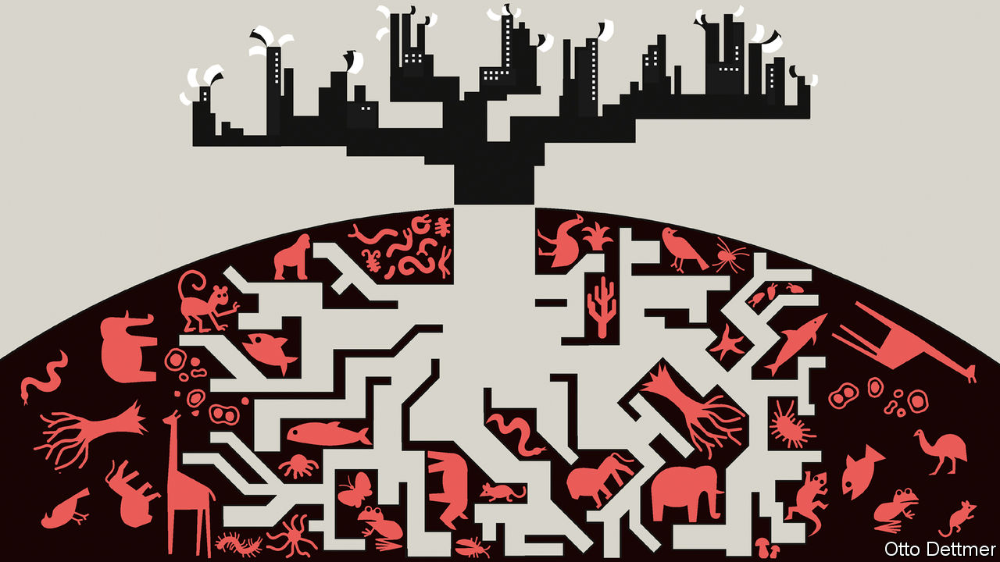
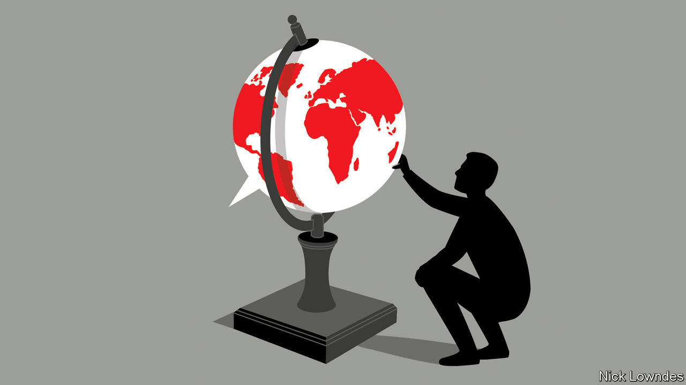

###### On decarbonisation, Russia, America’s constitution, diversity, biodiversity, foreign expressions

# Letters to the editor 

##### A selection of correspondence 

 

> Mar 6th 2021 


Letters are welcome via e-mail to 

Alternative energies


As your briefing on decarbonising America noted, New Mexico’s economy depends on robust oil-and-gas production in the Permian basin that was revitalised by fracking a decade ago (“”, February 20th). New Mexicans, however, have been interested in innovation and energy diversification for quite a lot longer than the article implied. America’s only uranium-enrichment facility is in the state. It is one of the largest private-capital investments ever made in New Mexico, producing around a third of the nuclear fuel required to power the 94 nuclear reactors that generate a fifth of America’s electricity and 55% of its carbon-free electricity.


So although New Mexico may indeed be producing 1% of America’s greenhouse-gas emissions, it is also producing the fuel which generates carbon-free electricity. The technology used to process uranium is modular and can be expanded economically to meet the growing need for nuclear power that Bill Gates has recently called for.


KIRK SCHNOEBELEN

President

Urenco USAArlington, Virginia


You did not mention efficiency. Greater end-use efficiency reduces the investment in renewables required to reach ambitious climate targets, and improves grid resiliency when generation or transmission infrastructure may otherwise be stressed. It is a huge challenge to decarbonise America’s energy sector; we’ll need all the solutions available to do it.


RUSSELL MEYER

Senior economist

Oracle Utilities

Los Angeles

 


A small-minded country


was right to say that Russia should be handled more firmly and decisively by the European Union (February 13th). Helmut Schmidt, Germany’s chancellor from 1974 to 1982, summarised it best when he said that Russia is basically Upper Volta with rockets (now Burkina Faso). Unfortunately Russia has no systematic plans to develop its natural-resource capabilities or better the lot of its citizens, quite unlike China. And it is run by cronies.


ANDREAS BARTELS

Munich

 


Constitutional order


There is an interesting story behind the First Amendment of the American constitution, which Donald Trump’s defence made much of during his impeachment trial (“”, February 20th). The First Amendment protecting free speech, among other rights, is a combination of what was originally intended to be the third and fourth of 19 amendments that James Madison introduced in June 1789 as the Bill of Rights. They were combined into a Third Amendment, and became the First only after the two that came before it failed to get enough support in the states for ratification.


Madison gave numerical priority to the anti-establishment and exercise of religion clauses, and originally put freedoms of speech, press and assembly into a separate subsequent amendment. Mr Trump’s team expounded free speech as not being an “accident”, that it is the “very first liberty in the first article of the Bill of Rights…the most important one”. Actually, it is first because of exactly that, an accident of history.


STEVEN RESKE

Minnetonka, Minnesota

 


Expanding diversity


It is difficult to share giddy excitement about diversity within the Conservative Party (January 30th). The black and brown faces in the cabinet share, for the most part, the same social, educational and professional backgrounds as their white colleagues. Although this is progress, it is picking at the low-hanging fruit of diversity. As a black Briton I think that many of the black Tories mentioned in the article hold views that differ from the minority communities we are told they represent. Indeed, many have been missing in action on issues that resonate with black Britons, such as policing and criminal justice, the Windrush scandal, Black Lives Matter and covid-19. Perhaps having more black and brown people in government gives comfort to Conservatives, but they are neither a source of excitement nor inspiration for the black community.


If you want “diversity” you need a more meaningful representation of minority peoples.


KAFUI TAY

London

 


Who watches the sunset?


You asked how should economists think about biodiversity (, February 6th)? One policy that I struggled with while working at Britain’s Department for the Environment, Food and Rural Affairs (DEFRA) was placing a value on those areas where the exact economic benefits to humans is difficult to quantify. What, for example, is the economic value to humans of the view of an unsullied beach at sunset, or of the continued existence of pandas, or of the re-introduction of beavers or wolves in areas where they are extinct? The value of a sunset can, to some extent, be estimated from house-price differentials, but we struggle with the other examples; if we cannot put a numerical value on something, it often gets overlooked.


The British government’s report on the economics of biodiversity, produced by Partha Dasgupta, is a vital step towards making the case for environmental protection in the most effective way possible. But we must be careful not to focus on those areas that we can easily quantify at the expense of those that we cannot.


THOMAS ROBERTSON

Former economist at DEFRAOxford

 


Greetings


I enjoyed article on foreign expressions that are absent from English (February 13th). The Italians have an expression that is used to wish good luck: In bocca al lupo (Into the wolf’s mouth). It was an ancient morning wish to hunters before their departure. The correct answer is: Crepi! (Let him die!)


ANTONELLA SPRING

Lisbon


One expression I often wish we had in English is the Turkish kolay gelsin, basically meaning “may it come easy for you”. It is said as one person passes another who is working, for instance to a housekeeper at a hotel. I have especially missed being able to say something like that during the past year to the people who have had to stay on the job, while the rest of us kept our distance.


BETHANY MENDENHALL

Irvine, California


My favourite foreign expression is Schadenfreude. I have lived in London for 30 years. The lack of an English equivalent shows the underlying compassionate nature of the natives of my adopted home. Being Hungarian I can attest to the opposite in my homeland.


ZSUZSANNA SCHIFF

London


Having lunch with a French friend one day, I remarked that we didn't have an equivalent to bon appétit. His reply was that the English had no expectations when it came to food.


JEFF HENDYEl Dorado Hills, California


A French colleague I dined with used to say “Bon appétit, or as they say in English, good luck!”


BARRY DOHERTY

Dublin

