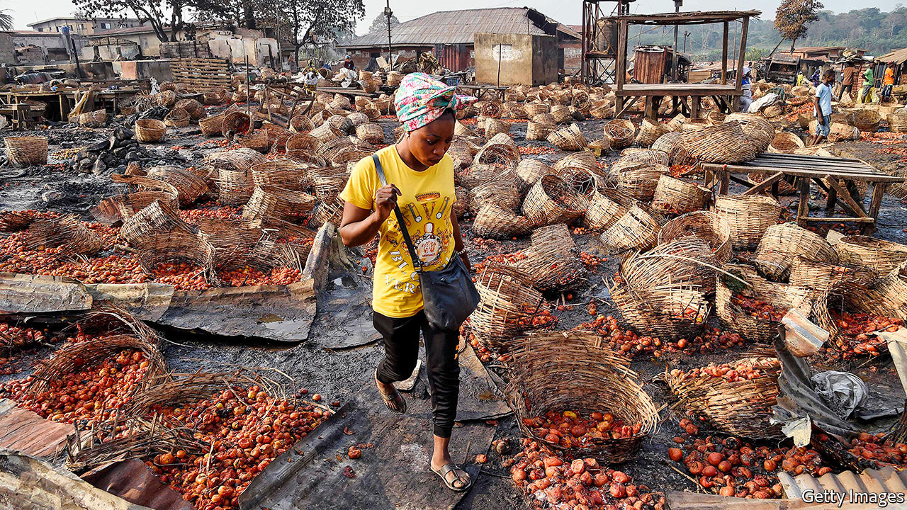
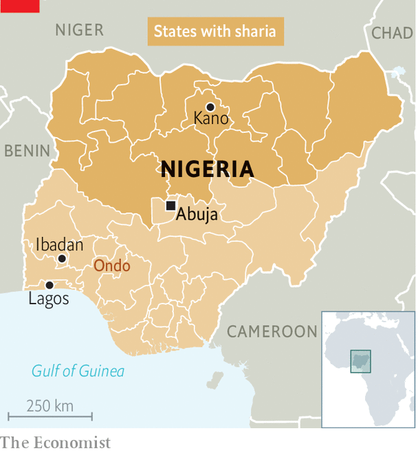

###### Tomato truce

# How a spilled basket of tomatoes paralysed Nigeria 

##### Northerners briefly blockaded the south in protest against ethnic killings 

 

> Mar 6th 2021 


IT STARTED WITH a squashed tomato that led to a killing. It has since escalated into clashes that have taken at least 20 lives and a standoff between northerners and southerners that has paralysed Nigeria, Africa’s most populous nation.


Last month a porter carrying a basket of tomatoes in the crowded Shasha market in Ibadan, a city in south-western Nigeria, accidentally spilled his cargo, leaving a pulpy mess. An argument with a nearby shopkeeper over the clean-up soon took an ethnic turn. The porter, who spoke Hausa (a language that identifies him as coming from Nigeria’s north), took a blow from a Yoruba man. As the porter fought back, his assailant slumped, mortally stricken.


Word soon spread on social media that a Yoruba man had been killed in the heart of Yoruba land, inflaming long-smouldering tensions in a country divided between its mostly Muslim north and predominantly Christian south. For hours afterwards Hausa and Yoruba traders hacked at one another or burned down market stalls. At least 20 people are thought to have been killed. Thousands, most of them northerners, were forced to flee.

 


The clash erupted after years of mounting tensions along religious and ethnic lines as well as between (mostly Christian) farmers and (mostly Muslim) herders. The International Crisis Group, an NGO, estimates that fighting between farmers and cattle herders over access to land claimed more than 1,300 lives in just the first six months of 2018. More recent data are sparse, but many Nigerians believe the conflict has intensified and taken new forms. Since December gangs of kidnappers have struck three schools, snatching hundreds of children and holding them for ransom. Although the kidnappers have not been identified or arrested, many Nigerians believe—rightly or wrongly—that they are Hausa-speaking herders.


Instead of dousing ethnic hatred, politicians have fuelled it. Last year the governors of six south-western states hired local militias to form a regional security outfit known as Operation Amotekun (“leopard” in Yoruba). These vigilantes have been accused of brutality and even murder. In December and January they reportedly killed 11 people. Also in January, the governor of Ondo ordered thousands of herders to leave land reserves in his state, blaming them for a rise in kidnapping and banditry. After the one-week deadline expired, Yoruba mobs attacked herders, killing some and destroying their property.


In protest northern traders and cattle dealers blocked the flow of food and livestock to the south. The blockade is starting to bite. Almost no meat is on sale in the usually bustling Mile 12 market in Lagos, Nigeria’s biggest city and commercial capital. The price of tomatoes (essential for making spicy jollof rice, Nigeria’s unofficial national dish) has shot up. Baskets that once sold for about 5,000 naira ($13) now go for 35,000 naira. In the north, which grows most of the country’s fresh produce, the price of onions and tomatoes has slumped so sharply that many farmers are leaving crops to rot in the fields.


The government has since called in the army to clear corridors along which trucks can travel. And after the main spy agency “invited” leaders of the blockade to discuss their grievances—before promptly detaining their president—the traders agreed to call off their protest and allow food to flow south again.


It is not clear whether the government agreed to the protesters’ demands, which included compensation for those who were killed and police protection for northerners in southern states. What is clear, however, is that Nigeria needs better ways to stop its festering grievances from bursting open like rotten tomatoes. ■

