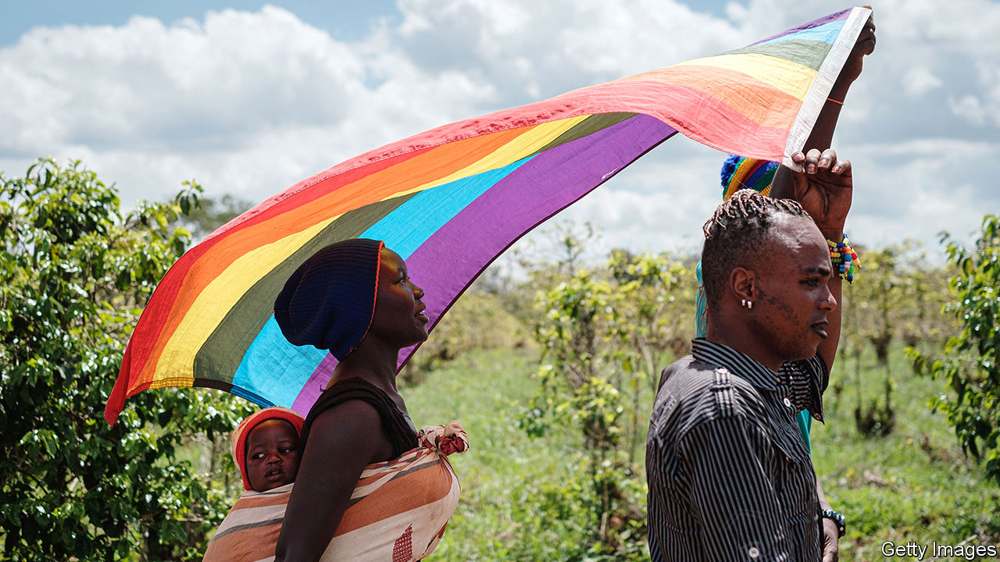
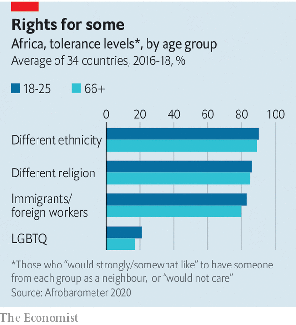

###### Out and preyed on

# On gay rights, young Africans share the intolerance of their elders 

##### Gay Africans demanding equality face a violent backlash 

 

> Mar 4th 2021 


WHEN GAY Nigerians took to the streets to join massive protests against police brutality last year, it was not just the police who attacked them. Fellow protesters also hurled insults at them, ripped up their rainbow flags and tore placards from their hands. “I felt like a lot of people just wanted me dead,” says Matthew Blaise, a 21-year-old student.


In many parts of the world the young are far more tolerant than their elders of lesbian, gay, bisexual and transgender (LGBT) people. But with a few exceptions, such as in Botswana, which decriminalised homosexuality in 2019, young Africans seem to be almost as homophobic as their grandparents.


A survey released last year by Afrobarometer, a pollster, found that only 21% of Africans aged 18-25 would not mind having a gay neighbour, compared with 17% of those aged 66 or older. That makes Africa different from places like Japan, where 92% of those aged 18-29 think homosexuality should be accepted by society, compared with just 56% of those above the age of 50. The homophobia of young Africans is especially worrying, given how numerous they are: half the continent’s population is under the age of 20. And it contrasts starkly with their tolerance in other areas.

 


In an African Youth Survey last year, conducted in 14 countries and funded by a South African foundation, 83% of young Africans said that more should be done to protect the rights of ethnic minorities, while 64% agreed that “sexual harassment is a problem in my country”. Yet 69% disagreed with the statement: “My country should do more to protect the rights of LGBTQ people.” (The Q stands for “queer or questioning”.)


This is not because robust protections for gay rights are already in place. On the contrary, at least 32 African countries still criminalise gay sex, and openly gay people are often abused, beaten up or worse. Only one country, South Africa, has genuinely gay-friendly laws (eg, it allows same-sex marriage). Even there, outside urban liberal enclaves gay people are at serious risk of being attacked or even murdered.


Savn Daniel, a Nigerian human-rights activist, wrote on Twitter that people trying to support gay rights as part of a broader struggle against police brutality “should be arrested and prosecuted”. “We’re not wasting lives for such unlawful nonsense!” he wrote. Human rights, he argues, are not universal but “context-specific” and should not be used to upend Africa’s conservative moral values.


“They look progressive but they are very, very homophobic,” says Mr Blaise of many of the Nigerians who protest against police brutality. “I see them as oppressors.” Across the continent in Sudan a gay artist, Ahmed Umar, who took part in the revolution that toppled President Omar al-Bashir in 2019, has faced death threats because of his sexuality. “What has this young generation learned from this experience of being under a dictatorship?” he asks. “How can they not see that what they are practising is exactly what they had practised on them?”


Much homophobia is religiously inspired. After the Middle East, sub-Saharan Africa has the highest proportion of religious people in the world. It is the only region where the young are just as religious as their parents, according to the Pew Research Centre, a pollster. Conservative strains of Christianity and Islam predominate, whose adherents deem homosexual acts sinful, notes Ayo Sogunro of the Centre for Human Rights in South Africa. Studies suggest that religion in Africa exerts more sway over how people view same-sex relationships than their level of education, whether they live in cities or the countryside, or whether they are on the internet.


Opportunistic politicians often denounce homosexuality as un-African—a depraved Western import. In Uganda’s recent election President Yoweri Museveni tried to smear his opponent, Bobi Wine, by saying “he gets quite a lot of encouragement from foreigners and homosexuals.” Yet during the campaign gay Ugandans were abused not only by Mr Museveni’s supporters but by Mr Wine’s as well.


Despite the risks, young gay Africans are gaining the courage to stand up for themselves. “Queer folk are being assertive right now,” says Basiru Alumbugu of the African Queer Youth Initiative, a network of activists across the continent. The backlash is a sign that gay Africans are more visible than before. A generation ago, they could not organise online, and hardly any would have dared to take to the streets. “We could never have protested 20 years ago,” says Vincent Desmond, a gay Nigerian journalist. In other regions, as more gay people came out, their neighbours eventually learned to see them as normal. Activists hope that will happen in Africa, too. But it takes courage to lead the way. ■

