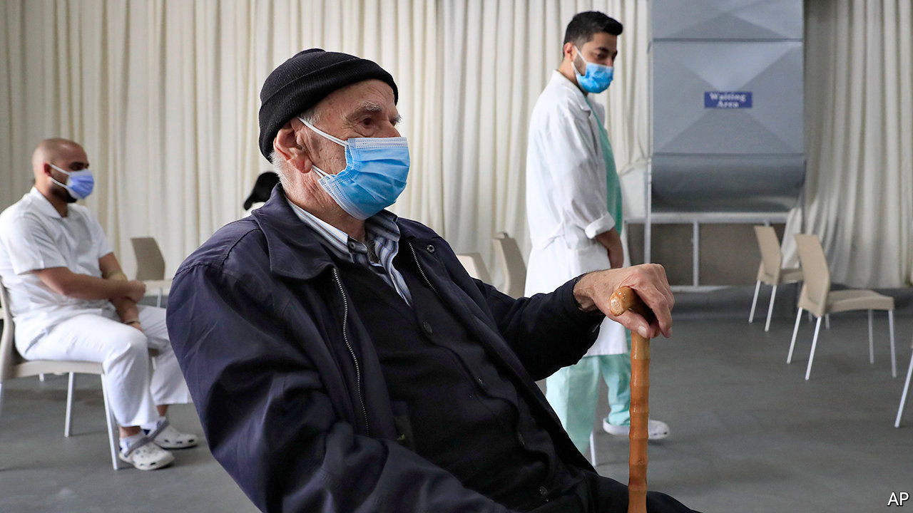

###### A jab among friends

# Politicians in Lebanon jumped the queue for covid-19 vaccine 

##### Thus starting a feud with one of their country’s only sources of help 

 

> Mar 4th 2021 


AT FIRST GLANCE one might have thought the cardboard box was a visiting head of state. On February 13th Lebanon’s first batch of covid-19 vaccines emerged from a jet at Beirut’s international airport. A delegation of officials drove out to meet it; local media broadcast the event live. Never mind that the shipment contained a meagre 28,500 jabs. After a miserable year of pandemic, economic collapse and a catastrophic explosion in Beirut, the vaccines offered a dose of hope.


Scepticism, a pre-existing condition in a country notorious for corruption, prevailed too. Many Lebanese expected the rich and powerful to jump the queue to get their shots. They drew some comfort from the involvement of the World Bank, which in January allocated $34m to fund vaccine imports, enough to cover doses for more than 2m people (a third of the population).


Lebanon was the first country to strike such an agreement with the bank. It came, however, with conditions. The bank demanded transparency. Lebanon would have to set up a system for distributing vaccines. Everyone would have to wait their turn. “There will be no wasta,” said Ferid Belhaj, the bank’s top official for the Middle East, using an Arabic word that connotes nepotism. The health ministry published a plan that allocated the first doses for medical workers and over-75s.


Elie Ferzli is neither. That did not stop the 71-year-old MP and 15 of his colleagues from getting a dose on February 23rd. About half were under 75, and they took their jabs at the parliament building rather than a designated hospital. The World Bank raged. Saroj Kumar Jha, a regional director, said the bank could halt its funds.


A few MPs apologised. Others claimed they were front-line workers in need of protection. Mr Ferzli embarked on a series of televised diatribes, called Mr Jha a liar and urged his bosses to “send a replacement”. He took a further jab at him by mispronouncing his first name as “Farouj”, Arabic for a roast chicken.


The World Bank faced a dilemma familiar to Lebanon’s donors. To do nothing would set a bad precedent, in Lebanon and other countries with similar agreements. But to halt funding would delay an already sluggish vaccine roll-out. So far it has demanded only that the health ministry publish weekly data on vaccine distribution.


Most of Lebanon’s friends have tired of such scandals. The country desperately needs help. Its currency has lost 85% of its value since October 2019. Hyperinflation has pushed more than half the population into poverty, with food prices up fourfold last year. Daily blackouts are growing longer as power plants run short of fuel. Despite a restrictive lockdown imposed in mid-January, Lebanon still has some of the world’s highest rates of new covid-19 infections and deaths.


Almost no one is queuing up to help. The Gulf states have closed their purses, judging Lebanon too friendly with Iran, their arch-rival. Western donors are tired of funding corruption and dysfunction. A pot of $11bn in aid pledged at a donors’ conference in 2018 remains undisbursed because the Lebanese government failed to approve minimal reforms. Talks with the IMF last year went nowhere.


The World Bank has been among Lebanon’s few remaining friends. In January it pledged a $204m loan to provide cash transfers to 147,000 poor Lebanese families for the next year. Even there, though, Lebanon’s leaders found a way to twist the scheme to their advantage. The money will be transferred to Lebanon in dollars but distributed to recipients in local currency at a below-market rate. The Lebanese central bank, in other words, spotted an arbitrage opportunity in humanitarian aid.


Last month gunmen assassinated Lokman Slim, a prominent critic of Hizbullah, the Shia militant group-cum-political party. (The murder, like most such killings in Lebanon, has not been solved and probably never will be.) On March 2nd the pound hit 10,000 to the dollar, its weakest rate ever, which led to angry protests across the country. Gone was the hopeful atmosphere of October 2019, when hundreds of thousands of people turned out for anti-government rallies. The mood has turned dark. Lebanon’s avaricious leaders may need protection against more than covid-19 in the months to come. ■

