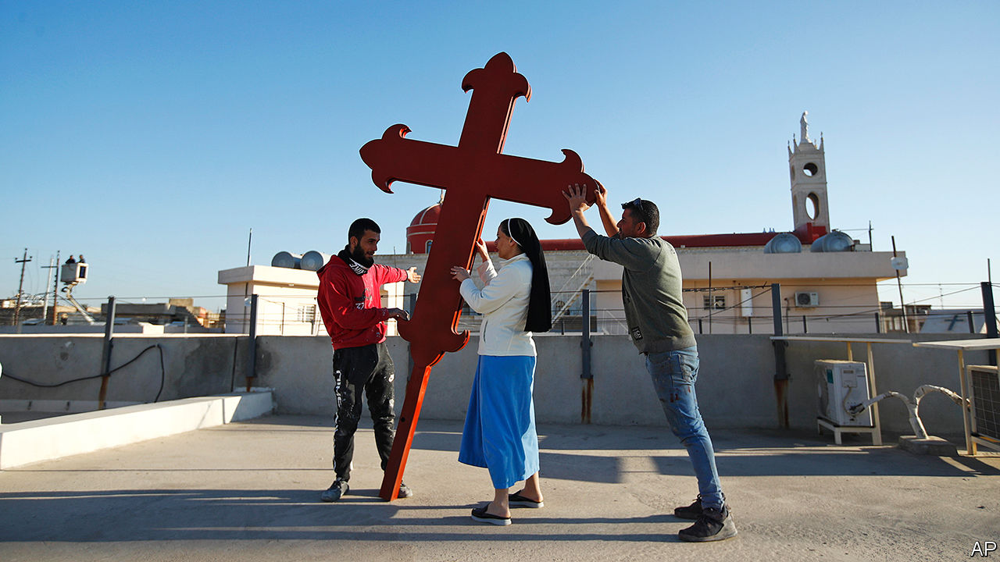
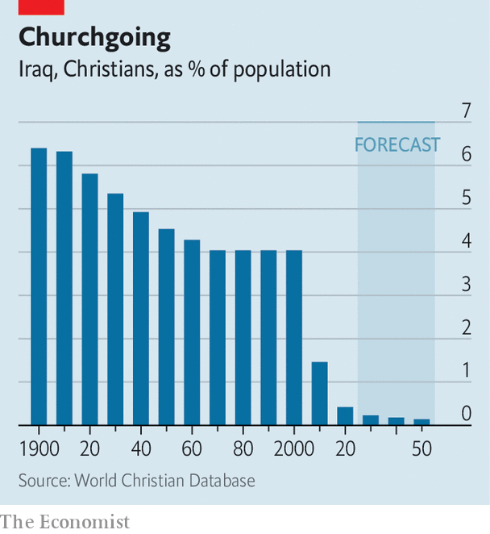
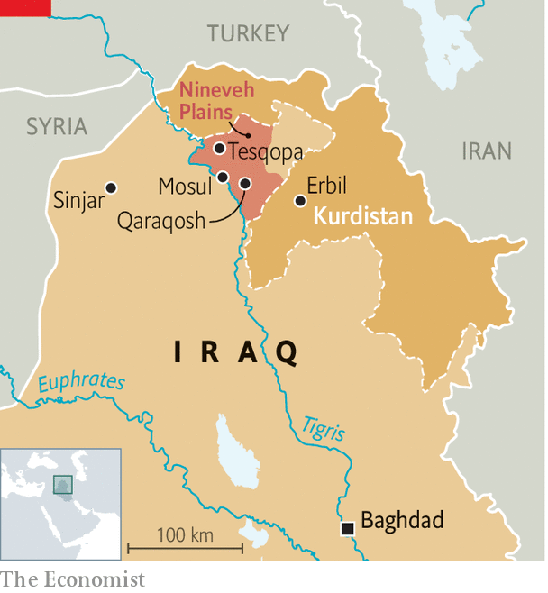

###### Still bearing the cross

# The pope is heading for Iraq, where Christians remain afraid 

##### The country is rebuilding churches, but will anyone fill the pews? 

 

> Mar 4th 2021 


THINGS ARE moving quickly in Qaraqosh, a sleepy Christian town just outside Mosul in northern Iraq. Pope Francis arrives on March 7th, four years after Islamic State (IS) was chased out. So local priests have been hurriedly cleaning up al-Tahira, their cathedral and one of Iraq’s largest churches. They have refurbished its burnt interior and repaired most of the masonry that the jihadists used for target practice. When your correspondent visited, five days before the pope, smashed chandeliers and a golden crucifix torn down by IS still littered the forecourt. Father Ammar Yako, the priest overseeing the project, says he has received no support from the Iraqi government; the funding has come from Catholic groups in the West. He says he will finish just in time for the Holy Father.


Pope Francis is the first-ever pontiff to visit Iraq, where over 95% of the population is thought to be Muslim. He arrives at a difficult time for its Christians, whose forebears have been in the country since the first century. Churches are being rebuilt, but there are fewer believers to fill the pews. Around 1.2m Christians lived in Iraq in 2003. War and misery have pushed that number down to around 250,000, or less than 1% of the population (see chart). Many of those who left will never come back. But Iraq’s leaders hope that Christians displaced within the country will soon feel safe enough to go home. President Barham Salih says the pope’s visit will help Iraq to “heal”.


The trouble for Christians began after the removal of Saddam Hussein, Iraq’s dictator, in 2003. He had largely protected the group—even making a Christian, Tariq Aziz, his deputy prime minister. But some Muslims view Christianity, despite its long history in the region, as a Western import. Anti-Christian violence increased during the American occupation and turned into an existential threat when IS captured swathes of the country in 2014. The jihadists told Christians that they could leave, convert to Islam or be killed. In August that year, around 100,000 of them fled from the Nineveh Plains, the heartland of Iraqi Christianity, which IS conquered. Some went to Baghdad or to Erbil, capital of the autonomous Kurdish region, but many left the country. An enduring source of resentment towards Christians in Iraq comes from the notion that they can easily claim asylum in the West, says Pascale Warda of the Hammurabi Human Rights Organisation, an NGO in Baghdad.

 


Aid to Church in Need, a Catholic charity based in Germany, estimates that the war against IS destroyed or damaged 14,936 homes and 363 church properties in the Nineveh Plains. Around 57% of the homes and 11% of the church properties had been repaired by January. Christians have trickled back. But many sold their homes to Muslim families. Others stay away because of a lack of security and jobs.


Reconstruction has happened separately from efforts to stabilise the region, says Reine Hanna of the Assyrian Policy Institute, a think-tank in Washington. It reckons that across the Nineveh Plains, 53% of Assyrians, a predominantly Christian ethnic minority, have returned to their villages. But in some areas that number is less than 10%. “When people don’t feel safe, it doesn’t matter if they have reconstructed churches or houses,” says Ms Hanna.


The calculations of Christian families often depend on which group controls their home town. At least six groups claim authority in different parts of the Nineveh Plains. They include Iranian-backed and predominantly Shia militias (known as the Popular Mobilisation Forces), Kurdish forces (known as the Peshmerga) and the Iraqi government. In many places portraits of Qassem Suleimani, the late commander of Iran’s Revolutionary Guard Corps, are common. But in towns controlled by the Nineveh Plain Protection Units, a Christian militia, Pope Francis smiles down from billboards. Unsurprisingly, these towns have higher rates of return.

 


The Iraqi government has made at least some effort to reach out to Christians. It declared Christmas an official holiday last year. But many Christians say it treats them as second-class citizens. They have a tougher time getting government jobs than Muslims. The constitution dating from 2005 is based on Islam. Marriages between Muslims and Christians are frowned upon. Children born of mixed parentage are automatically classed as Muslim, even if the child is a product of rape. In Baghdad, the capital, Christian businesses are often attacked, says Ms Warda. Christian leaders were vocal supporters of big anti-government protests in 2019.


Iraqi Kurdistan, in the north-east, is more hospitable to Christians. The Kurdish national project is based on ethnicity, not religion, and the Kurdistan Regional Government (KRG) has more provisions for religious pluralism than the Iraqi government has. But the KRG does not always adhere to its own laws, says Ms Hanna, and ethnic tensions can be as febrile as religious ones. Under Kurdish rule “you can be Christian, but you can’t be Assyrian,” she says. Assyrians and Yazidis, another religious minority, felt abandoned when the Peshmerga withdrew from the Nineveh Plains in 2014, leaving the area to IS. Some of that distrust still lingers.


Western aid groups have singled out Iraq’s Christians (and Yazidis). USAID, America’s development agency, committed $27.5m (or 2.5% of its total development spending in Iraq) to help people returning to the Nineveh Plains in 2018 and 2019. It was the only district to receive a dedicated stream of funding for resettlement from America. USAID also renegotiated the terms of a $75m contribution to the UN in 2018 that was slated for a stabilisation project in Iraq. The agency made sure that $55m would be spent supporting religious minorities in the Nineveh Plains.


When Donald Trump was America’s president, USAID was reportedly pressed to direct more support towards Christians. Most Western countries do not want to be seen favouring one religion over another. But some do not mind. In 2017 Hungary launched “Hungary Helps”, a project aimed at Christians around the world. Tristan Azbej, the Hungarian minister for the aid of persecuted Christians, said in 2018 that the programme’s “flagship project” was the reconstruction of Tesqopa, a predominantly Assyrian town in the Nineveh Plains.


For Christians, as for so many Iraqis, painful memories of fleeing their homes are still fresh. Tempting them away from stable and relatively prosperous places such as Erbil will be difficult. Convincing them to forgo Western visas will be tougher still. Some Iraqis think the pope’s visit will raise awareness of Christianity’s long history in the country and, perhaps, lead to greater understanding between faiths. But Father Yako thinks it will take a bigger effort. “Other communities, especially Muslims, need to do more to make us feel comfortable,” he says.■

