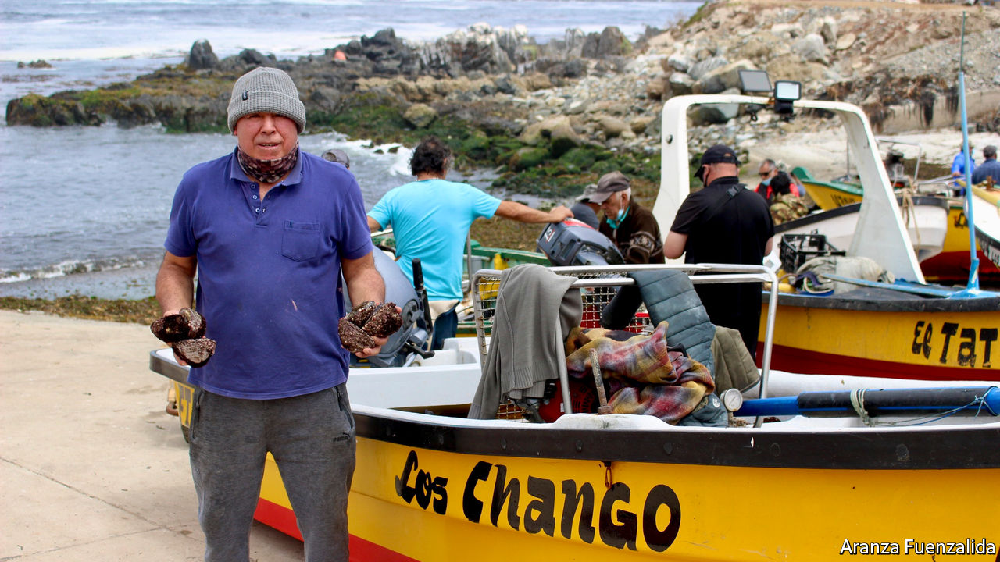

###### A sea change

# A new constitution could give indigenous Chileans more say 

##### Even the Chango people, whose culture is supposedly extinct 

 

> Mar 6th 2021 


BRENDA GUTIéRREZ, a 50-year-old shellfish gatherer, knew she was a Chango for as long as she can remember. When she was growing up in a fishing village in northern Chile, her parents always called her Changuita (little Chango girl). Her schoolmates, alas, called her “smelly” and “dirty” because of her indigenous roots.


Such discrimination turned her into an activist. She lobbied for the Chilean state to recognise her people, an indigenous group whose culture is supposedly extinct. “We exist and are alive,” she says. In October last year, the Changos won recognition. And an election next month for a convention to change Chile’s old constitution could boost them further.


The Chango—a colonial-era term which has stuck—are descended from nomads who inhabited South America’s west coast over 10,000 years ago. Despite their culture having supposedly vanished, 4,725 Chileans defined themselves as Chango in a 2017 census, in the “other” category. Many still work as hardscrabble nautical types, as their ancestors did (they were known for sea-lion skin rafts). Some still use ancient tools such as the chinguillo, a net fibre bag to carry fish, and the chope, an iron file to scrape molluscs off rocks. 


One reason why people mistakenly thought they no longer existed is that the Chango people, who are thought to have come from a number of different tribes in coastal areas of northern Chile, tended to assimilate. (By, for example, abandoning their native languages for Spanish.) And unlike other groups, such as the Diaguitas (recognised in 2006), most of them did not see any need to be officially acknowledged. According to Luis Campos, an anthropologist, many were politicised only after a fishing law in 1991 and its amendments in the 2000s limited fishing to certain areas.


Chileans are growing more aware of their indigenous compatriots. Over the past two decades more have appeared in official statistics. Some 13% of Chileans are now recorded as indigenous, up from around 5% in the census of 2002.


In October last year the Chango were added to the list of peoples entitled to benefits under the Indigenous Peoples Law of 1993. This law offers scholarships and economic development grants. It also provides a chance to reclaim ancestral land. More recognition is coming, too. Elections for the body to draft a new constitution will take place on April 11th.


The constitutional convention will have 155 members. Seventeen seats have been reserved for indigenous groups. Their votes could be crucial to achieve the two-thirds majority required to approve each clause of the new constitution, thinks Antonia Rivas of the Centre for Intercultural and Indigenous Research.


For activists such as Ms Gutiérrez, who is standing as a potential candidate at the convention, such influence could transform Chile. The country is still recovering from huge protests against inequality in late 2019. The various indigenous groups (such as the Mapuche, who are 10% of indigenous people in the country) were not mentioned in Chile’s constitution, drawn up in 1980. Now they will have a seat at the table to draft the new one.■

