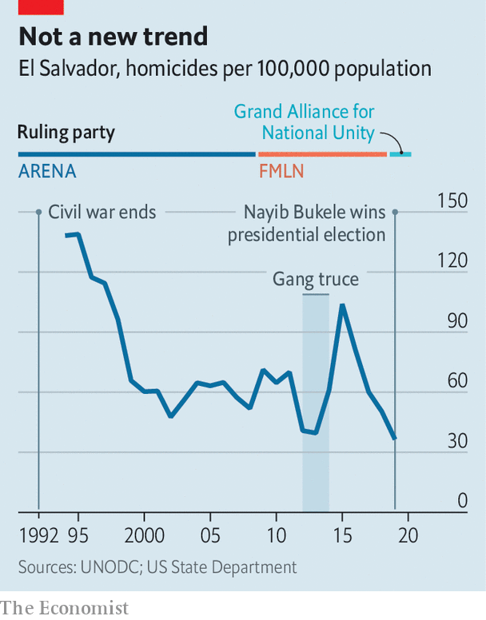

###### Elections in El Salvador

# Why Salvadoreans love their populist president, Nayib Bukele 

##### His New Ideas party won a landslide election victory 

 

> Mar 2nd 2021 


OUTSIDE A POLLING station in El Salvador’s capital city Jennifer Vásquez, a 36-year-old selling water, explains why she voted for candidates from New Ideas, the party of the president, who is just a few years older than she is. “Nayib Bukele has done things no president has ever done before,” she gushes, dressed in a T-shirt the sky blue of Mr Bukele’s party. “We have received packages of food, including tuna and rice, and he is going to send computers to my children.”


Most voters in the country of 6.5m seem similarly smitten. New Ideas won a landslide in the legislative and municipal elections on February 28th. The party, which was founded in 2018—too late for the previous general election—won at least 56 seats in the 84-seat assembly, giving it a two-thirds majority.


The result has shattered El Salvador’s political duopoly. Since the end of the civil war in 1992 politics has been dominated by the Farabundo Martí National Liberation Front (FMLN), a left-wing party that grew out of guerrilla groups, and the Nationalist Republican Alliance (Arena), a conservative party that was founded by a former soldier to oppose those guerrillas. Now these parties have fewer than two dozen lawmakers between them.


At first glance Mr Bukele does not seem like a traditional caudillo. The 39-year-old, who was elected president in 2019, wears his baseball cap backwards and broadcasts his every passing thought on social media. An astute publicist, he has enthralled a populace sick of graft. (Three of the previous four presidents have been investigated for corruption; one is now in jail.)


Mr Bukele’s approval ratings, at around 90%, are higher than those of any other Latin American leader. Critics see in his ascendancy a danger to democracy. He controls two branches of the state: the legislature and the executive. His super-majority gives him a chance to shape the third: the legislative assembly must pick a new attorney-general and five Supreme Court judges this year.


Since he came to office Mr Bukele has shown little regard for institutions. “He treats laws like we treat driving regulations,” says Nelson Rauda, a journalist. In February last year, frustrated by lawmakers’ refusal to approve the budget for his security programme, Mr Bukele entered Congress with gun-toting soldiers. In April, after a rise in the murder rate, his government forced hundreds of prisoners (mostly gang members) to huddle together with their hands tied behind their backs, naked apart from their underwear and face-masks. Mr Bukele tweeted the photo, unembarrassed by the risk that jam-packing prisoners might spread covid-19.


He has demonised anyone who opposes him, including businessmen, journalists and politicians; a fact some blame for the shooting of two FMLN activists in January, the worst act of political violence since the end of the civil war. And like other populist leaders, he foments distrust of democratic institutions. Last week he warned, without evidence, of possible fraud, and just before the polls closed he broke electoral law by giving a press conference urging people to vote.


Those in power say the election result will mollify Mr Bukele (along with tweeting furiously about his detractors, he keenly watches his approval ratings). Felix Ulloa, the vice-president, says the “resistance” of the bureaucracy and assembly “generated a confrontational attitude in him”. Others are more worried. “We will see how he governs once there are no obstacles,” says Alex Segovia, an economist and former FMLN official.


Mr Bukele has a lot to tackle. The World Health Organisation has praised El Salvador’s handling of covid-19—the government invested in hospitals and handed out money to ease the economic pain of the pandemic. However, it also imposed lockdown rules so harsh that the Supreme Court ruled some of them unconstitutional. And these measures contributed to an economic contraction of close to 9% in 2020, among the worst in the region. Public debt is around 90% of GDP. Crime, corruption and poverty remain entrenched.


Mr Bukele claims to have no ideology; he says he simply wants to get things done. But he has no plan, says Bertha Deleón, his former lawyer who cut contact with the president after his gun-toting antics in February. “Everything is pure publicity,” she says. His advisers are typically yes-men. Some are his brothers: one heads his party; another led his presidential campaign. His record so far is decidedly mixed.

Drifting to demagoguery


Take corruption, which he has vowed to curb. Early in his term, he set up an independent anti-corruption body. But his government has produced no evidence of how it has spent the hundreds of millions of dollars it received from donors during the pandemic. When the anti-graft body sent to the attorney-general evidence suggesting mishandling of such aid, the government obstructed the investigations. In November the police, who like the army now seem loyal to Mr Bukele rather than the state, stopped agents from entering the health ministry to gather more evidence relating to procurement contracts, including those with companies owned by ministerial relatives.


Since Mr Bukele took office the murder rate has fallen, as he often reminds voters. He has given the security forces better pay and fancier equipment. He has also dispersed them around the country to areas with particularly high criminality. But criminologists point out that the homicide rate has been falling since 2015, before Mr Bukele was in charge (see chart). The International Crisis Group, a think-tank, says that one reason why crime has ebbed is that the state may have cut deals with gangs. Such deals often backfire in the end. Meanwhile, extortion remains as common as ever. By one estimate, it costs El Salvador 3% of GDP a year.

 


Asked why they love Mr Bukele, some Salvadoreans point to snazzy infrastructure projects. On a sweltering Saturday afternoon, crowds stood snapping photos of a new road to “Surf City”, a coastal strip that hopes to become a tourism hub.


Others mention handouts: since the pandemic started, the state has given many people food packages and $300 lump sums. It has also pledged to give laptops to 1.2m pupils, to the delight of people like Ms Vásquez. How all this will all be paid for remains to be seen—possibly with a loan from the IMF.


A lack of checks and balances is worrying in any country. It is doubly so in El Salvador, given Mr Bukele’s track record and unprecedented power. Few other politicians are trying to stand up to him. The only source of criticism seems to be coming from the United States, where President Joe Biden’s new administration has raised concerns about Mr Bukele’s tactics.


Salvadoreans may be willing to overlook their leader’s caudillo-like tendencies if they continue to feel that he is looking out for them. Many have low expectations of their politicians, anyhow: at 28%, support for democracy as the preferred form of government is the lowest in Latin America (jointly with Guatemala). “We have seen this story many times before in this region,” says Celia Medrano, a candidate for the Inter-American Court of Human Rights, a regional body. She is referring to populists who end up wrecking their countries, such as Hugo Chávez in Venezuela. “The president wants to, and can, make history but needs to learn from history,” she thinks. Unfortunately, New Ideas may turn out to be the party of old tricks.■

