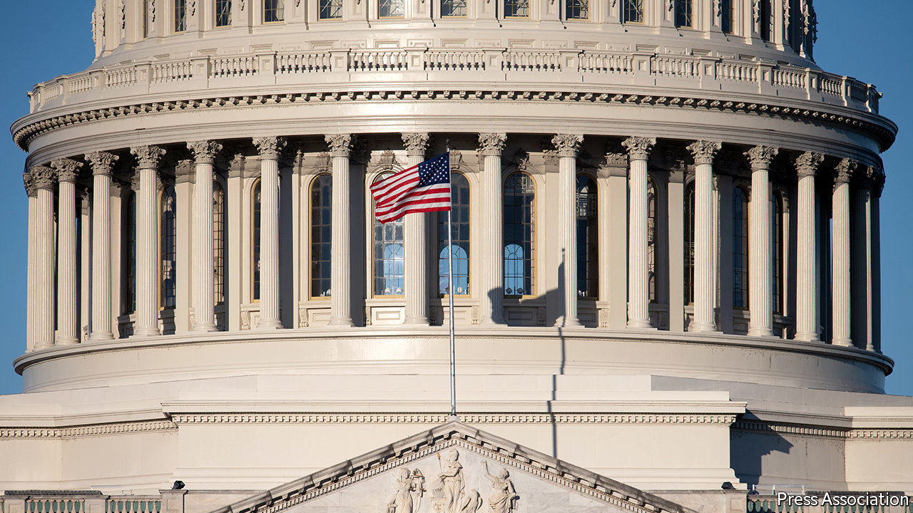
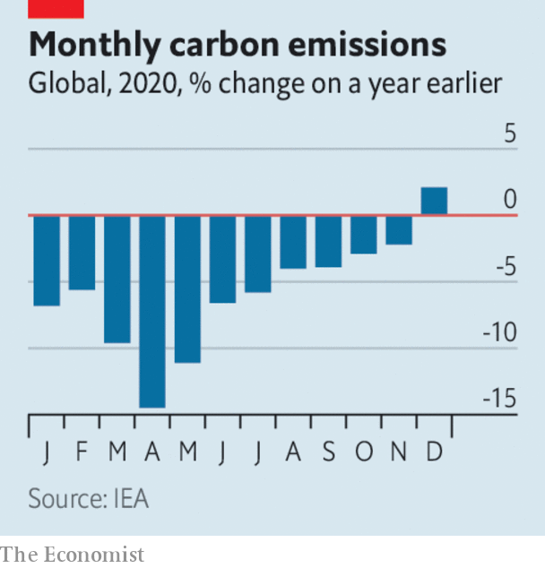

###### 

# Business this week 

#####  

 

> Mar 6th 2021 


The American Senate began debate on Joe Biden’s $1.9trn stimulus bill, after it passed the House of Representatives. Mr Biden will need the support of all 50 Democratic senators if it is to succeed. In one setback, the Senate’s parliamentarian said that a measure to raise the minimum wage to $15 an hour could not be included in the legislation under the procedure by which the Democrats have introduced the bill. See .

Spend now, pay later


In Britain the government’s budget provided yet more spending on workers and businesses to cushion the blow of the pandemic. The furlough scheme, which pays staff wages and has been in place for a year, was extended to September. Fiscal support for the pandemic now totals £407bn ($570bn). To pay for all this the government set out tax increases, including a rise in corporation tax from 19% to 25% in 2023. Before that there will be a two-year tax break for companies intended to spur investment. See .


Bond markets were quieter, following a rout in prices sparked by fears of rising inflation in America. The yield on the ten-year US Treasury bond fell back to 1.46%, having risen above 1.6%. It started the year well below 1%. See .


India’s economy pulled out of recession in the last three months of 2020, but only just. GDP expanded by 0.4% in the quarter, year on year.


A huge stimulus package helped Brazil limit the pandemic’s damage to its GDP, which shrank by 4.1% last year, a better performance than economies of similar size.


February was a record month for the value of SPACs, shell companies that list on a stock exchange with the intent of merging with an existing company, and so avoid the rigours of an IPO. SPACs struck 50 merger deals last month, totalling almost $109bn. See .


Rio Tinto’s chairman decided to step down within a year because of the mining company’s demolition of a sacred Aboriginal cave in Australia in May 2020. Australian pension funds had pressed Rio’s board to hold senior executives to account for the destruction.


Another week and another carmaker announced an ambitious electrification strategy, as Volvo said it would phase out all petrol-powered cars, including hybrids, by 2030, and sell only fully electric ones. It also plans to disrupt the established way of selling cars by ditching dealerships and making its new cars available only online.


Las Vegas Sands, founded by the late Sheldon Adelson, reached an agreement to sell the Venetian hotel in Las Vegas to private-equity and property investors for more than $6bn. The investors are taking a punt that Sin City will rebound when covid-19 restrictions are eased. The deal underpins Las Vegas Sands’ focus on its casinos in Macau and Singapore, the backbone of its business.


Both Lufthansa and International Airlines Group, the owner of British Airways, reported big annual losses. Looking for ways to save cash, BA has reached an agreement to defer £450m ($628m) in pension deficit contributions.

 


Covid-related restrictions brought about a 6% drop in energy-related carbon-dioxide emissions last year, according to the International Energy Agency. But as demand picked up, so did emissions, which were 2% higher in December 2020 than in December 2019. With its economy rebounding, China’s emissions rose over the year, by 0.8%; in America they fell by 10%. Globally, the decline in road activity accounted for 50% of the fall in demand for oil, and the slump in aviation for 35%.


There may be a new president in the White House, but Amazon still finds itself caught in political crosshairs. Joe Biden warned the retail giant this week not to interfere with a vote by workers at a warehouse in Alabama on whether to unionise, a first for all the employees at an Amazon facility. Meanwhile, Amazon was forced to change the recent redesign of its app logo, because the Twitterati thought it resembled Hitler.


Birkenstock was sold to a private-equity firm backed by LVMH in a deal worth €4bn ($4.8bn). Associated with hippies in the 1970s until they became de rigueur for hipsters in the 1990s, Birkenstock sandals trace their history back to Germany in 1774; the current design dates from the 1960s. The Birkenstock family will no longer be sole owners, but they will retain a minority stake.

A one-way ticket?


Maezawa Yusaku, a Japanese tycoon, invited applications for eight places on his planned trip around the Moon, pencilled in for 2023. Meanwhile SpaceX, the firm that will fly Mr Maezawa and his companions, was testing a prototype version of the rocket he hopes to use. The machine managed to return to its landing pad after flying 10km into the air, but blew up a few minutes later. See .

