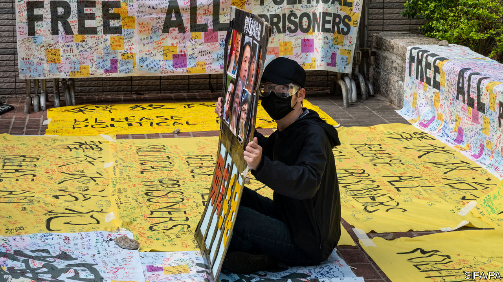
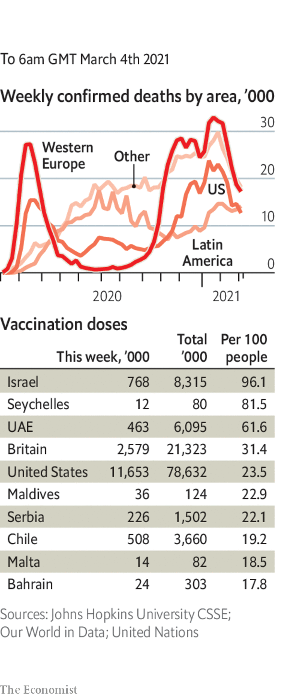

###### 

# Politics this week 

#####  

 

> Mar 4th 2021 


In Hong Kong, 47 activists were charged with violating the territory’s national-security law. As a court began hearing defendants’ petitions to be released on bail, hundreds of supporters gathered outside. The activists’ alleged crimes relate to an informal primary ballot held last year by pro-democracy politicians in order to produce strong candidates for the Legislative Council. The government saw this as a plot to gain control of the council and block its work. See .


China's Communist Party began a purge of agencies involved in maintaining law and order, including the police, secret police, courts and the prison system. The aim is to cleanse their ranks of corruption and disloyalty to China's leader, Xi Jinping. See .


Security services killed dozens of people demonstrating against the recent military coup in Myanmar. The repression of the protests has been getting steadily more violent. See .


Mushtaq Ahmed, a writer detained without trial for almost a year in Bangladesh for criticising the government online, died in a prison hospital. On the same day in neighbouring India the government published new rules obliging social-media firms and digital publishers to remove certain content at the government's request. See .


In El Salvador, New Ideas, a party created in 2018 by Nayib Bukele, the 39-year-old president, won a landslide in legislative elections, taking at least 56 seats in the 84-seat assembly. Mr Bukele, who has been president since 2019, has an approval rating of around 90%. Now he has even fewer checks on his power. See .


Controversial changes to energy rules in Mexico proposed by the president, Andrés Manuel López Obrador, became more probable. The Senate agreed to a measure that could give the state power utility priority over private firms in supplying power to the grid, even if its output is dirtier and costlier. This could breach free-trade rules.


America’s House of Representatives passed a bill that would make postal voting easier and weaken the voter-ID requirements favoured mostly by Republican state legislatures. The bill is unlikely to pass the Senate, where it would need the support of Republicans.


Joe Biden abandoned his attempt to appoint Neera Tanden as his budget director, because of a lack of support in the Senate. Her previous abrasive tweets about senators pondering her nomination probably did not help.


Andrew Cuomo, the governor of New York, said he would not resign, after three women accused him of behaving inappropriately. This comes on top of criticism of Mr Cuomo’s lack of transparency over covid-19 deaths in the state’s nursing homes.


America placed seven Russian officials, including Russia’s top spy, under sanctions for their alleged part in the poisoning last year of Alexei Navalny, the country’s leading opposition figure.


Nicolas Sarkozy, a former president of France, was convicted of corruption and sentenced to three years in prison, two of them suspended. He immediately appealed. This is the first time a French president has been handed an irreducible jail term (Jacques Chirac got a suspended prison sentence for misusing public funds as mayor of Paris). See .


Hungary’s prime minister, Viktor Orban, withdrew his Fidesz party from the European People’s Party, the centre-right and largest grouping in the European Parliament. This came as the EPP agreed to rules that would make it much easier to expel a delegation from a country, like Hungary, that violates the rule of law.


Scotland’s first minister, Nicola Sturgeon, faced tough questions from a parliamentary committee at Holyrood about her mishandling of allegations of sexual harassment levelled at Alex Salmond, her predecessor. A jury found Mr Salmond not guilty of all charges a year ago. See .


Britain’s Supreme Court ruled that Shamima Begum could not return to the country to challenge the government’s decision to strip her of her citizenship. At the age of 15 Ms Begum left Britain to join Islamic State in Syria and is stuck in a camp there. The court decided that her right to a fair hearing did not override public-safety concerns.


The International Criminal Court's chief prosecutor opened an investigation into alleged war crimes in the Palestinian territories since June 2014. After a preliminary examination she said charges could be filed against both Israelis and Palestinians.


Israel's prime minister, Binyamin Netanyahu, said Iran was behind an explosion that damaged an Israeli-owned commercial vessel in the Gulf of Oman. Days later one of his ministers linked Iran to an oil spill off Israel’s coast that has caused grave environmental damage.


Amnesty International accused government forces in Mozambique, mercenaries working with them and the jihadists they are battling of committing war crimes. A report by the human-rights group said the warring parties have indiscriminately killed hundreds of civilians.

Coronavirus briefs

 


Joe Biden promised that there would be enough covid-19 vaccine for every adult in America by the end of May. This came after the White House negotiated a deal by which Merck will help produce the one-shot dose developed by Johnson &amp; Johnson.


Facing criticism about the slow speed of its vaccination drive, the French government said people aged 65 to 74 would now be able to get the AstraZeneca shot. People over 75 still must have either the Pfizer or Moderna jab.


Colombia became the first country in Latin America to receive vaccines through the COVAX distribution programme, backed by the World Health Organisation.


The governor of Texas ordered the lifting of most restrictions relating to covid-19, saying his state was open for business “100%”. Health officials warned that this was too soon.

