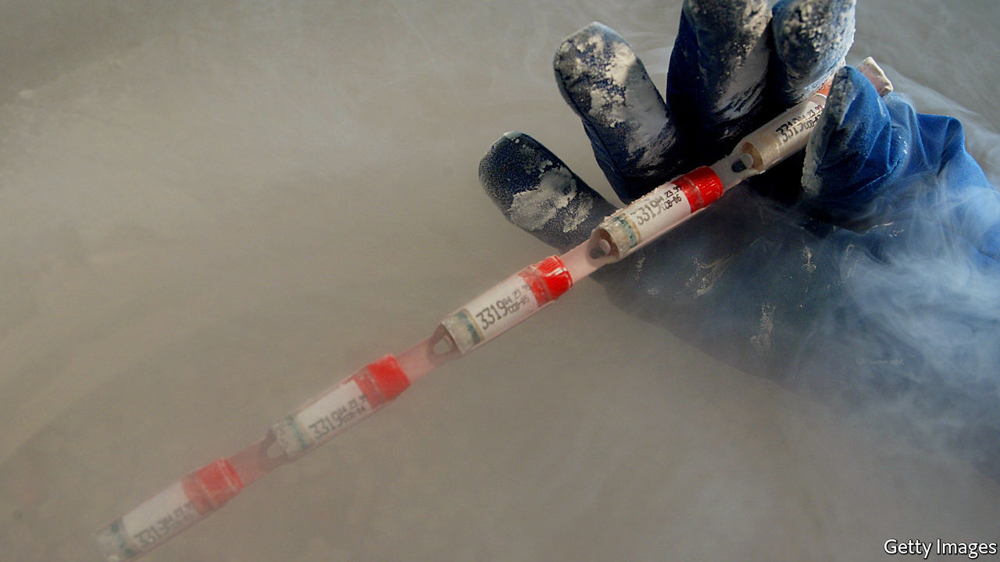

###### Swimming freestyle

# America’s love of free markets extends to its fertility clinics 

##### Thanks to an absence of regulation, America is a notable exporter of human sperm 

 

> Mar 3rd 2021 


EVERY TIME one of America’s genetic-testing companies advertises a deal on DNA kits, Michael (not his real name) braces himself for what may follow: a message from one of his hitherto unknown offspring. Three decades ago, as a student at the University of Houston, Michael became a sperm donor; the clinic would “pull me out of retirement”, he says, every time a customer wanted to expand their family. So far, the 55-year-old knows of around 60 children (and a dozen grandchildren) he has sired in addition to the four teenagers he shares with his wife; he suspects the true number is closer to 100.


“I could write a book,” he says, about the lifelong consequences of what had seemed, at the time, like an easy buck and an incentive to live healthily (he steered clear of heavy drinking and drugs to preserve his sperm's motility). Several children contact him regularly. He has been surprised by how many had been led to believe the father who brought them up was their biological parent: “Sometimes they’re very angry they’ve been lied to all their lives”. He is aware of some offspring who know his identity but have not made contact, and of a Facebook group he is not part of “so they can compare notes”. He gets a lot of cards on Father’s Day.


An ever-increasing number of men (and women who donate eggs) will have similar experiences. Because America’s sperm- and egg-donor industry is largely unregulated, no one knows how many children have been conceived this way. But social changes mean the industry is going through a period of extraordinary and unprecedented growth. Most of the children Michael fathered were born within heterosexual marriages. Today such couples constitute a minority of clinics’ customers, in part because advances in reproductive medicine mean more couples with fertility problems are able to conceive. But there are two bigger reasons for the change: the legalisation of gay marriage and the rising number of single women who are choosing to become mothers. The majority of sperm banks’ customers today are gay couples and women without partners.


Rosanna Hertz of Wellesley College, the author of “Random Families”, says the market is booming as gay Americans reach marrying age and elective single motherhood becomes more widespread. Partly because conceiving using donor sperm is a lot more straightforward and affordable than doing so using donor eggs, children born through sperm donors are likely to outnumber those from egg donors.


Surging demand and an absence of government regulation have created a field that has developed “more like a business than medicine”, says Dov Fox of the University of San Diego, the author of “Birth Rights and Wrongs”. The line is often blurred. Regulating baby-making can raise difficult ethical questions about who should be parents and who should be born. But some elementary regulations are overdue, not least because clinics are already making such decisions: requiring, for example, that sperm donors should be a certain height and educated to college level.

Gametes gate


The most obvious gap is a legal limit on the number of children a sperm-clinic donor, however tall and brilliant he may be, can help create. America is one of the few countries to have no such cap (Britain, by comparison, has a limit of ten donor-created families per donor). Many clinics have their own limits. Jaime Shamonki of Generate Life Sciences, which operates California Cryobank, America’s biggest sperm bank, says although people worry that large groups of half-siblings could lead to incest, a bigger concern is that a donor with an undiagnosed hereditary health condition may spread it widely.


But without a law, even self-imposed limits are routinely flouted. Alan (not his real name) reckons he fathered “hundreds” of children as a result of the four years he donated sperm to a clinic three times a week. Because he had a high sperm count, most of his donations were divided into 15 to 20 vials (one is used per insemination effort) and they tended to sell out. The clinic, he says, never mentioned a limit on the number of children he would beget, though he is not complaining; in his most lucrative year he made $50,000.


Beside health concerns, there is another important reason for limiting a donor’s fecundity. The children of sperm and egg donors, like those who are adopted, often want to trace their blood relations. But it is difficult to forge strong relationships when vast numbers of children are involved. Wendy Kramer of the Donor Sibling Registry, which helps connect members of donor families, says this is an example of how the contract between clinics and would-be parents has ignored the interests of the children it produces. She established the group in 2000 after her then ten-year-old son, conceived using donor sperm, had become curious about his wider family. Last month he learned of the existence of two new half-siblings, bringing the tally to 22. Ms Kramer had been told her sperm donor would father no more than ten children, a limit she considers sensible.


Related to this is the issue of anonymity. Most sperm clinics in America offer donors the option of remaining anonymous until a child is 18, or for ever. But because donor-conceived children, like adopted ones, fare better psychologically when told of their origins from babyhood and allowed to trace their relatives if they wish to, there is a push to prohibit anonymity. It is, in any case, a false promise, thanks to DNA testing. There would be a cost: when anonymity is banned the number of donors falls. Other countries have decided that is a price worth paying for children’s well-being. Anonymity (and the fact that donors can be paid) is one of the reasons America has become an exporter of sperm.


Many observers would also like a law requiring clinics to do more comprehensive screening for health conditions. In 2014 a once-popular donor who had fathered innumerable children in several states and at least two other countries was found to have lied about being a polyglot neuroscientist with an IQ of 160 and perfect health. He was, rather, a university drop-out with a criminal record and several health disorders. The case has sparked multiple lawsuits against the clinic in Georgia that had marketed and sold his sperm without checking his medical records or conducting a criminal check. Several were dismissed on the ground that the clinic was not breaking the law.■

