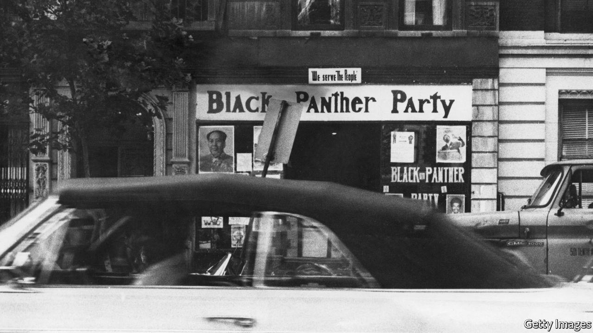

###### The red and the black

# Black American radicals once forged links with Chinese communists 

##### Now only echoes remain 

 

> Mar 4th 2021 


ON FEBRUARY 23RD, from a basement in Queens, New York, a little-known organisation announced that China would be receiving a special honour. “We present [the] People’s Republic of China with the H.R. 1242 Resilience Project W.E.B. Du Bois Award,” wrote the group’s president, Victor Mooney, in a letter to the Chinese ambassador to the United Nations. The award celebrates China’s donation of the Sinopharm covid-19 vaccine to African countries. “W.E.B. Du Bois is a vivid reminder that China is a brother to Africa and African-Americans,” Mr Mooney added.


In a time of strained relations between America and China, Mr Mooney’s olive branch is unusual. But then so is Mr Mooney. He claims to be the first African-American to have rowed across the Atlantic, braving boat-slapping sharks and boat-pinching pirates (the international arbiter of such challenges, the Ocean Rowing Society, does not recognise his efforts). He is an ally of President Teodoro Obiang Nguema Mbasogo of Equatorial Guinea, Africa’s longest-serving despot. Perhaps it then says something that it is Mr Mooney alone who is trying to resurrect a long-forgotten friendship between black activists and the Chinese Communist Party (CCP). His award harks back to a time when figures such as Du Bois, to some the godfather of the civil-rights movement, looked to China to lead a Third World liberation struggle, which included black Americans. Today, however, only the faintest echoes remain.


For black radicals looking to smash racism and capitalism at home, “Red” China was once a “vision of Utopia”, says Keisha Brown of Tennessee State University. In contrast to the Soviet Union, it was an example of an independent, non-white nation, and its revolutionary leader, Chairman Mao Zedong, was an icon. Radicals rushed to go there. Langston Hughes, a poet, wrote his anti-colonial poem “Roar China!” after visiting Shanghai in 1933. Du Bois, a brilliant sociologist who became a staunch defender of Chinese communism, spent his 91st birthday lecturing at Peking University. His wife, Shirley Graham Du Bois, an activist in her own right, died in China in 1977.


A Chinese connection was also crucial to the Black Panther Party’s early successes. With a capitalist streak which might have got them purged in China during the Cultural Revolution, they bought battered copies of Mao’s “Little Red Book” in Chinatown for 20 cents each. Then, beneath the arches of Sather Gate, they sold them to Berkeley students for a dollar. “We made a killing,” recalled one of the group’s co-founders, Bobby Seale.


Today it is black radicals in the Bay Area who are most nostalgic for what China once represented. Tyson Amir grew up in East Oakland, the son of Black Panther affiliates. He travelled to China in 2018 to follow in the footsteps of his “elders”, who raced to “beat Nixon” to China in 1971. Sanyika Bryant, another Oakland-based activist, used to keep a photo of Mao and Robert Williams, a black-defence leader, as his screensaver. (The picture also holds a darker meaning. At the start of the Cultural Revolution, Williams, dependent on the CCP for his upkeep, watched helplessly from his Beijing apartment as his sons’ teachers were marched down the street by Red Guards.) But “there’s a lot of people, especially younger organisers, who have no clue about this history,” he sighs.


Candace McKinley, an organiser in Philadelphia, is one such example. She read about Du Bois in middle school, but his Chinese connections have not influenced her activism. She cares about the “global struggle of anti-capitalism”, but scarcely thinks about China. “I don’t see it as a model, or a place I want to go,” she shrugs.


This is partly because China has changed. As authoritarian as it was under Mao, it is now capitalist (albeit with Chinese characteristics), and no longer a wellspring for revolutionary ideas. Outwardly, however, it still aspires to a revolutionary foreign policy. It continues to make overtures to Africa, such as its latest attempts at vaccine diplomacy. After the death of George Floyd in 2020, its diplomats attacked American racial discrimination and police brutality at the UN, echoing Mao’s statements in support of black Americans in 1963 and 1968. But in America such gestures have largely fallen on deaf ears. For the few who know about China, racist attacks on Africans in China and a whiff of political opportunism have undermined the solidarity message.


Zifeng Liu of Cornell University sees some evidence that, in the minds of radicals, old cold-war attachments still remain. Many are reluctant to criticise China’s treatment of the Uyghurs, for example, because, by cold-war logic, that makes you pro-American, he explains. Even Ms McKinley, although “not a supporter of the CCP”, is “sceptical” of the Hong Kong protests. She equates that movement for democracy with a movement for capitalism.


Back in New York, Mr Mooney remains confident that he is the man to revive Sino-Black relations. He hopes to travel to China once the pandemic lifts, to present his award in person. “My mother used to say, ‘Victor, you don’t need a football team to score a touchdown’,” he says. It is just as well. He will not find too many clamouring to be on his team.■

