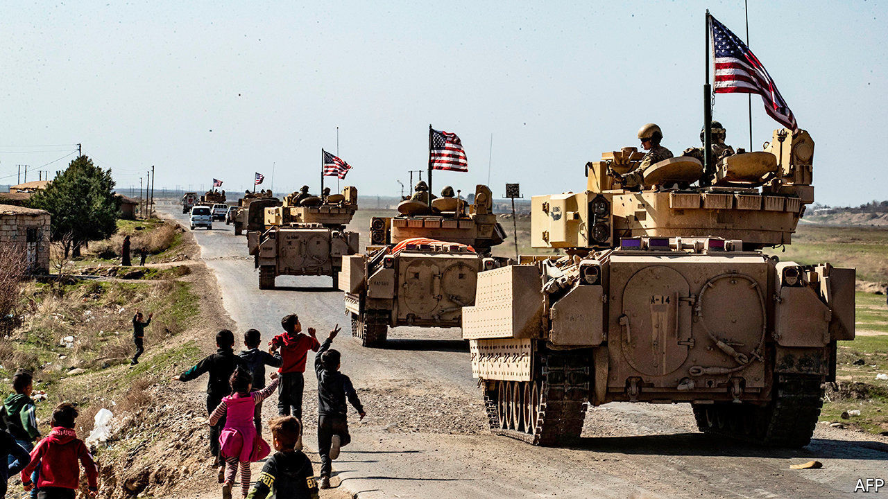
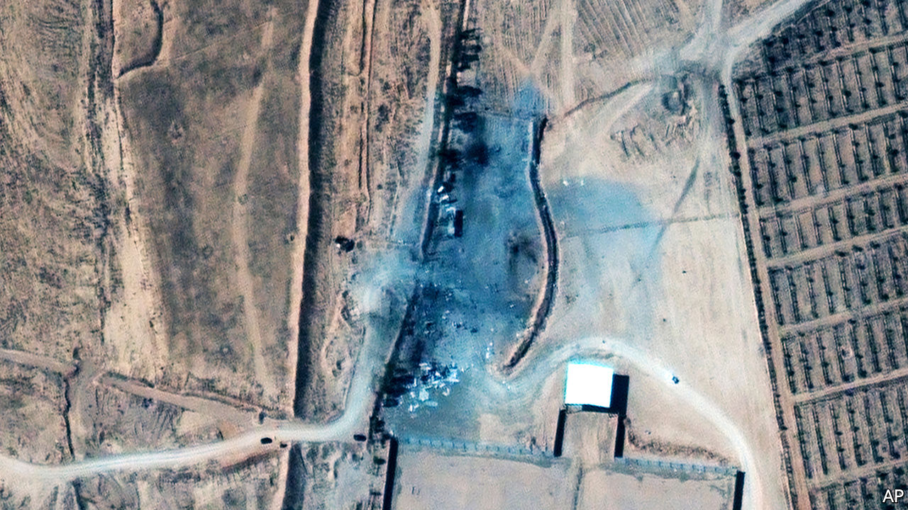

###### Exodus, chapter 41

# Can Joe Biden get America out of the Middle East? 

##### The past two American presidents thought they were too involved with the Middle East, but the Middle East refused to let them go 

 

> Mar 3rd 2021 


BARACK OBAMA tried to pivot to Asia, but the Arab Spring, Syrian civil war, Islamic State and Iran’s nuclear programme kept dragging him back. For all the noise Donald Trump made about ending the “forever wars”, he edged towards war with Iran. He dispatched 14,000 troops to the region and, in the end, did not much change the sprawling American military commitment there. Now, even more than his predecessors, President Joe Biden is signalling an intention to downgrade the Middle East among America’s priorities.


He took so long to make his first phone call to the Israeli prime minister, Binyamin Netanyahu, that his spokeswoman, Jen Psaki, felt compelled, in response to a reporter, to declare the president meant no “intentional diss” (as though an unintended oversight might not be even more humiliating). Mr Biden finally placed the call on February 17th, almost a month after his inauguration. He waited another week to call King Salman of Saudi Arabia, just before his administration  accusing the king’s son, Crown Prince Muhammad bin Salman, of approving the operation that resulted in the dismemberment of a journalist, Jamal Khashoggi.


Mr Biden, who promised during the campaign to make Saudi Arabia “the pariah that they are”, disappointed many of his supporters by not punishing the crown prince. But he is not looking to further roil the Middle East by threatening America’s long-standing alliances. Instead, he wants the allies to learn to expect a new detachment from the Americans.


Mr Biden has frozen a shipment of offensive weapons to Saudi Arabia and has also ordered a review of weapons sales to the United Arab Emirates. He has shown little interest in chasing peace between Israelis and Palestinians, a grail pursued by the past five presidents. His defence secretary, Lloyd Austin, has begun a review of American deployments that is expected to consider a shift from the Gulf. “That’s a lot for leaders in the region to digest,” said Martin Indyk of the Council on Foreign Relations, who was Mr Obama’s special envoy to Israeli-Palestinian negotiations.


And yet it comes as little surprise, given the shift in thinking of left-leaning Middle East experts. Mr Indyk, a former ambassador to Israel who devoted much of his career to seeking peace, published an opinion article in the Wall Street Journal last year on which the jaded headline summarised an emerging consensus: “The Middle East Isn’t Worth It Anymore”.


This view holds that America’s core interests in the region—protecting Saudi oil and the state of Israel—are diminishing as concerns. America still has an interest in the stability of the global oil market, but it imports more oil from Mexico than from Saudi Arabia and fracks plenty of its own. Israel, the only nuclear power in the region, is not in existential peril. Further, the Middle East is now riven less by an Israeli-Arab divide than a Sunni-Shia one, with Israel lined up alongside Sunni Arab states, including Saudi Arabia, against Iran.


In the magazine Foreign Affairs last year, Jake Sullivan, now Mr Biden’s national security adviser, and Daniel Benaim, now the deputy assistant secretary of state for Arabian Peninsula Affairs, wrote that the shift in interests did not mean America “should leave the region outright”. But skilful diplomacy, they concluded, “will ultimately allow for sustained military reductions”.


Yet a familiar obstacle is blocking the exit: Iran. Among Mr Biden’s first orders of business—unfinished business, for many members of his foreign-policy team—is to curb Iran’s nuclear programme and contend with its proxies, starting in Yemen.


The agreement to constrain Iran’s programme, the Joint Comprehensive Plan of Action, was among the proudest foreign-policy achievements of the Obama administration. Mr Trump called the deal “horrible and laughable” and in 2018 he pulled out of it, reimposing sanctions which had been dropped or waived. He went on to impose further sanctions, in what he called a campaign of maximum pressure.


Even as Iran’s currency collapsed and covid-19 raged, the country responded with “maximum resistance”. It began enriching more uranium, and to greater purity, than allowed by the deal. It has also violated the agreed terms on its use of centrifuges. Today Iran stands closer to being able to build a nuclear bomb than it did when Mr Trump left the agreement, though it continues to insist it wants to use nuclear power only for civilian purposes.

 


The Biden administration has said it is willing to restart negotiations alongside the same allies. But at the end of February Iran rejected the idea of face-to-face talks with the Americans unless they commit themselves in advance to lifting some sanctions. Administration officials say Iran must comply with the agreement before they will relieve any sanctions.


Each side believes the other wants to restore the deal, and both are manoeuvring to discover which wants it more. Presidential elections in Iran in June may create some deadline pressure, since at a minimum installing a new government, which is expected to be more hard-line, would interrupt and delay any negotiations.


This argues for a busy period of diplomacy in the spring. “I’ve seen this movie before,” said Ali Vaez, director of the Iran Project at the International Crisis Group (ICG), an NGO based in Brussels. He recalled that before the original deal each side also insisted that the other must move first. He added, “When I look at the cast of characters in this administration, I can’t imagine they’d let the agreement collapse on their watch.” Until recently, Mr Vaez’s boss at the ICG was Rob Malley, a veteran of Middle East negotiations under Bill Clinton and Mr Obama. Mr Malley, who also helped achieve the original agreement, is now Mr Biden’s special envoy for Iran. 


Shortly before Mr Malley left the ICG, it issued an unsigned report describing steps America should take to return to the deal. These include a commitment from the Biden administration to support an emergency loan from the IMF sought by Iran to cope with the pandemic, followed by a negotiated timetable for Iran to reverse its breaches of the accord. America would provide some sanctions relief each time the International Atomic Energy Agency certified that Iran had rolled back a violation, in a process that might take two to three months.

Centrifudge


Then, after a new Iranian president has taken office, America and its allies could pursue what the administration calls a “longer and stronger” follow-on agreement. Such a deal might exchange economic normalisation for long-term guarantees of the peaceful nature of Iran’s nuclear programme and limits on its ballistic missiles. Though some Biden officials had argued for attempting first to strike the fuller deal, that debate appears to have been resolved in favour of the incremental approach.


Renewing nuclear diplomacy with Iran, Mr Biden’s advisers believe, would create a basis for America to press for talks among regional powers to end their proxy conflicts. The Americans want to begin with Yemen, where Houthi rebels, backed by Iran, have been fighting the Saudi-backed government for seven years. Yemen weighs on the consciences of many Biden officials because of support the Obama administration gave to the Saudi-led effort. The Trump administration intensified that support, and today the United Nations regards Yemen as the world’s worst humanitarian crisis.


Mr Biden has appointed an envoy to push for peace in Yemen, and there are hints of progress, at least among the outside powers. The combatants themselves, however, have yet to show much interest in halting the fighting.


According to the vision of Mr Sullivan, the national security adviser, a new framework for regional powers to address their differences, together with nuclear diplomacy, would allow America to begin to pull back. The Middle East, he and Mr Benaim wrote in Foreign Affairs, is “the world’s most dangerously under-institutionalised region”, with nothing like the African Union or the Organisation of American States to police norms.


Any effective regional organisation is a long way off. If anything, would-be members seem more inclined than ever to go their own ways. The UAE last year normalised relations with Israel and last month put a spacecraft into orbit around Mars, while Egypt, preoccupied with its economic woes, has vanished from its historic leadership role. Saudi Arabia and Iran retain strong interests in preserving enmity between the United States and Iran, since the former—like the UAE and Israel—benefits from the costly protection of American forces, while the Iranian regime derives legitimacy from its standoff with the Great Satan. Add on the crisis in Yemen, the suppurating wound that is Syria, the precarity of Iraq, the assertiveness of Turkey and a building humanitarian and human-rights disaster in Ethiopia: Mr. Biden will have to pay more attention than he would like to the neighborhood if America has any hope, however thin, of someday paying it less.


Or else he will have to embrace the role of ruthless realist, and walk away. His treatment of the Saudi crown prince—shaming him but not punishing him, respecting the regime but urging reform—looks like an attempt to split the difference. And already a familiar, violent pattern is asserting itself: last week America dispatched F-15 fighters to drop bombs in eastern Syria on facilities used by Iraqi militias linked to Iran, in response to rocket attacks by Iran-backed groups against Americans in Iraq. Mr Biden said he meant to warn Iran to “be careful”.


American administrations find it easier to talk about shifting their attention from the Middle East than to do so in practice, says Senator Chris Murphy, a Democratic member of the Senate Foreign Relations Committee. “There’s always a crisis,” says Mr Murphy. “There’s always something new and exciting happening in the Middle East. Whereas China’s trajectory is slow and quiet and steady.”■


