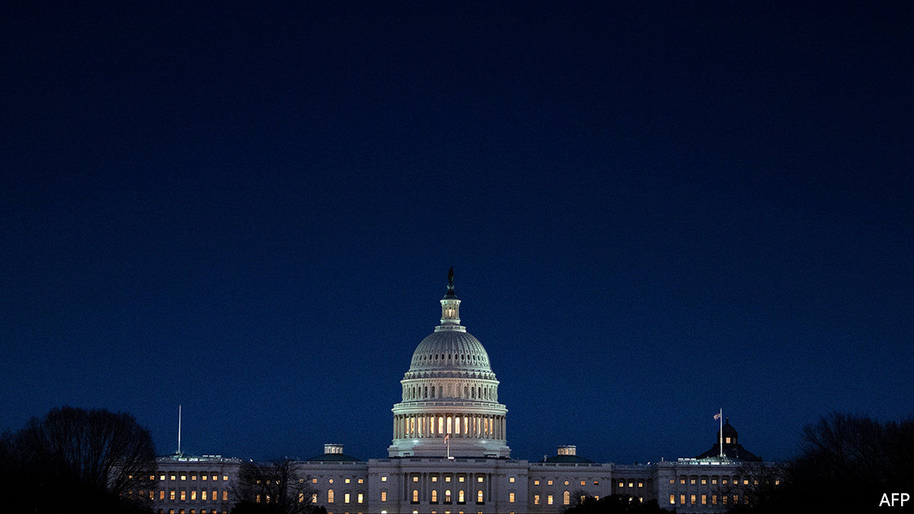

###### Slimming tips

# How the $1.9trn stimulus plan will be trimmed by senators 

##### A user’s guide to Byrd baths, Byrd droppings and $1,400 cheques 

 

> Mar 4th 2021 


IT LOOKED LIKE good timing at first. On February 27th the House of Representatives passed the maiden legislative hope of President Joe Biden, a behemoth $1.9trn package for covid-19 relief. It was speedy because it was unimpeded by any serious bipartisan negotiating—the legislation mirrored the White House’s proposal almost exactly, with not one Republican vote to show for it. That left more than two weeks for the Senate to pass the proposal before a self-imposed March 14th deadline, when emergency federal unemployment benefits for 11m Americans from the last round of stimulus will start to expire. Unfortunately for the president, smooth-sailing legislation has a habit of getting stuck in the Senate. A brittle Democratic majority and obscure parliamentary procedures in the chamber promise a lengthier drama.


Perfect party unity among Democrats would be needed to achieve a simple majority in the Senate. (It would be an unexpected coup for Mr Biden if even a single Republican voted in favour.) For normal legislation, that would spell instant defeat because of the filibuster, a parliamentary procedure that raises the effective threshold for passage to 60 votes out of 100. To get round this, Democrats are using a special procedure known as budget reconciliation. Reconciliation is filibuster-proof—but at a high cost. Legislation must pass a strict, Talmudic standard known as the Byrd rule, which requires consulting an oracle of sorts (an unelected official called the Senate parliamentarian). This triggers a bizarre-sounding series of events: the edicts of the parliamentarian usually result in a “Byrd bath” with the purged provisions (“Byrd droppings”) unceremoniously discarded.


Already, one probable casualty of the Byrd bath is the ambition to increase the federal minimum wage to $15 per hour. Because reconciliation is meant to apply only to budget bills, and to exclude regulatory changes with “merely incidental” effects on taxing or spending, the parliamentarian advised against including it. Some Democrats have suggested simply overruling the parliamentarian by a majority vote. “It could not be more clear that we should not be allowing these minoritarian mechanisms from a bygone era,” says Mondaire Jones, a progressive Democratic congressman from New York, who has urged Kamala Harris, the vice-president who formally presides over the Senate, to overrule the advice. The administration, and thus by proxy Ms Harris, has looked askance at that manoeuvre in public statements.


Even aside from the maddening rules debate, the American Rescue Plan, as it is formally called, may return to the House a bit slimmer. Conservative Democrats like Senator Joe Manchin of West Virginia have suggested fat to cut: more modest unemployment benefits than proposed ($300 in top-ups rather than $400) and more targeted distribution of another round of stimulus cheques worth $1,400 per adult (which currently would be given in full to Americans making less than $75,000 per year).


The $350bn in proposed bail-outs to state and local governments may also be shrunk, as moderate Democrats point out that state and local tax revenues did not decline nearly as much as feared. Overshadowing these intra-party negotiations between moderates and progressives is the clear precariousness of the plan. If any Senate Democrat were to withdraw support, the legislation would almost certainly collapse.


Both chambers must eventually agree on an identical text. How much moderates can remove before triggering a progressive revolt in the House is as yet unclear. So far, the left flank of Democrats has not been as obstructive as the right flank of Republicans was during their time in the majority. But the threat of only five breakaway votes in the House would be enough to threaten the bill and force negotiations. America would then have another maddening spin on the stimulus merry-go-round.■

