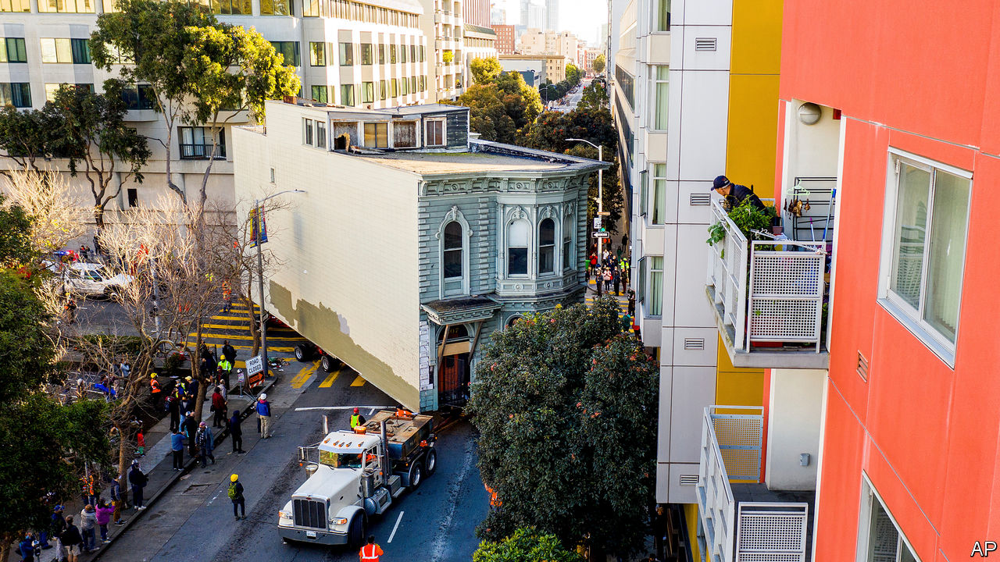

###### If I had a hammer

# It is possible to build houses cheaply in the Bay Area 

##### But the construction has do be done elsewhere 

 

> Mar 4th 2021 


THE BUILDING at 833 Bryant street in San Francisco’s trendy SoMa neighbourhood will be unusual. To start with, all the inhabitants of its 146 units will previously have been homeless. Its constituent parts will have been prefabricated, constructed miles away and fitted together on-site like puzzle pieces. Most unusually, the project will have been cheap to build, at least by Bay Area standards. A report by the Terner Centre at University of California, Berkeley found that, once completed in July, the project will cost 25% less per unit than comparable ones.


That is an achievement in California, where per-unit construction costs for supposedly affordable housing have ballooned since 2000; they are now the highest in the country. Subsidies for below-market-rate housing come with strings attached. Affordable developments that take public funds may be forced to install solar panels, contract with small businesses, or enlarge balcony spaces: well-intentioned demands that nonetheless drive up costs. Builders need to work with a patchwork of local and state agencies that sometimes impose unclear or inconsistent requirements.


Mercy Housing, the builder of 833 Bryant, was able to avoid these headaches. The project’s funders, Tipping Point Community and the San Francisco Housing Accelerator Fund, prioritised low costs and a short timeline, sought no return and imposed few requirements on the builders. The project was thus able to avoid many of the problems that plague affordable housing developments. But it still faced the high construction costs endemic to all new housing across the state.


California tells developers of some affordable housing to pay labourers a “prevailing wage”, which is set by the state and can be nearly twice the median wage for a given trade. Prices for some materials have risen sharply in recent years and labour shortages have driven up wages, especially for skilled workers. Developers say that the Bay Area’s high housing prices exacerbate this problem: the region is too expensive for many construction workers to live in.


State and local permit-allocation makes projects even more expensive. In San Francisco neighbourhood organisations can challenge building permits, disrupting construction. Across the state, developers quake at the prospect of litigation under the California Environmental Quality Act (CEQA), a law dating from 1970 that can be deployed to block new housing. Since property tax increases are capped by law in California, some cities raise revenue by levying “impact fees” on developers that can exceed $150,000 per unit. Though no single factor accounts for high costs, says Paavo Monkkonen, a professor of urban planning at UCLA, the combination results in “death by a thousand cuts”.


To keep construction costs down, 833 Bryant has taken advantage of technological wizardry, which the Bay Area is known for, and innovative governance, for which it is not. The use of modular housing allowed work to continue on site while units were assembled elsewhere. The project also benefited from a streamlined review process made possible by California Senate Bill 35, which passed in 2017. SB 35 set a 90-day deadline for cities to approve qualifying projects, shielding it from challenges under CEQA and precluding the interminable back-and-forth that drives developers in California mad.


These innovations and more like them are sorely needed. According to a report by McKinsey, a consultancy, California faces a shortfall of 3.5m homes. San Francisco’s neighbour across the bay is already charging ahead. On February 24th, Berkeley’s city council voted to do away with single-family zoning. Lori Droste, Berkeley’s housing-wonk vice-mayor, hopes this will open the city up to new construction, driving down prices. SB 35, she says, has already streamlined the development of affordable housing.


San Francisco should follow suit. Even with the well-documented exodus of tech workers, the Association of Bay Area Governments estimates about 55,000 new units will be required every year to meet demand. In 2020 San Francisco added just 4,000. The 146 units in 833 Bryant show that it can be done.■

