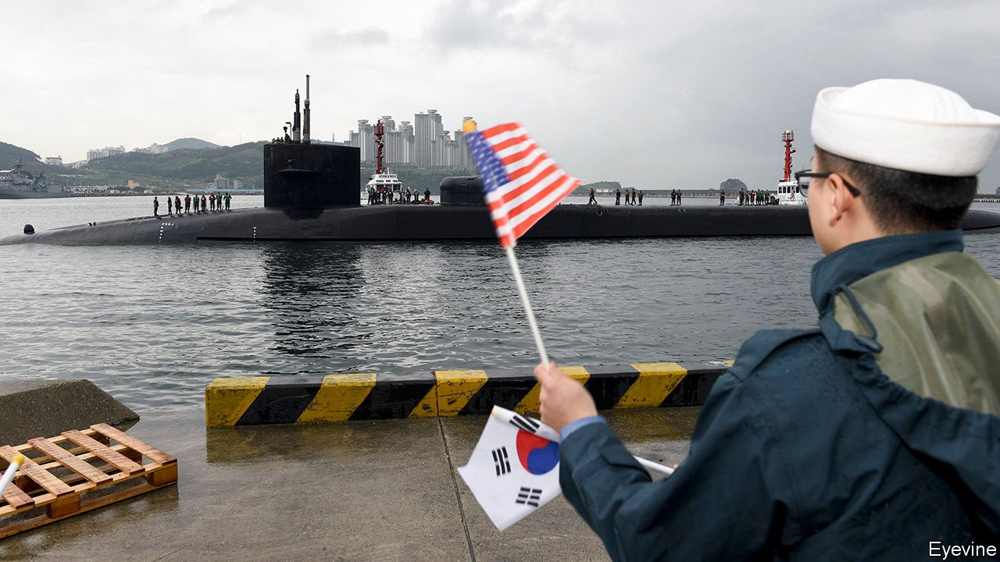
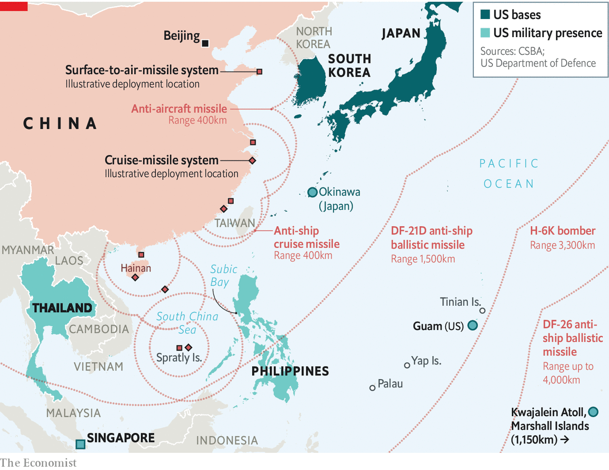

###### Dispersal orders

# America’s top brass responds to the threat of China in the Pacific 

##### American bases are easy targets for Chinese missiles 

 

> Mar 11th 2021 


FOR YEARS American commanders have watched the military balance in Asia shifting against them. In 2018 a commission warned that, in a war with China, “Americans could face a decisive military defeat”. On March 4th Admiral Philip Davidson, head of America’s Indo-Pacific Command (INDOPACOM), said China would achieve “overmatch” within five years. 


That prospect has roused Congress. In December it authorised a $2.2bn fund, the Pacific Deterrence Initiative (PDI), to shore up INDOPACOM. Now American commanders in Asia have asked Congress to double funding for the initiative, with $4.7bn in 2021-22—more than the defence budget of the Philippines—and $22.7bn in additional funds over the five years to 2027. In a report published on March 1st they explained how they would spend such a windfall.


America has plenty of troops, planes and ships. The issue is where to put them. In any conflict in Asia it would rely on a handful of large bases, notably in Japan and South Korea, well within range of China’s huge arsenal of conventional missiles (see map). American commanders want to use the PDI to harden their defences, spread their forces out and develop new ways of putting China on the back foot. 

 


The centrepiece of these efforts is Guam, a Pacific island that INDOPACOM describes as “our most crucial operating location in the western Pacific”. It is close enough to China to use as a springboard for bombers and other weapons, yet distant enough—some 3,000km from the Chinese mainland—to be out of range of China’s most numerous missiles. Conveniently, it is also American territory, so commanders could use it without haggling with allies. A new Marine Corps base on Guam that opened in October is the corps’ first in Asia since 1952.


The problem is that Guam, despite its relative safety, can still be struck by some of China’s newer ballistic missiles, though these are fewer in number, as well as low-flying cruise missiles launched from ships, subs and bombers. INDOPACOM therefore wants to spend almost $4.4bn over six years to upgrade the island’s air and missile defences, in part through new radar systems, both on satellites and on the ground in Palau, an archipelago 1,300km to the south-west.


But if American bases in Japan and South Korea are peppered with missiles, Guam may not suffice. Troops will need more places to disperse. Admiral Davidson says that America is therefore “adapting from our historic…focus on north-east Asia and Guam” towards a “distributed” force spread out more widely. To that end, he wants to spend $9bn over six years building and upgrading runways, fuel stores and arms depots, among other infrastructure, all across the region. Potential sites include American territories, such as Tinian in the Northern Marianas; islands in friendly Pacific countries, such as Yap in the Federated States of Micronesia; and as-yet-unspecified spots in Asia.


The point of this dispersal is not simply to hunker down and wait for an onslaught, but also to give China a taste of its own medicine. Donald Trump’s withdrawal from the Intermediate-range Nuclear Forces Treaty in 2019 allows America to build conventional land-based missiles with a range of over 500km. The PDI sets aside $3.3bn over six years for such weapons, which would be aimed at China’s navy.


The catch is that not many countries are enthused by the prospect of hosting American missiles in peacetime or becoming a refuge for American troops in the middle of a war. Singapore, for instance, is a strategic maritime hub, but would come under intense Chinese pressure to deny use of its territory to America in a conflict.


Euan Graham of the Singapore branch of the International Institute for Strategic Studies (IISS), a think-tank, says that America would benefit from a return to Subic Bay in the Philippines, which it left in 1992, to “plug a gap between Singapore and Japan”. But he says that is unlikely, especially during the remaining 15 months of the presidency of the mercurial Rodrigo Duterte. Pentagon insiders argue that China’s aggressive behaviour will eventually persuade Asian countries to open up to American forces. Some optimistic observers think even Vietnam, America’s cold-war foe, may welcome American troops in a decade or so.


In the meantime, INDOPACOM wants to lubricate relations with cash. More than $2.6bn is earmarked for training and equipping friends in the region over six years. That is sorely needed: last year China’s defence budget grew by $12bn, more than those of every other Asian country combined, according to the IISS.


For now, this remains a wish list. America’s defence spending is not expected to grow this year. Admiral Davidson plaintively points out that his request is “less than seven-tenths of 1%” of defence spending. What is pocket change for the Pentagon would make a splash in the Pacific. ■

