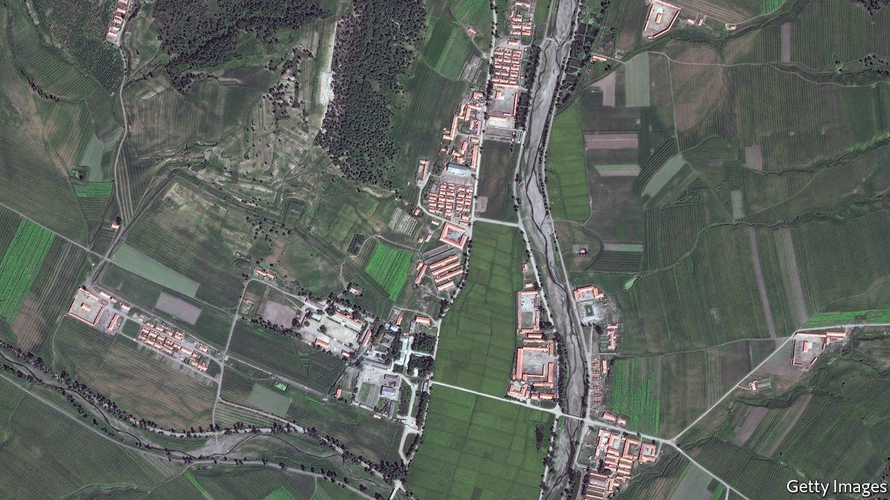

###### In the dark

# Getting information about North Korea’s gulag is harder than ever 

##### But the regime seems to be planning an expansion 

 

> Mar 13th 2021 


ONE FAMILY was sent to a prison camp after a relative was accused of, and then executed for, opposing the regime. Another family was detained after one of them was caught searching for relatives of a man who had escaped to South Korea. One unfortunate fled to China, only to be arrested and sent home, whereupon he was promptly dispatched to a camp.


The Database Centre for North Korean Human Rights (NKDB), a monitoring group in South Korea, has documented hundreds of cases of North Koreans sent to labour camps for “political” crimes such as criticising the government or watching South Korean television shows. Their stories make grim reading. Recently, however, there have been fewer such reports. That is not because the regime is less inclined to torment its own citizens, but because it has become so strict with them that even less information has been trickling out.


Collecting information about North Korea’s prison camps has always been hard. The regime has never even admitted that they exist. They tend to be in remote, mountainous areas. A UN report published in 2014 found that inmates are forced to do hard labour, receive very little food and are subject to rape, torture and random executions. The camps are designed to look like ordinary villages to avoid attracting attention. Foreign residents or visitors to North Korea, of whom there are fewer and fewer, are not allowed anywhere near them. 


Former inmates who have managed to escape from North Korea have been the main source of information about what goes on inside the camps. But in recent years fewer people have escaped from the country, because of stricter border controls, higher fees for smugglers and more stringent surveillance in China, which the fugitives must cross to seek refuge in South Korean consulates in South-East Asia. The covid-19 pandemic has sealed the border almost entirely. “I have heard of nobody escaping after January 2020,” says Sokeel Park of Liberty in North Korea, which helps North Koreans cross China.


What is more, few recent refugees have first-hand experience of detention in a camp, says Hanna Song of NKDB. In part that is because there are fewer camps. But it is also because the remaining ones are run differently. Refugees interviewed in 2019 by researchers from the Korea Institute for National Unification said that people continued to be sent to the gulag for things like trying to defect to South Korea or distributing Bibles. But most camps appear no longer to have “revolutionary zones”, from which detainees could hope to be released after a period of political indoctrination. Instead, they are “total-control zones”, where people are imprisoned for life. “Most of what we know about life inside the camps comes from people who were imprisoned in revolutionary zones for a time,” says Ms Song. “Virtually nobody gets out of the others, so they can’t tell us about them.”


This is particularly worrying because North Korea seems to be preparing to expand the camp system again. In January Kim Jong Un, the country’s dictator, announced a crackdown on “anti-socialist elements” in the ruling party. Soon afterwards, according to DailyNK, a website based in Seoul with sources in the North, the authorities ordered an expansion of the camps’ capacity, recently stretched by violators of quarantine rules, to make space for wayward officials. ■

