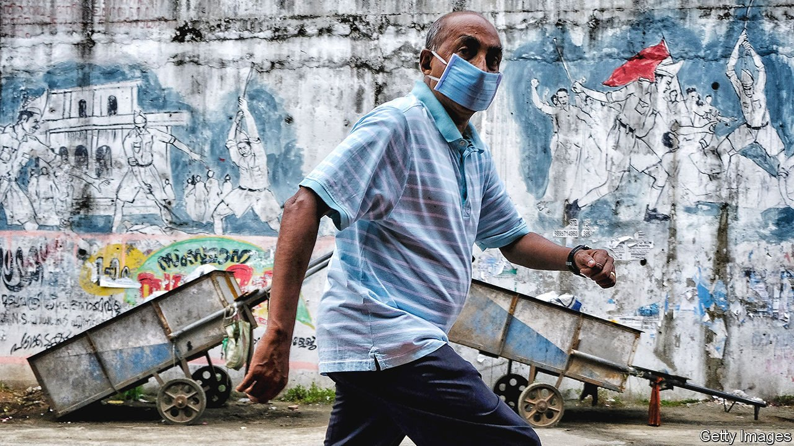
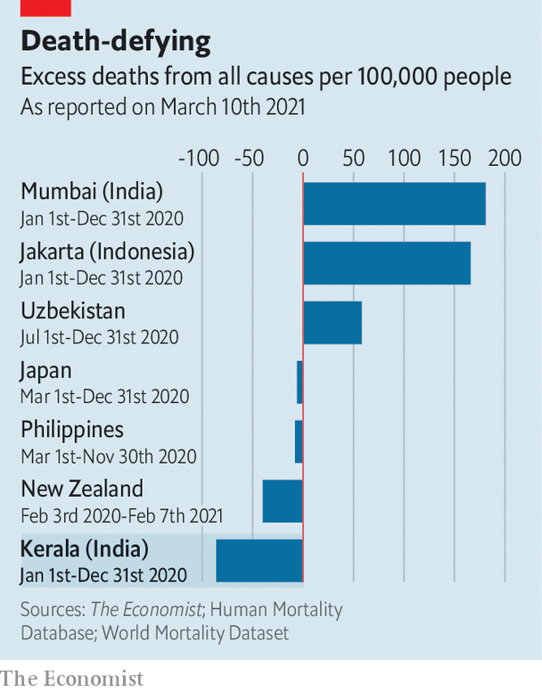

###### Getting off lightly

# India seems to have suffered surprisingly few deaths from covid-19 

##### What explains its apparent success? 

 

> Mar 13th 2021 


“WE’VE KILLED it,“ drawls a grand client at a fancy hairdresser in Delhi. “Covid came to India but we were so grubby and diseased it just bounced off, rolled over and died.” The hyperbole elicits a round of chuckles, as it was meant to. 


Such glibness might seem tasteless, considering an official national death toll of nearly 160,000, as well as ominous signs that India is on the cusp of a second wave that its vaccination drive may be too slow to suppress. Yet as a share of its nearly 1.4bn people, the tally is minuscule, despite a huge outbreak. A national survey of blood samples suggests that by December some 22% of Indians had been exposed to covid-19, 30 times the official tally of around 11m cases to date. If that estimate is right and if India’s fatality rate had been as high as, say, Britain’s, there would have been some 10m deaths. 


Arun Madhavan, a doctor in Palakkad, a town in the southern state of Kerala, was pretty sure one patient would not survive covid-19. Thin and frail, the farm labourer was over 80. More to the point, she had lost a lung to tuberculosis 40 years earlier. Yet to Dr Madhavan’s amazement she suffered only sniffles, aches and a fever. 


Across the country, tales of such resilience abound. Politicians have been quick to grab credit, ascribing the low numbers to their wisdom in decreeing strict lockdowns or boosting hospital capacity. Health experts are sceptical. India has certainly made big efforts, but its lockdown and subsequent easing may have actually spread the disease, as migrants were first cooped up in covid-racked cities and then allowed to return to their villages. Neither convincing data nor medical evidence have yet been produced to explain why the disease’s impact has been relatively light. 


One place that provides clues is Kerala, a state with much better record-keeping than most of India. It claims to register 100% of births and deaths, compared to less than 50% in many other states. K.K. Shailaja, the state’s health minister, notes that, despite the state’s strong public-health system, its 35m people should have been more susceptible to covid-19 than the rest of the country: “We have double the population density as the rest of India, but also a higher proportion of old people and also more lifestyle diseases, like diabetes.” 


Yet in January, when the state released its vital statistics for 2020, the number for deaths from all causes revealed a surprise. They showed that Kerala saw nearly 30,000 fewer deaths during the epidemic year than in 2019, and fewer deaths than in any year since 2012. Whereas overall mortality rose by 15% in America last year, and in almost covid-free New Zealand dropped by 5%, in Kerala it seemed to have plummeted by an astonishing 11%.


Alas, this news proved too good to be true. Since the initial tally was published, the addition of unreported deaths has narrowed the gap to a still impressive 8%. It may shrink further. “I would have waited before tom-tomming those numbers,” cautions Rajeev Sadanandan, a former top health official in the state. “Civil registration data always come with a delay, which may now be worse because of covid, so we will only know for sure by June or so.”


Even with the downward estimate, Kerala appears to have weathered the pandemic remarkably well (see chart). A group of students returning from Wuhan, China in January 2020 brought the state’s (and India’s) first cases. But a fierce government-led campaign, mobilising more than 300,000 volunteers to trace and look after patients, nearly eradicated the virus. The subsequent lifting of India’s national lockdown and the return of some 500,000 expatriate workers from the Gulf fed a surge in cases that was harder to control. But the state’s stronger curbs seem to have delayed the peak of its first wave, which came in October, a month after the rest of India’s. The most recent national survey of blood samples showed Kerala’s rate of exposure to the virus was half the national average, a sign of success in containing its spread. Official figures also suggest that Kerala’s fatality rate has been substantially lower, at just 0.4% of confirmed cases, than the rate of 1.4% for India as a whole.

 


These figures, too, are far from accurate. Dr Madhavan has carefully compared local newspaper obituaries with official death records. For political reasons, he believes, the state has been underreporting covid-19 fatalities by 30-40%. Other doctors concur, saying they are encouraged to cite comorbidities as the cause of death when covid-19 was the main factor.


Even if Kerala has suffered far more than the official 4,300 fatalities from the disease, however, its overall death rate remains strikingly low. Critics such as Mr Madhavan concede that the communist-led state government, which faces an election in April, has done a creditable job of caring for people, including the very poor. Health experts cite a range of other reasons for the low death rate, such as reduced traffic accidents, less stress-related illness and an almost total absence of other infectious diseases. One doctor jokes that colleagues complained of having so few cases in Kerala’s post-monsoon “fever season” last summer that they feared going out of business. 


The limited data available suggest that in other parts of India, too, covid-19 has been less lethal than in much of Europe or the Americas. One group of researchers compared data on deaths with the infection rate (based on surveys of blood samples) in the state of Karnataka and the city of Mumbai. In those locations, too, they found that Indians, and especially the elderly, had an unusually high chance of survival. The number of covid-19 deaths in Karnataka would need to have been underreported by a factor of five to match the typical global fatality rate.


Mr Sadanandan says plenty of research disproves the theory that India may have lucked out with a weaker strain of the disease. Dr Madhavan agrees. “The fact is that Indians have been exposed to a lot of pathogens, so there is probably some cross-immunity at play here.” Perhaps the talk in Delhi’s hair salons is not all bluster. ■


Dig deeper


All our stories relating to the pandemic and the vaccines can be found on our . You can also listen to , our new podcast on the race between injections and infections, and find trackers showing ,  and the virus’s spread across  and .

