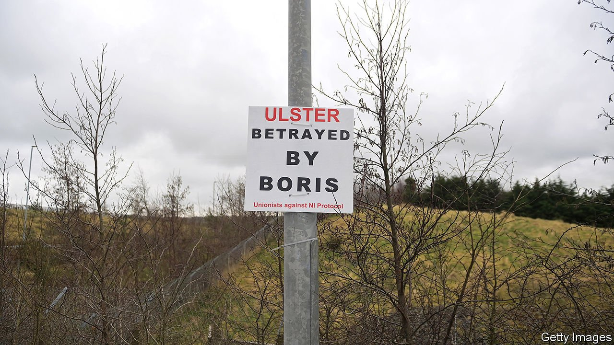

###### Brexit

# Anger and division among loyalists over the Northern Ireland protocol 

##### The guns are still packed away, but the threat is there 

 

> Mar 13th 2021 


THE GOOD FRIDAY AGREEMENT of 1998 brought peace to Northern Ireland after 30 years of bloodshed. But rather than removing the gun from society, it pushed it out of view. Thanks to Brexit, and a new border in the Irish Sea to which the British government agreed in order to avoid a hard one on the island of Ireland, the threat of violence has re-emerged.


Earlier this month the Loyalist Communities Council (LCC) wrote to Boris Johnson saying that its members were withdrawing their support for the 1998 agreement. Red tape and checks on goods moving from Great Britain to Northern Ireland, they said, “undermines the basis on which the Combined Loyalist Military Command agreed their 1994 ceasefire”.


The people behind the letter have weapons and thousands of men. The Ulster Volunteer Force (UVF) and Ulster Defence Association (UDA), the two main loyalist groups, decommissioned some of their guns more than a decade ago. But they have always retained access to weapons. Since the Good Friday Agreement, the groups have killed more than 70 people—mostly from loyalist areas. The security services reckon the two organisations together have 12,500 members. By contrast Northern Ireland’s biggest political party, the DUP, has about 1,000.


The LCC is a very Northern Irish creation, born of the decision that the peace process should prioritise pragmatism over moralism. A legal body created to steer loyalists from criminality, it was set up in 2015 with the help of Jonathan Powell, Tony Blair’s former chief of staff and one of the negotiators of the 1998 treaty. But its leading members are illegal paramilitary groups, among them the UVF, UDA and the Red Hand Commando, which during the Troubles terrorised Catholics.


Organisations which politicians cannot be seen to meet rebrand themselves thus to talk. The week before the letter was sent, Arlene Foster, Northern Ireland’s first minister and the DUP’s leader, met the LCC to discuss the protocol. Nationalist and centrist politicians criticised her for doing so.


David Campbell, the LCC chairman, is not a paramilitary but a businessman, more likely to be seen on his farm in a tweed suit than in a loyalist drinking den. He previously worked for David Trimble, the moderate unionist leader who negotiated the peace. The feelings of betrayal by London at the imposition of a damaging constitutional settlement are reminiscent of those after the Anglo-Irish Agreement in 1985, he says. The paramilitary bosses’ appeal for peaceful protest is genuine, he believes. But a paramilitary leader told him that “the guys around me in their 20s are now saying ‘you had your war, granda—it’s our turn now’.”


Such warnings can be self-serving: deal with me, they imply, for the guy who comes after me will be worse. But the old guard seems to have kept a lid on genuine anger. “Brexit and the protocol have breathed new life into their activities and given it a political tinge. No one should underestimate what that means,” says Aaron Edwards, an expert on loyalists who lectures at the Royal Military Academy Sandhurst. Targets for violence are less obvious if the primary perpetrator is the prime minister, but there is a “highly destructive tendency within Ulster loyalism”, which could lead to lashing out.


Mr Campbell says that the LCC will support a new legal challenge to the protocol. That terrorist groups are instructing barristers encapsulates the success of the 1998 agreement. But it only buys time. Unionism now represents just over half the Northern Irish population; loyalism, unionism’s militant form, makes up a small part of that. Mr Johnson has unilaterally delayed implementing portions of the protocol, which has led Brussels to initiate legal action. But he insists the move is intended to increase support for the deal rather than kill it.


What if loyalists’ campaign against the protocol designed by more powerful forces in London, Dublin and Brussels fails? The risk is a political vacuum, as the DUP loses support to more radical forces, and devolution collapses. “Then we’re into really dangerous territory,” says Mr Campbell. ■


For more coverage of matters relating to Brexit, visit our 

