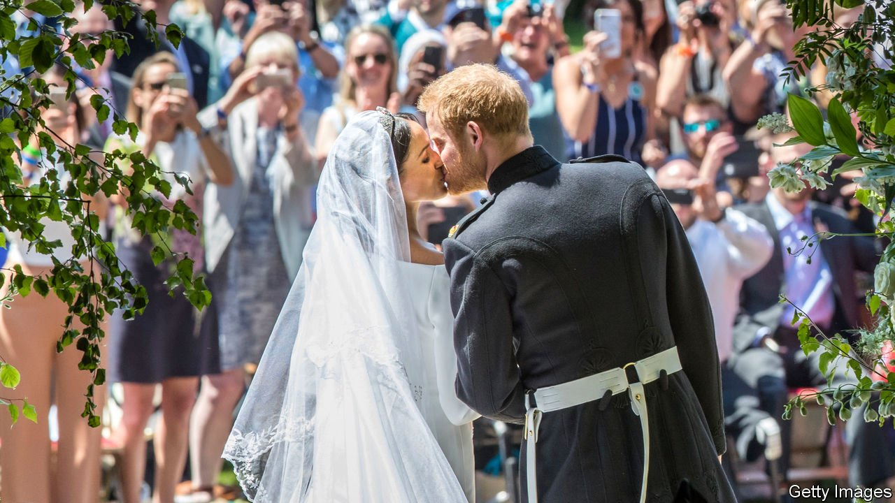
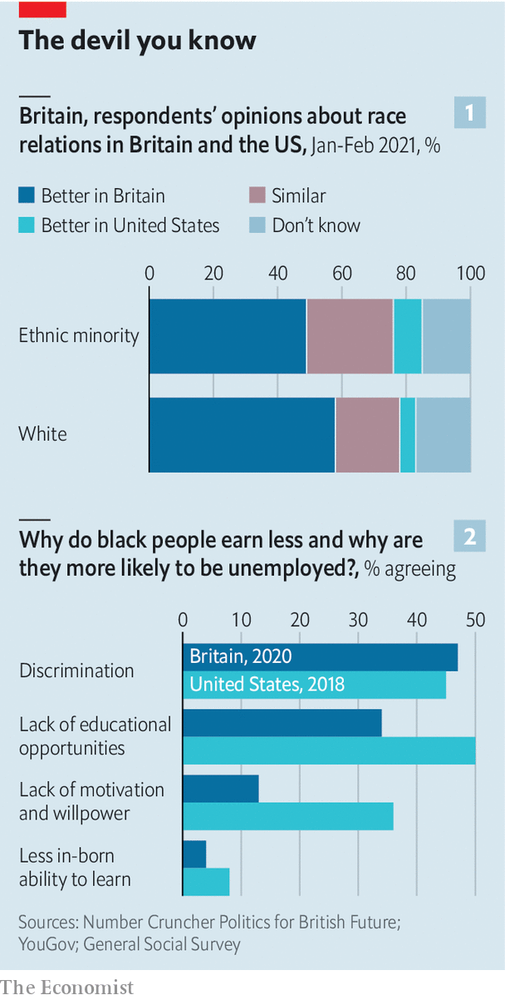
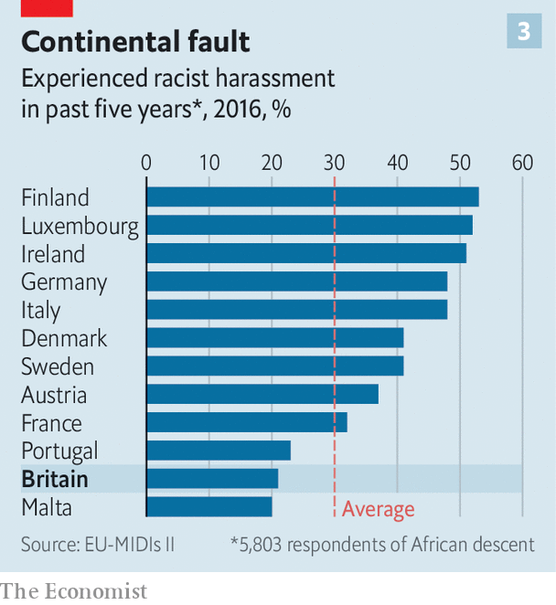

###### By royal disappointment

# The royal interview puts racism in Britain back in the spotlight 

##### But Britons think America is the more racist country 

 

> Mar 13th 2021 


NOT LONG ago, any report on the state of race relations in Britain would have featured a large photograph of the Duke and Duchess of Sussex. According to a long line of commentators, their marriage in 2018 symbolised a country at ease with itself. “A reverend quoting Martin Luther King, a swaying black gospel choir, and a mixed-race duchess,” ran a typical headline, on Mail Online: “the day the monarchy embraced multicultural Britain’s future”.


In their interview with Oprah Winfrey, the couple offer a rather different commentary on race. They attributed their decision to quit Britain for America partly to the “bigoted” tabloid press and said that a member of the royal family had queried how dark their baby’s skin would be.

 


Britons think theirs a less racist society than America’s. That is truer of white than non-white Britons, but holds for a plurality of ethnic minority voters (see chart 1). Britons are less likely than Americans to cite racist explanations for disparities in income and unemployment rates (see chart 2) and about as likely to approve of their country’s increasing diversity. Both are more relaxed about mixed marriages than in the past, but particularly Britons. Mixed-race Britons are more likely to marry a white partner than are their American counterparts, according to analysis by British Future, a think-tank. Black Britons also report less racist harassment than their peers elsewhere in Europe (see chart 3).


 


But white and black Britons see things differently. A poll for The Economist last year found 31% of white Britons reckon Britain “a racist country” and 46% of ethnic minorities do. There is a similar gulf in attitudes towards the behaviour of the police. Britain may not be America, but it is not a model of harmony. ■

