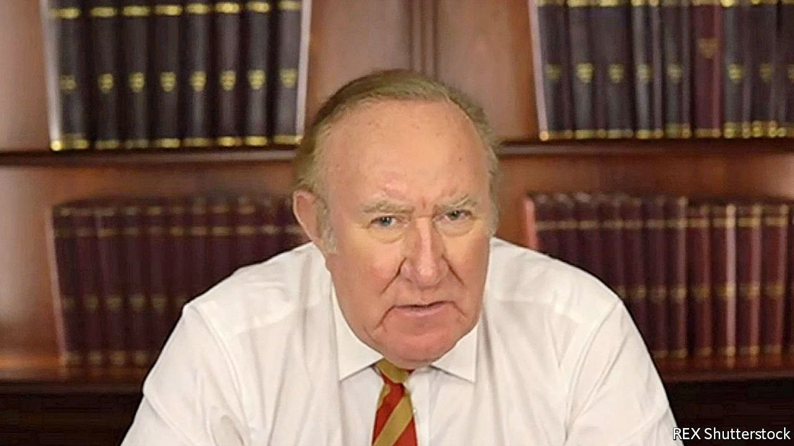
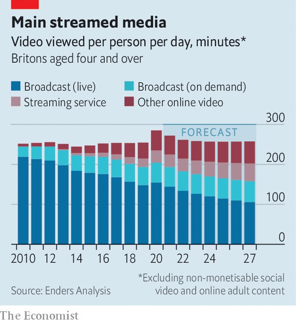

###### Eyes right

# Two conservative upstarts aim to disrupt British TV news 

##### Broadcast laws rule out a “British Fox”. But the shift to streaming could change that 

 

> Mar 13th 2021 


“HE SAYS THEY’RE ignorant!” complained a member of the audience of “Question Time”, a BBC current-affairs show, at a recording in Derby, a Brexit-voting town in 2019. “They’re not ignorant. They knew what they were voting for.”


Moments like this persuaded some TV news executives that they were missing an audience. Britain’s broadcasters are practised at balancing political left and right, but their staff of young, London-based graduates means that, as Andrew Marr, the BBC’s main political interviewer, once said of his employer, they have an “innate liberal bias”. As Brexit has ignited cultural debates—on identity, migration and more—that bias increasingly irks conservatives.


Two new channels hope to hoover them up. News UK TV, part of Rupert Murdoch’s empire, plans to launch in late spring. With content and reporters from titles like the Times and the Sun, it will make right-leaning news and entertainment. Initially it will produce just a few shows a day, to be distributed by streaming, though the company has acquired a broadcasting licence.


Hot on its heels is GB News, a more ambitious startup backed by Discovery, an American media giant, and others. It too will stream, but its emphasis is on broadcast TV, where it will pump out 18 hours of original shows a day. Its primetime presenter and chairman, Andrew Neil, has promised to challenge the “woke worldview”.


Launching in a pandemic is proving tricky. GB News had hoped to be on air this month, but has hired just 20 of a planned staff of 140 and has yet to build a studio. Mr Neil is stuck at home in France. The channel now aims to launch before July, when people may want to escape their screens.


Its longer-term problem is that live TV is in decline (see chart). Within a couple of years it will account for less than half of video consumption in Britain. Among under-35s it already makes up only a quarter. Optimists point out that news is something the insurgent streamers, like Netflix, have so far ignored: in America cable-news ratings are breaking records.

 


But whereas American news networks make most of their money from the fees they charge cable companies, GB News and News UK TV will rely on advertising, a tough market. GB News is looking at other moneyspinners, such as paid newsletters or chances to meet presenters. Mainly it will cope by keeping costs down: the £60m ($84m) it has raised for its first three years would sustain the BBC for less than a week.


Some nonetheless feel threatened by what they call British versions of Fox News. Stop Funding Hate, a campaign group, is trying to organise an advertisers’ boycott of GB News. Two of the nine presenters the channel has hired so far are former Brexit Party candidates. But insiders insist that it will be no more right-wing than Channel 4 News, an existing broadcaster, is left-wing.


The law will mostly hold them to that. Britain has wild newspapers, which helped drive the Duke and Duchess of Sussex to America, but TV is required to be staid. Broadcasters follow a code enforced by Ofcom, a regulator whose output includes a 126-page report on rude words, from “jizz” to “Jesus”. This year it has penalised a Sikh station for inciting violence and Loveworld, a religious channel, for covid mumbo-jumbo. News must maintain “due accuracy” and “due impartiality”; CGTN, a Chinese network, had its broadcast licence revoked last month for failing to do so. Fox, which showed American programming in Britain till 2017, fell foul of Ofcom’s impartiality rules before it left.


Yet online, Ofcom is less fierce. It regulates streamers such as Amazon and Disney+. But the rules cover only things like inciting hatred and product placement. Streamed news need not be impartial. Indeed, Britons can stream Fox. A planned “online harms” bill will let Ofcom regulate user-generated video, from YouTube to TikTok. But the bill’s focus is on child abuse and wild misinformation, not unbalanced news.


Viewers’ drift from linear TV may make life hard for GB News. But it means that opinionated shows, of left and right, will become a bigger part of the national news diet. America abolished its “fairness doctrine”, an obligation on broadcasters to provide balance, in 1987, as cable gave viewers a choice of what to watch. Three decades on, as Britain embraces the choice offered by streaming, it is, in effect, letting go of rules on TV news.■


 An earlier version of this article said that Hope Not Hate, a campaign group, was trying to organise an advertisers’ boycott of GB News. It is actually Stop Funding Hate, another campaign group, which is organising the boycott. Sorry.

