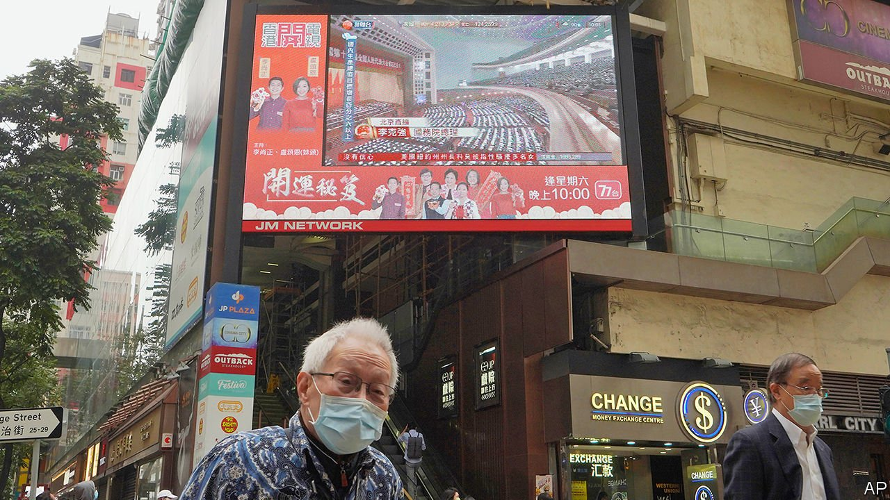

###### Democracy, China’s way

# To crush democracy, China is changing Hong Kong’s political rules 

##### The national parliament has called for sweeping changes 

 

> Mar 13th 2021 


WHEN BRITAIN handed over Hong Kong to China in 1997, the former colony was far from a proper democracy. Its departing leader was a governor sent from London. Only one-third of its legislators were directly chosen by the public. But at least it had open and free elections. Encouraged by Chinese officials, many hoped that, under Chinese rule, it would become much more democratic. Some even thought it would inspire the rest of the country. There has been little progress on either front. Now China is trying to snuff out its democracy altogether.


On March 11th, at the end of its annual meeting in Beijing, the country’s rubber-stamp parliament, the National People’s Congress, called for the overhaul of Hong Kong’s election rules. Delegates applauded as the resolution passed with 2,895 votes in favour, zero against and one abstention. A Chinese official said the aim was to create “a new democratic electoral system suited to Hong Kong’s realities and with Hong Kong characteristics”. That is another way of saying that the territory can have as much democracy as the congress itself displayed: an abundance of it, as the Communist Party would claim, or virtually none at all, as was in fact the case.


A few days before the congress began its meeting, a senior Chinese official had already made it clear that, in future, only Chinese “patriots” would be allowed to stand in Hong Kong’s elections, and that to count as patriotic one must support Communist rule in China. At the meeting itself, more details began to emerge of how this may work. The resolution called for the establishment of a new body to vet candidates standing for election. Discussions of this have made clear that no one deemed unpatriotic will pass. 


The resolution calls for more power to be given to the Election Committee that currently chooses Hong Kong’s chief executive. The 1,200-member body is already stacked with the party’s supporters. It will gain another 300 members—all party loyalists. In 2019 pro-democracy candidates won a landslide victory in district polls after months of anti-government unrest. That would give them control of the 117 seats in the Election Committee that are allocated to district councillors. So these seats will probably be given to other, more reliable, people. Candidates running for chief executive will need at least 15 supporters from each of the committee’s five sectors. That, in effect, will give the most loyal sectors the power of veto.


The committee will also gain a new responsibility, namely filling some of Legco’s seats. These will be increased from 70 to 90. The five Legco seats that are currently filled by elected district councillors may be allocated another way.


At present, half of Legco’s seats are filled through competitive elections in which the public has a vote. The others are chosen by “functional constituencies” comprising business, professional and other groups such as the district councils. For the directly elected ones, the boundaries of constituencies may be redrawn and the voting system changed to make it even more likely that pro-establishment politicians will win (the next polls are due to take place in September, but may be delayed because of these developments). The resolution called the overhaul “another major step taken by the state to improve” Hong Kong’s legal and political systems following the imposition of a national-security law in the territory last June. 


Details of the political changes will now be discussed by the national parliament’s Standing Committee, which will then write them into Hong Kong’s mini-constitution, the Basic Law. Companies in the city will applaud or keep mum. Swire, a conglomerate that controls Cathay Pacific, an airline, said the principle of patriots governing Hong Kong was “beneficial to the city’s future as a world-leading business and financial centre”. But on March 3rd a prominent Chinese academic wrote that the pro-establishment camp in Hong Kong must prove they are “virtuous patriots” rather than “rubber stamps or loyal garbage”. That may prove harder than changing the rules. ■

