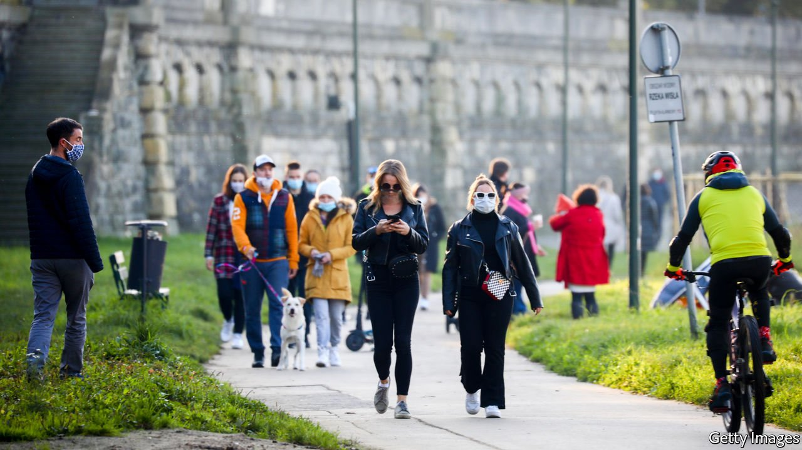
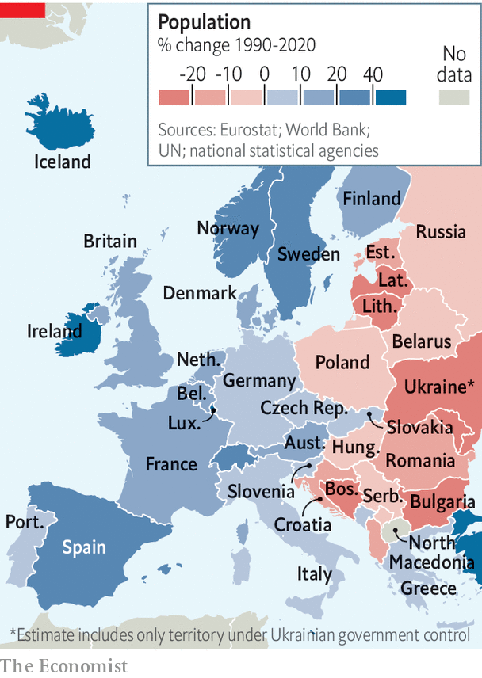

###### Gotta find ’em all

# European censuses are being disrupted by covid-19 

##### It is ever harder to know what is going on 

 

> Mar 13th 2021 


IT IS TIME for Europeans to stand up and be counted. Every ten years most European countries hold a census, generally in years ending with a “1”. Britain seems to have started the tradition, back in 1801, and its own decennial stock-take will take place (except in Scotland) next weekend. Before covid-19, there were not many surprises. This year, thanks to the pandemic, there will be shocks and problems galore.


Everywhere more people than expected have died in the past year. Fewer babies are being conceived. Many migrant workers and foreign students have gone home. It is harder for census-takers to count people, because of social distancing. And it will be harder for anyone to make sense of the numbers they collect, because the past year has been so anomalous.


Some countries, such as the Netherlands, no longer conduct a formal count, relying instead on various data-banks to serve up national statistics. Most do still conduct one, but the amount of actual door-knocking varies. Information stored in databases and collected by census declarations online often needs enumerators to go out and check things, but sending them to ply the streets while covid-19 is still raging is not on. So Germany, France, Ireland and Scotland, among others, have postponed their censuses until next year.


Until the pandemic, demographic trends in most European countries were fairly similar. Europeans were ageing and having ever fewer babies. Without immigration the population of most European countries was set either to shrink soon or had already started to do so. Since 2012 deaths in the European Union’s 27 members have exceeded births. That has been the pattern in Germany since 1972 and in Italy in every year bar two since 1993. The fertility rate in the EU is now 1.53 children per woman—well below 2.1, the rate at which a population remains roughly stable. It is lowest in Malta, at just 1.14, and highest in France, at 1.83.

 


The biggest disparity between countries has been migration. Richer European countries attract migrants from poorer ones. So the population of those richer countries has increased over the past quarter of a century, despite low birth rates, whereas the population of the poorer ones has plummeted (see map). Bulgaria’s has shrunk by 21% since 1990; Romania’s by 17%. So worried is the EU that since 2019 it has had a commissioner for demography.


The pandemic has disrupted all of these trends. Around 547,000 people have so far died of covid-19 in the EU. Many east Europeans have gone home. The pandemic-induced recession has left many couples feeling financially insecure, so birth rates are expected to tumble even lower. For the first time since 2011 Germany’s population has not grown.


Unlike births and deaths, data on migration are hard to capture. Whereas Germany’s population has merely stopped growing, Britain’s may have shrunk dramatically. According to the Economic Statistics Centre of Excellence, a research body in London, covid-19 may have driven away more migrants than Brexit. Many had jobs that have disappeared, such as waiting tables and pulling pints. Thanks to an exodus of central and east Europeans, the United Kingdom’s population may have fallen by a whopping 1.3m.


Data on the number of migrants who have gone back home are sketchy. Ognyan Georgiev of the European Council on Foreign Relations, a think-tank, found that more than 558,000 Bulgarians returned from across Europe during the first lockdowns, between last March and May. The prime ministers of Serbia and Romania reported that 317,000 and 200,000 respectively of their citizens returned in the first few weeks of the pandemic.


Some of those who have gone back east are professionals who can work remotely, and may stay after the pandemic recedes, collecting British and German salaries while enjoying a lower cost of living in their homelands. But that could swiftly end if their employers ask them to come back to the office.


The pace of economic recovery will dictate Europe’s future migration patterns. Kresimir Ivanda, a demographer at Zagreb University in Croatia, says that if northern and western European countries recover faster than southern and eastern ones he will expect a new wave of Bulgarians, Croats, Italians and Spaniards to migrate once more for work. “In the short term,” says Mr Ivanda, “we will see huge disruption.” Mortality rates will rise and women, especially those in less secure jobs, will delay having children—and may never have as many as they had hoped. As covid-19 passes into history, he expects “the trends we have been witnessing in the last two decades to continue.” ■


Dig deeper


All our stories relating to the pandemic and the vaccines can be found on our . You can also listen to , our new podcast on the race between injections and infections, and find trackers showing ,  and the virus’s spread across  and .

