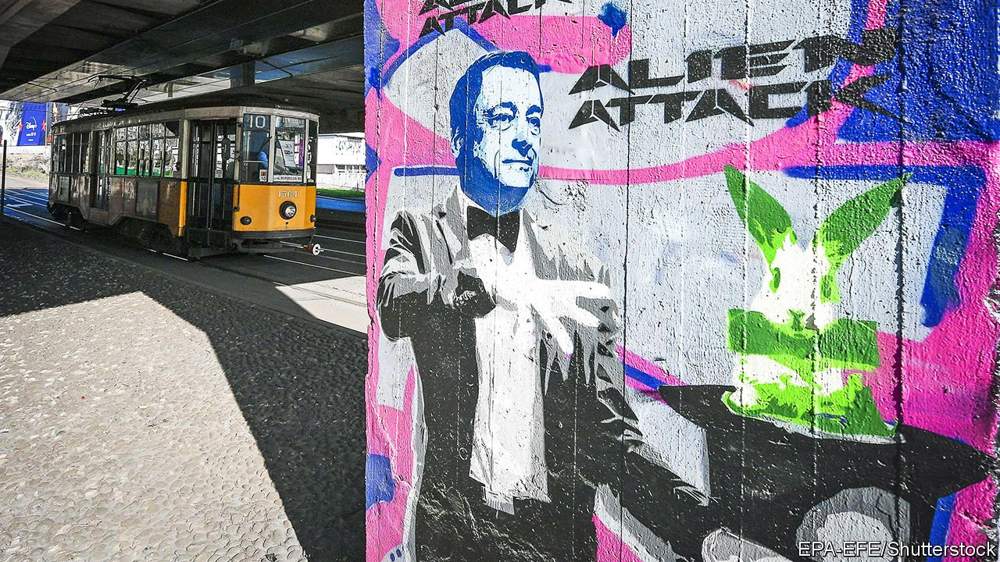

###### Demolition Draghi

# Italy’s new prime minister upends the country’s political parties 

##### The leader of the Democrats quits 

 

> Mar 13th 2021 


IN THE DAYS when Italy’s former prime minister, Matteo Renzi, saw himself as an instrument of creative destruction, he revelled in the nickname il rottamatore, the Demolition Man. Today, that title is more applicable to Mario Draghi, the technocrat Mr Renzi boasts of manoeuvring into the premiership. Restrained and courteous, Mr Draghi is an unlikely wrecker. Yet his arrival has so far split the biggest party in parliament, the Five Star Movement (M5S), and pitched the centre-left Democratic Party (PD) into leaderless disarray.


The trouble began as soon as Mr Draghi sought parliament’s endorsement of his broad coalition. Though the Five Stars’ leaders had opted to back him and secured the approval of party members, some of its lawmakers saw this as an unacceptable capitulation. The M5S was founded to bring down the establishment, yet here it was supporting a man who embodied it. Fifteen M5S senators and 16 deputies voted “no” and were expelled. They have applied to form a new group in parliament.


The revolt highlighted an anomaly: the movement’s rulebook is at odds with the Italian constitution, which gives parliamentarians the freedom to vote as they see fit. The party rules say Five Star legislators must implement the wishes of the party’s members as expressed in online votes staged on a platform managed by Davide Casaleggio. The son of Gianroberto Casaleggio, the internet guru who inspired the movement’s foundation, Mr Casaleggio now champions the Five Stars’ early idealism. On March 10th he presented a document ostensibly intended to define the role of the platform. Many suspect it marks his first step towards taking control of a rival movement.


Forebodings of division also hang over the PD—part of the governing coalition, like the Five Stars. On March 4th Nicola Zingaretti, its affable leader, astonished followers by abruptly resigning, saying he could not any longer put up with the infighting, particularly over government jobs. The PD is arguably as ill-sorted as the M5S, the result of a marriage of convenience in 2007 between old enemies: former Christian Democrats and ex-Communists. Their differences have never really gone away. Mr Zingaretti’s merit was to be broadly acceptable to a majority of PD activists. The same is true of Enrico Letta, a former prime minister, who as The Economist went to press was considering appeals to head the party.


This is more than just a crisis of leadership. The PD was meant to be the party of reform. Yet the structural problems Italy faces today, which Mr Draghi and his fellow-technocrats have been enlisted to tackle and which the new prime minister has enumerated to parliament, are exactly the same as in 2007: an obstructive bureaucracy, a sluggish judiciary, a tax system that discourages productive economic activity, and low female employment. “If the resort to Draghi represents a failure of Italian politics, then it represents all the more so a failure of the PD,” argues Franco Pavoncello, professor of political science at John Cabot university in Rome.


Polls indicate that support for the PD has fallen sharply since Mr Zingaretti’s resignation. But they hold out hope for the M5S, which has lost about half its following since the 2018 election. On February 28th the party’s leaders entrusted Mr Draghi’s predecessor, Giuseppe Conte, with a relaunch of the movement, in what was widely seen as a first step to his becoming leader. Polls suggest support for a Five Star Movement led by the popular Mr Conte could soar. As for Mr Draghi, the more his sponsors bicker and split, the less time they will have to snipe at him. For now. ■

