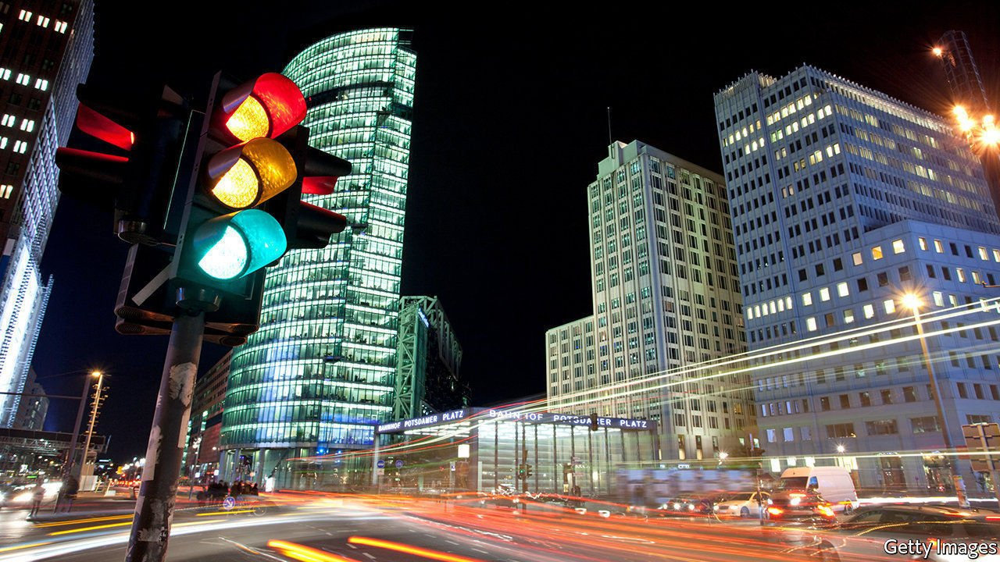
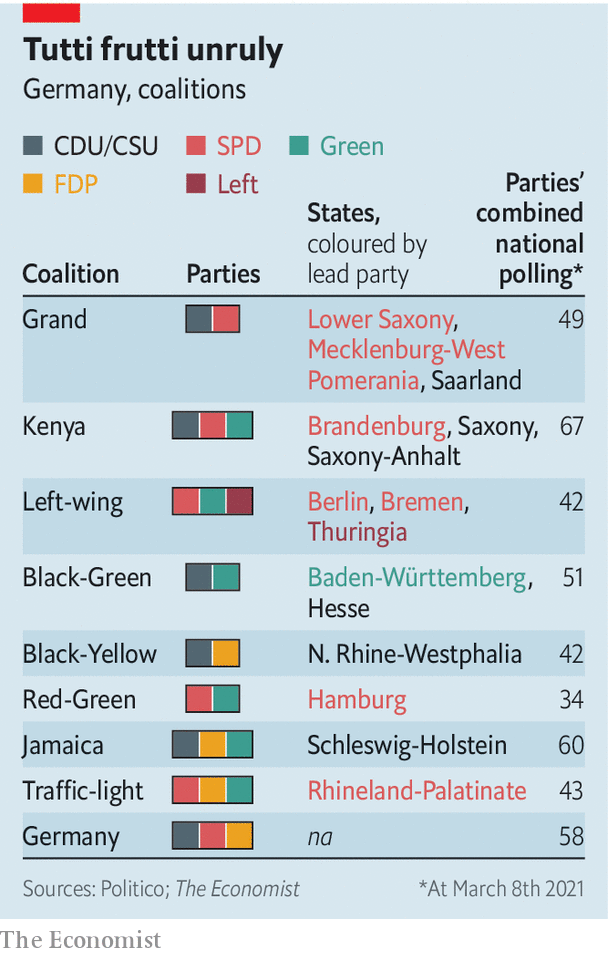

###### Red in bed with yellow and green

# The many colours of German coalitions 

##### From “Jamaica” to “traffic light”, via “Kenya” 

 

> Mar 13th 2021 


ASSEMBLING COALITIONS in Germany was once a simple affair. Power alternated between the centre-right Christian Democratic Union (CDU, with its Bavarian ally, the CSU) and the Social Democrats (SPD), with the liberal Free Democrats (FDP) or Greens in support. Colourful names occasionally emerged for other governing arrangements: “Jamaica” for coalitions uniting the CDU, Greens and FDP—the parties’ colours match the island’s flag—or “traffic light” for the SPD, FDP and Greens. For years these exotic amalgams mainly fuelled the fever dreams of political scientists. More recently, political fragmentation and Germany’s federal system, in which 16 states churn through their own governments, have made them flesh.


Half the states now have unwieldy three-party coalitions. Some, like the “Kenya” groupings in three east German states, are dysfunctional marriages of convenience. But the traffic lights in Rhineland-Palatinate, in Germany’s south-west, have been “very successful”, beams Daniel Stich, secretary-general of the SPD there. They may well abide after an election on March 14th. Next door in Baden-Württemberg, which also votes that day, many in the ruling Greens want to dump the CDU, their coalition partner.


If that were to happen, a national traffic-light coalition would no doubt become more likely after Germany’s election in September, says Hans-Ulrich Rülke, the FDP’s lead candidate in Baden-Württemberg. True, the three parties are currently short of a majority (see table). For now a CDU/CSU-Green tie-up remains the best bet to take over from today’s unloved “grand coalition”. But the covid bonus long enjoyed by the CDU/CSU in the polls has evaporated, and the FDP is staging a modest recovery. A lot can happen between now and September, notes Alexander Schweitzer, leader of the SPD’s deputies in Rhineland-Palatinate.

 


A traffic-light coalition would be an uneasy fit for those Greens and Social Democrats who dismiss the FDP as heartless neoliberals. But it has its attractions. The Greens would have a shot at leading the government; the SPD a realistic way to stay in office (Olaf Scholz, its chancellor-candidate, is a fan). And it offers the FDP, which propped up the CDU/CSU in a miserable coalition in 2009-13, a road back to relevance. Do not count it out.

