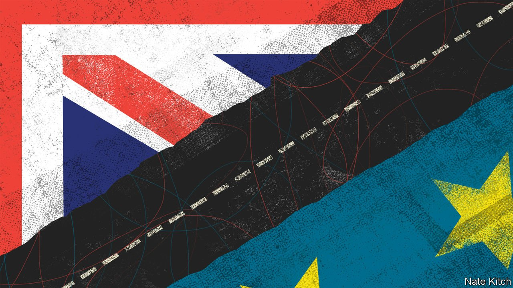

###### Growing apart

# How Britain can benefit from Brexit 

##### Damage is inevitable, but there are ways of mitigating it 

 

> Mar 13th 2021 


IN JANUARY BRITAIN faced two simultaneous problems. Its departure from the European Union’s single market and customs union on the first day of the month hit trade. Early data have suggested that exports to France, for instance, were 20% lower in January than six months earlier. (That does not seem to have been due to the pandemic: trade in 2020 was higher than in the previous year.) The second blow came from a surge in covid-19 cases. Britain, which already had the highest death rate in any big economy, saw deaths peak at 1,361 on January 19th.


The way Britain managed the second of these problems holds lessons for how it should deal with the first. The speed with which its medical regulator approved covid-19 vaccines allowed a swifter roll-out than in any other large country, which has helped slash the daily death toll to around 200. If Britain is to derive any benefit from leaving the EU, nimble  is one of the ways of doing so.


Britain’s economy has experienced other big shocks in the past century, but the one brought about by Brexit is different from those inflicted after the second world war and in the 1980s. Clement Attlee’s and Margaret Thatcher’s governments had clear ideas about the direction in which they were taking the country. Boris Johnson’s does not. Brexiteers burbled about a British economic model, distinct from the European social-democratic model, without specifying what it should look like. The budget speech on March 3rd by Rishi Sunak, the chancellor, included a single reference to Brexit; the 111-page “plan for growth” that was published alongside the budget offers only a couple of pages of platitudes about Brexit at the end. Rather than producing a plan, the government has been going out of its way to pick fights with the European Commission instead.


This failure has several causes. Britain’s scope for diverging from the EU is limited. The trade deal agreed on Christmas Eve between the two commits Britain to staying close to European norms. If it does not it may be punished by trade restrictions; anyway, most businesses are fine with the EU’s standards. To sell into the bloc, they need to stick to its rules, and working with one set of regulations is cheaper than working with two. Northern Ireland’s half-in half-out position raises the costs of divergence, for a bigger gap between Britain and the EU hardens the border in the Irish Sea and angers unionists committed to keeping the province inside the United Kingdom. And British voters do not have much appetite for the hyper-liberal economy which some Brexiteers advocated. Britons want their food safe and their employers to be required to treat workers well.


In most ways, therefore, Britain should aim to stay close to Europe. Yet there is scope for it to diverge in both damaging and beneficial ways. Britain could, for instance, abandon the EU’s restrictive state-aid regime; indeed, the government is already consulting on how to go about it. Britons should be wary of these moves. No doubt, Britain has room to improve on the EU’s rules, which are pernickety, but voters should regard the prospect of ripping up limits on state aid as a risk, rather than a benefit, of Brexit. Shovelling money in the direction of private companies is not a habit that taxpayers should want their governments to acquire.


In other ways, divergence could work in Britain’s interests. The process of regulation can be faster for one country than for 27 and, as the medical regulator showed with vaccines, there is much to be said for speeding it up. The nature of rules can be different, too. Where Britain has critical mass—as in finance—and in others in which it has innovative companies, such as fintech, life sciences and artificial intelligence, the country can help set the standard for liberal, nimble regulatory regimes, rather than taking whatever rules Brussels makes. And Britain can sharpen up competition. It will need to, since Brexit will reduce competitive pressure and thus undermine productivity. The Competition and Markets Authority has offered a number of wise proposals for opening up sectors to new challengers—by, for instance, overhauling antiquated EU rules that shield airlines from competition. The turmoil in the travel business makes this an excellent time to do so.


This newspaper still regards the decision to leave the EU as a self-inflicted wound. But Britain will, for the moment at least, have to live with it. It should therefore grab advantages from Brexit where it can find them, and exploit them thoroughly. ■


For more coverage of matters relating to Brexit, visit our 

