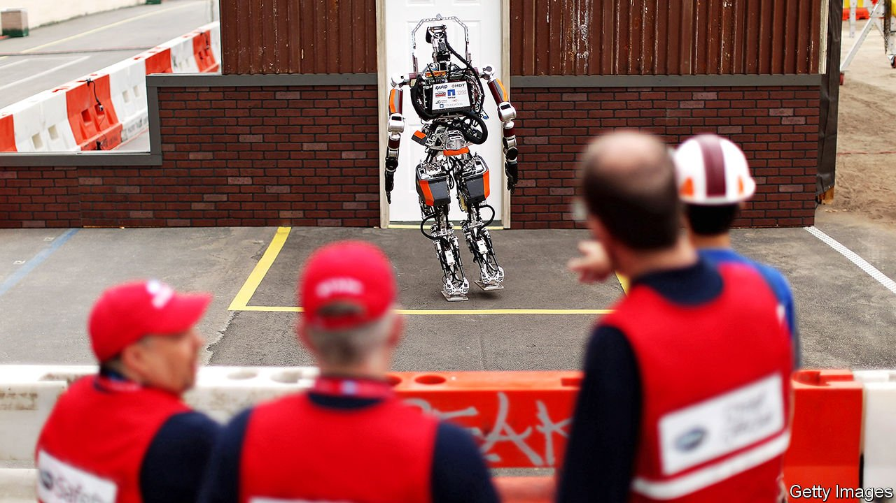
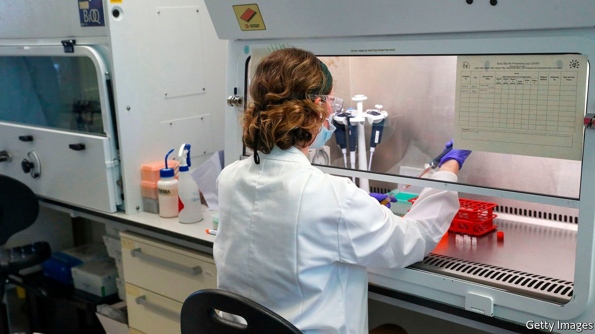

###### On innovation, Charles II of Spain, touching, travel, beliefs

# Letters to the editor 

##### A selection of correspondence 

 

> Mar 13th 2021 


For the sake of science


By definition, “blue skies research” is driven by curiosity, without any obvious practical implications (“”, February 6th). Yet the aim of Britain’s new Advanced Research Projects Agency is to develop proposals that give a payout to the economy. The left field nature of paradigm-changing scientific discoveries and their long path to being actually applied mean that no manager at ARPA would understand the impact of such research. Who, for example, would have predicted that understanding blood-clotting in the horseshoe crab would end up protecting our drug supply from bacterial contaminants, including covid-19 vaccines?


Arguments for the importance of basic science continually fall on deaf ears. In 1897 Santiago Ramón y Cajal, the Nobel-prizewinning father of modern neuroscience, noted an unhealthy preoccupation with applied research and highlighted the existence of “mysterious threads that bind the factory to the laboratory”.


We do need to fund applied research, but this cannot come entirely at the expense of fundamental science. Scientific development is near impossible to plan centrally; its success relies on a free market of ideas. An extreme focus on short-term gain will in the long-run risk severing the mysterious threads that connect ideas to applications.


PROFESSOR BRIAN STRAMERRandall Centre for Cell and Molecular Biophysics

King’s College London

 


Your ingredients for innovation include “good education” (“”, February 27th). Quite so. “Good” should mean broad based, crossing disciplinary ranges, and lifelong. This needs stressing, as governments too often take a narrow view, emphasising skills training, STEM subjects (science, technology, engineering and mathematics), and education ending at age 18 or 21. When Britain faced its ultimate STEM-based challenge, breaking the Nazi codes at Bletchley, which included developing the world’s first digital programmable computer, researchers were recruited from across the disciplinary spectrum.


In 1919 the British Ministry of Reconstruction’s report on adult education urged “good education” so that the newly extended electorate could think critically and weigh evidence. It also had the foresight to warn that unknown industries and technologies were on the horizon, so it was no use just training workers for today’s skills. A workforce had to have the capabilities to make the most of new technologies as they emerged.


The Bank of England’s chief economist argued 100 years later, in a centenary report on adult education, that “the education system of tomorrow needs to span the generational spectrum—young to old—and the skills spectrum—cognitive to vocational to interpersonal.”


JONATHAN MICHIEProfessor of innovation and knowledge exchange

University of Oxford

A sovereign’s debt


Graphic detail’s analysis of the limited ruling abilities of in-bred monarchs focused on King Charles II of Spain (“”, February 20th). Charles was certainly not the most brilliant of intellects, but recent historical studies, such as those by Luis Antonio Ribot, hold the view that he has been evaluated unfairly by mainstream historians. He deserves at least a passing grade.


Indeed, Charles II broke the trend of preceding Habsburg rulers, who viewed Spain as a warring champion of Catholicism. They continuously got Spain involved in a succession of meaningless religious wars, wasting its riches from a newly discovered continent. Charles II instead engaged in defensive wars. He selected capable ministers and stopped raging inflation, accomplishing the almost impossible feat of pulling the kingdom’s budget out of the red.


Charles II was derisively nicknamed “The Bewitched”. But as Professor Ribot says, he was “neither so bewitched nor so decadent”.


JESúS FERNáNDEZ SALIDOMarbella, Spain


Reach out and touch


Regarding your report on the loss of human contact during the pandemic (“”, February 20th), most children have been in pods with their families, so they at least have had the physical affection of their parents and siblings. Not so for the elderly in care. They were forced into isolation, unable to have visits from family members and companions. What will be the cost for all of us after a year without casual contact with our fellows? The handshake, hug, pat on the back, squeeze of the shoulders, none of it of deep emotional significance, but an assurance nonetheless, that we belong to the human community, that we aren't alone.


MARGARET MCGIRRGreenwich, Connecticut


I am 90 and have lived in America since 1969. I was born and raised in Japan, which is not a feely culture, and I do not miss that “lovin’ touch.” Since my divorce in 1979 I have slept alone. In Japan most married couples sleep on separate futons. Kissing is for foreign movies. My grandchildren and I hug lightly, but they are very much loved; we are connected. We all practise social distancing and wear masks, yet never feel a loss of love. Skin-to-skin contact does not necessarily promote vital health. Love truly from the heart is what matters.


MUNEYUKI NAKANOHonolulu


The pandemic has allowed us to understand what our ancestors went through during the Spanish flu epidemic a century ago. The result then, as now, was to limit social interaction and make life generally less pleasurable. Perhaps it was not surprising that the response once that pandemic was over was to resort to the heady exuberance and wild partying that became known as the Roaring Twenties. Hopefully, our own pandemic will follow similar lines, and we will have an exciting decade of explosive gaiety where we can let our hair down and enjoy life simply for the living. Anyone for the Charleston?


DAVID SCOTTPort St Mary, Isle of Man


Carrying your baggage


Your special report on the future of travel () recited Seneca’s view that a change of scenery can “impart new vigour to the mind”. Other writings reveal that the Roman Stoic was more ambivalent on the matter. Seneca also said that “All this hurrying from place to place won’t bring you any relief, for you’re travelling in the company of your own emotions, followed by your troubles all the way.”


Travel, for all its virtues, is no panacea for what ails us as individuals, or as a society.


M. ANDREW MCCONNELLChief executive

Rented.com

Atlanta


What people believe


It is a bit optimistic to think that Vladimir Putin’s over-the-top propaganda effort against Alexei Navalny will backfire (“, February 20th). In America between a third and half of Republicans partially or fully believe that cannibals and paedophiles pervade the government, and that Donald Trump was on a secret crusade to purge them. Hope springs eternal; perhaps Russians are more discriminating.


STEVE BAKERColorado Springs

