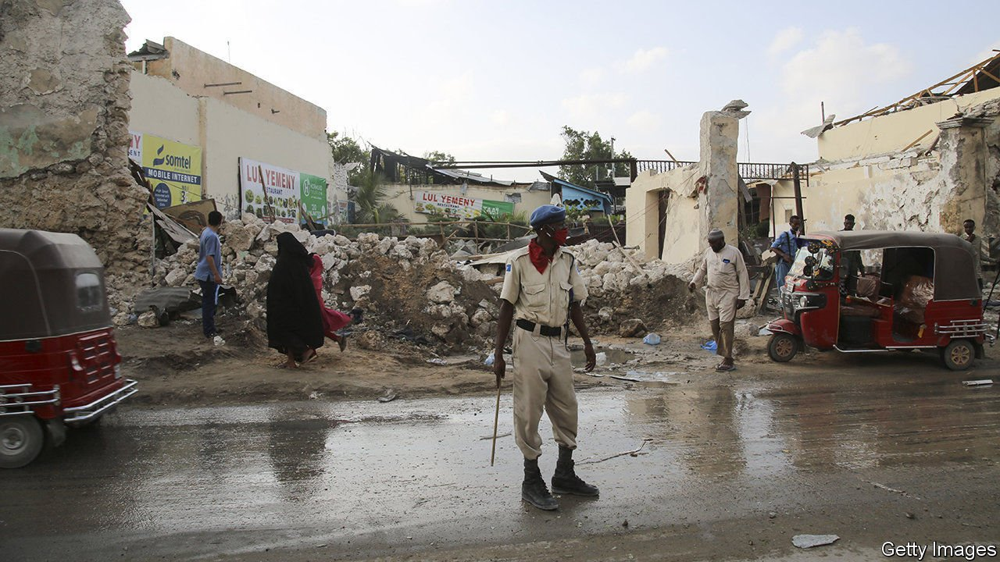
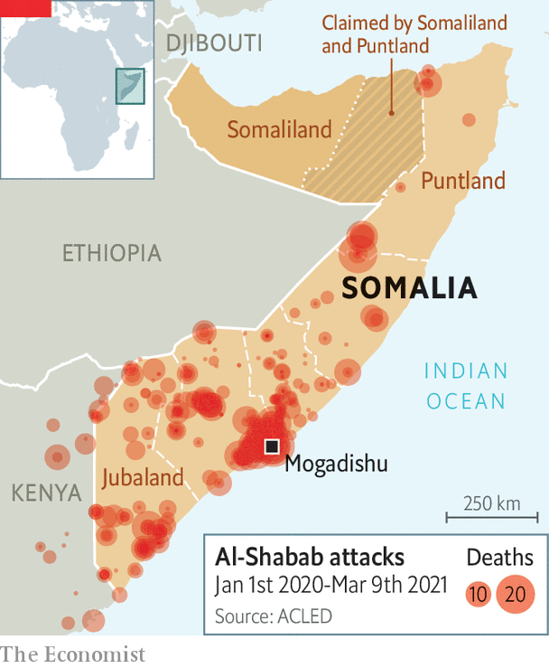

###### Guns, terms and stealing power

# A power grab by Somalia’s president has tipped it into crisis 

##### Elections have been indefinitely postponed because of covid-19 and jihadists 

 

> Mar 13th 2021 


“STAND UP HERE too long and you’ll be a target,” warns the manager of a hotel near the airport in Mogadishu. Visible from the rooftop are two watchtowers and several military checkpoints. In the basement is a bunker. The risks for visitors to this fortified enclave of the Somali capital are not hypothetical: on February 19th a rocket-propelled grenade hit a row of shops near its edge.


Protesters say it was fired at them by government forces. Tempers have been high since the indefinite postponement of presidential elections last month. This has left a question-mark over the legitimacy of Mohamed Abdullahi Mohamed, whose presidential term was meant to have ended in early February. His power grab has pulled Somalia into a crisis that threatens to set back its tentative state-building.


It has been 30 years since Somalia descended into something resembling anarchy. In 1991 Siad Barre, a Soviet-backed military dictator, was ousted. The central government collapsed, and a complex civil war broke out between shifting alliances of clans. There have been repeated failed attempts to rebuild a functioning state.


The first administration to restore a semblance of order to the capital was the Islamic Courts Union in the mid-2000s. But alarmed by its Islamism and amid allegations it was sheltering terrorists, Ethiopian troops backed by America toppled it and installed a friendly administration. From the remnants of the Islamist government emerged al-Shabab, an al-Qaeda affiliate that controls much of the countryside and frequently bombs the capital (see map). It is held at bay largely thanks to 20,000 African peacekeepers.

 


Somalia’s progress towards democracy has been faltering. The country has not had a direct election since 1969, more than three decades before most Somalis were born. Yet it seemed to be on the right track in 2017, when it held “indirect” elections, whereby members of parliament were elected by delegates chosen by about 14,000 clan elders. The MPs in turn picked the president, who had promised to hold proper elections in 2020. But last year election officials cancelled that plan, citing covid-19 and the insurgency of al-Shabab.


Instead they scheduled another indirect vote for February, the deadline set by the constitution for choosing a new president. But talks between the central government and regional leaders over how to conduct it collapsed. The opposition as well as leaders in Jubaland and Puntland, the two most powerful of Somalia’s five states (excluding the breakaway region of Somaliland), accuse the president of sabotaging the process in order to cling to office. “He cannot continue to act as president,” says Abdirahman Abdishakur, a former minister running against him for president.


The stand-off comes after years of worsening relations between President Mohamed, a former American citizen who spent much of his adult life in New York, and most of Somalia’s political establishment. Since taking office the president has shown little interest in the patient consensus-building required by Somalia’s fractious, clan-based politics. Instead he has sought to consolidate his power by sidelining rivals and using the security forces against opponents. He has also tried to weaken the regional states. On February 21st the leader of Puntland accused the president of acting like an autocrat.


Western governments, which pay for most of the government’s budget, face a dilemma. On the one hand they are backing a president who has long seemed keener to hold on to power than to build democracy. In 2019 he expelled the UN’s top envoy for questioning whether the arrest of the leading candidate in a regional election was legal. The president has also picked fights with neighbouring Kenya. And he has drawn closer to Eritrea and its ruthless dictator, Issaias Afwerki.


On the other hand, the government can point to some advances. Donors respect a former prime minister, Hassan Ali Khaire, who was ousted last year, as well as Abdirahman Dualeh Beileh, the finance minister. The two wooed the IMF and World Bank, and met the conditions for forgiveness of nearly all of Somalia’s foreign debt of $5.3bn. State payrolls were purged of “ghost” employees, who are paid but do not exist. In 2018 Somalia began to get budget support from the EU. “Before, the money was given to agencies and NGOs to spend,” says Mr Beileh. “Now they trust us.”


But the crisis threatens to undo this. “All of the [economic reform] is encouraging,” says James Swan, the UN’S envoy to Somalia. “But this political impasse is blocking progress in many other areas.” Since June the EU has halted direct payments to Somalia’s budget over concerns about attempts to rig the election. “Security has probably worsened on whatever metric you look at,” says Omar Mahmood of the International Crisis Group, a Brussels-based think-tank. Violence in Mogadishu is so common that when the boom of an attempted suicide-bombing resounded in the garden of your correspondent’s hotel, his Somali companion barely took notice.


Talks between the federal government and regional leaders are expected to resume. Diplomats still hope they will agree to hold another election, even an indirect one. But with every passing day that Somalia’s leaders squabble, a little more of the state’s scant legitimacy leaks away. “We are at the bottom of a very high hill,” sighs Mr Beileh. Time to start climbing again. ■


An earlier version of this article incorrectly stated that the World Bank has halted direct budget support to the government of Somalia. It has not. Sorry.

