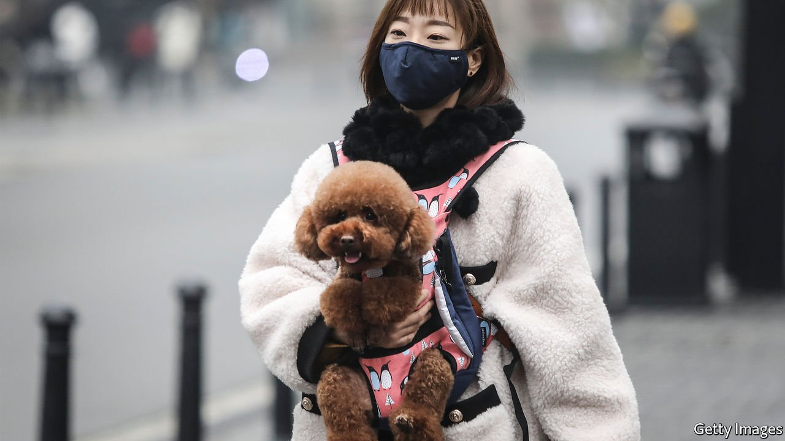

###### Mass craftsmanship

# How to know what customers want 

##### Personalised products are reshaping manufacturing in China 

 

> Mar 13th 2021 


TO SEE HOW consumers have turned the shopping experience on its head, look not to humans but to pets, who hold the world to the highest standards of customer care. If any group has thrived during covid-19, it is the fur-coated crowd. According to Bernard Meunier of Purina PetCare, a brand with $15.4bn annual sales owned by Nestlé, the world’s largest food company, pet ownership has soared during the pandemic. So has the coddling of pets with expensive treats and all manner of pet-related googling, ranging from how to buy the perfect puppy to how to find CBD oil for arthritic retrievers (this correspondent’s fruitless quest in Britain). 


Purina exemplifies three ways in which the selling and manufacturing of products for pets is being transformed by digital engagement. The first is wholesale e-commerce; it sells pet food through sites such as Amazon or Chewy. In China more than half of pet food is sold online, compared with about a tenth elsewhere, Mr Meunier says. The second is selling direct to the consumer (or at least its owner), via subscriptions and other services. In 2018 Purina acquired a majority stake in Tails.com, a British firm that sells tailor-made dog food online. The close relationship between company and pet owner allows it to “personalise” the brand, as Mr Meunier puts it. And third, as its engagement with pet owners increases, Purina is exploring “the blurring of lines” between products and services. It has bought control of Wamiz, a pet-lovers’ website, and in 2019 took a minority stake in IVC Group, a European firm of vets.


Don’t expect Nestlé to personalise everything. Grocery shoppers remain mass consumers. The bulk of its products will fill supermarket shelves or online baskets for the foreseeable future, says Jordi Bosch, global head of sales at Nestlé. But the more options consumers have for where to shop, and the more information they have at their fingertips about what to buy, the more manufacturers need to adapt their products, whether they are Nespresso coffee pods or varied pack sizes of Nescafé.


Bacardi, a global spirits giant, shows how deeper connection with customers can bring new razzle-dazzle to brands, according to Mike Birch, its head of digital commerce. During lockdown, it hosted live-streamed whisky-tasting on Amazon, introduced espresso martini cocktail kits for at-home “mixologists”, and sought to tickle single-malt whisky influencers with an Aberfeldy Scotch dubbed “The Loch Down”.


As yet, few manufacturers in the West are milking their customer data for more than clever sales and marketing campaigns. But in China a new approach to production is emerging: “consumer-to-manufacturer (C2M).” There are several versions, but in essence, C2M makes use of big data and artificial intelligence (AI) gathered by tech platforms to identify the latest shopping trends. Influenced by this, manufacturers then make specialised products directly for consumers, cutting out intermediaries. With more direct insights about customer demands, there is less need to create excess-inventory buffers, improving margins and reducing waste.


Pinduoduo (PDD) is one of the platforms that has pioneered the trend. David Liu, its vice-president of strategy, says that since it began C2M in 2018, it has worked with 1,500 manufacturers, making about 4,000 types of product and generating 460m accumulated orders from its 730m customers. One example is robot vacuum-cleaners. High-end versions sell for 3,000 yuan (about $500) making them affordable for many in China’s richest cities, but less so in poorer ones. So PDD worked with a manufacturer to produce a much cheaper version, proving via its data that demand existed, and allowing the manufacturer to use after-sales data to improve the product. Anecdotally, it reckons some fast-fashion firms and factories can shorten the time from conception to market to a few weeks.


PDD is also using agritech to help 12m farmers in its network cultivate products that customers want. For instance, it has launched what Mr Liu calls an “AI versus human strawberry-planting competition,” pitting teams of veteran strawberry farmers against teams backed by digital technology. The former produced slightly sweeter strawberries, but the latter did it more efficiently, Mr Liu says. A fringe benefit is that regulators look kindly on the digitalisation of agriculture, he adds.


Alibaba, China’s biggest e-commerce platform, also has a thriving C2M unit. Early in the pandemic, it noticed a sharp rise in demand for alcohol-based car-cleaning supplies to stop the spread of infections. It approached Odis, a company making car-cleaning products whose sales were cratering, and suggested it bring out portable sanitising sprays instead. It did so within three days, not the three months normally needed to create a new product. Customers were able to pre-order the spray even before manufacturing started. More than 200,000 were sold within 24 hours. ■

