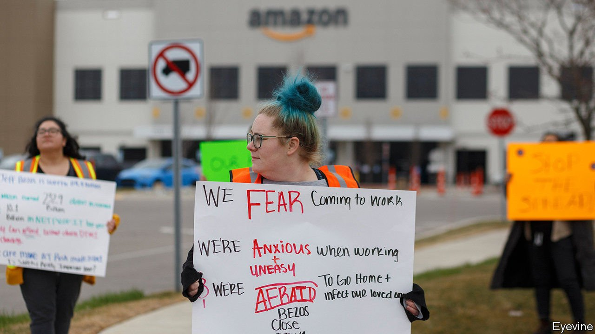
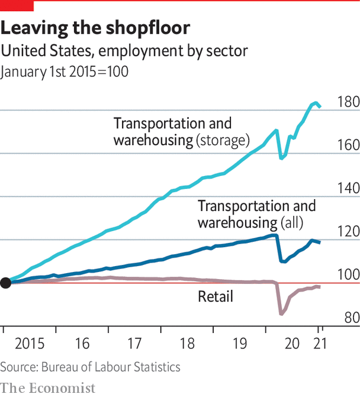

###### People

# Shop assistants and the retail renaissance 

##### The retail transformation will leave its mark on society 

 

> Mar 13th 2021 


BAD FOR shop assistants, good for shoppers. That is the obvious inference from the upheaval in retailing that is leaving shopping malls and high streets, and millions of low-income jobs, surplus to requirements, yet panders to the consumer’s craving for convenience. It is, though, an oversimplification. Retail-related jobs will change but not disappear. And shoppers must make uncomfortable choices about privacy and the exploitation of data.


Start with jobs. In America and Europe, retailing is a huge employer, especially of women and young people. The National Retail Federation, an industry body, says retailers are the largest private-sector employers in America, engaging 32m. In the EU about one in six workers have retail or wholesale jobs. Even before covid-19, the rise of e-commerce, retail bankruptcies and shop closures were leading to job losses. Lockdowns during the pandemic exacerbated that. In America 2.4m retail jobs were shed in March and April 2020. By January just 2m had been recovered. Yet many lost jobs are offset by e-commerce-related employment as warehouse workers, couriers and grocery pickers. America’s Bureau of Labour Statistics says jobs in transport and warehousing grew by more than 500,000 in the seven months to December. Amazon alone added that number last year. The Progressive Policy Institute, a think-tank, says industries related to e-commerce created 900,000 more jobs between the end of 2007 and the start of 2020 than those lost at bricks-and-mortar stores.


The prospects of moving to sorting and packing jobs rather than shelf-stacking and folding ones will be little consolation for many. Warehouses may be stuck on the edge of cities, far from traditional shops and supermarkets. They offer less direct connection with the public. They may be more physically demanding and involve relentless, soul-sapping targets. Workers may need retraining. And worker organisations are rare. Amazon has resisted efforts by its American employees to unionise, though this month those at a warehouse in Bessemer, Alabama, are voting on whether to become the first in America to join a union.

 


At least wages have risen. In America Amazon and others have pushed minimum pay to at least $15 an hour. Yet higher labour costs may tempt companies to replace workers with robots. A digitised retail industry raises demand for higher-skilled labour, but lowers it for entry-level workers. Jobs like delivery and grocery-picking may be outsourced to gig-economy workers, whose livelihoods depend precariously on customer ratings and reviews.


For the lucky minority still working in shops, the job may become more stimulating. That is because more tasks, from ringing up the till to showing the way to the nappy aisle, will be automated, leaving employees to offer more valuable services aimed at winning repeat customers. As Nilam Ganenthiran of Instacart says, workers whose jobs used to involve showing people where the pasta sauces are now advise on what types of pasta to make. Mark Pilkington, a former lingerie retailer whose book “Retail Recovery” will soon be published, says retail workers will need the skills of a stylist or an actor to advise shoppers what to wear and how to look fabulous, so that they return to the store. “A good stylist is cheaper than a good therapist,” he quips.


As automation increases, retailers will have to fight for tech talent. Eric Shea of Accenture, a consultancy, says the industry has had a “bad rap” and struggles to compete for employees with big-tech firms. So it needs to create “hubs” of digital experimentation away from the mothership. Instacart’s army of software engineers create tools to sell to supermarkets to automate their operations, so they do not have to build their own. The bifurcation between fast-paced warehousing jobs and creative customer-service ones is essential to make online shopping more efficient and in-store shopping more fun. Both aim at making customers feel they are truly king. No doubt the richer they are, the more regally they will be treated. Yet there is a bargain involved that shoppers are only just understanding. They pay by sharing data with retailers.

Data junkies


Data are the building-blocks of the retail renaissance. By one estimate, the volume of retail data globally is expected to rise from 33trn gigabytes in 2018 to 175trn by 2025. Until recently, stores made a hash of assimilating it. Even when they had an online presence, rivalry between physical and digital sides of the business meant information was not shared. Manufacturers had little information about customers, so no incentive to personalise. And retailers kept few tabs on what people did in their stores. As Mr Pilkington says, the irony is they would pay Facebook and Google to recruit customers online, yet let them walk free through their shops without collecting data on them. 


Loyalty cards were a step forward. Retail apps are the new way for retailers to connect with shoppers. These provide information on shoppers’ habits, either online or in-store. They inform decisions on what stock to carry. In some cases, they may alert manufacturers what goods to produce. Yet if shoppers feel their privacy is violated, they may react with outrage. Tools that can destroy trust if handled badly include location-tracking, facial and voice recognition, and voice-activated assistants who recommend products to buy in a biased way. Schemes common in China, such as community group-buy, may prove offputting in the West if shoppers are encouraged to persuade friends to join them in making purchases by social media. Data theft is a big problem.


A paper in the Journal of Retailing, an academic journal, by Kelly Martin of Colorado State University and others, suggests ways to enhance data privacy. It highlights the importance of Europe’s General Data Protection Regulation and California’s Consumer Privacy Act, as well as China’s new privacy standard, the personal information security specification (though it says Chinese shoppers worry about the government keeping their data safe). It also says firms should guarantee privacy protection as a sales strategy.


Retailers fret that, as Facebook and Google deepen their involvement in commerce, questions about the use of personal data will grow. But it is hard to put the genie back in the bottle. This is a data-driven economy, and for the retail renaissance to flourish, shoppers must feel confident that personal information is in good hands. As Mr Shea of Accenture puts it, customers once pledged loyalty to the retailer. Now it is the other way round. ■

