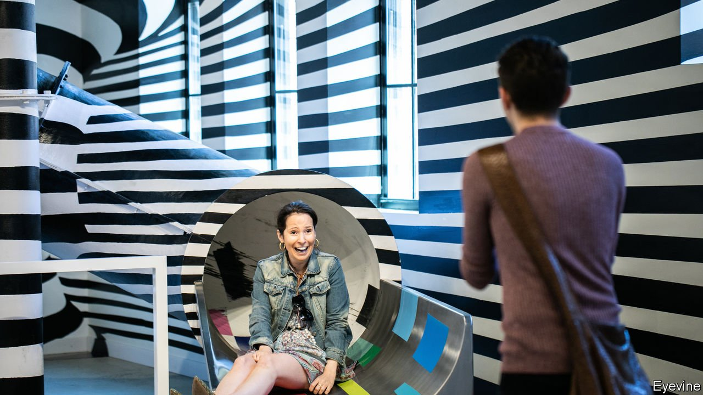

###### The future

# Welcome to democratised retail 

##### Shopping will be dominated by a few but enriched by many 

 

> Mar 11th 2021 


FOR A GLIMPSE of the future, go to Showfields, which has a four-storey department store in the Lower East Side of Manhattan. These being plague years, you can take a virtual tour via its app, which directs you to “the most interesting store in the world”. Amir Zwickel, Showfields’ co-founder, says the mission is to make it as easy to open a physical as a digital store. During the pandemic, retailers from Europe, Asia and Latin America have opened boutiques without setting foot in America. They can because Showfields provides the architecture to do it remotely, including providing human “storytellers” who act as stand-in brand ambassadors. It tracks customers via its app and with cameras, providing retailers with digital feedback. It also attracts shoppers with art exhibitions and live events. “I want to be for physical retail what Shopify is to e-commerce,” says Mr Zwickel.


Showfields is a landlord, not a retailer. It represents a niche solution to what Melina Cordero of CBRE, a property specialist, says is a dilemma in the retail-property industry: “credit versus cool”. Landlords used to insist that malls and shopping centres recruited tenants with strong brands and creditworthiness. But some venerable names have gone bust. Instead landlords need “cool”, youthful brands to attract shoppers. Showfields offers that. Property barons as arbiters of what is cool or not? That is one of many incongruities in a renaissance that is blurring boundaries between customers and retailers. Mr Zwickel calls it “c-commerce” for its customer-centricity. Retailers, landlords, brands, advertisers and manufacturers are in the service of consumers, whom they know better than ever because of their data trail.


If Showfields is any guide, the physical store will not only survive the rush to e-commerce but even thrive as a place of interaction between retail “stylists” and consumers. Freed from giant stores with their arrays of goods, shops can become more intimate, turning into pillars of the community and places in which to gather. They may be less concentrated in city centres, especially if working from home persists, reducing demand from office workers. Yet soulless shopping centres in suburbia offering only tatty goods and little service may also be on the way out.


The obvious presence in this new landscape will be giant online marketplaces, such as Amazon and Alibaba’s Taobao and TMall. Both are so strong that their dominance is likely to persist, even if it attracts regulatory scrutiny. The antitrust crusade is not an insurmountable worry. If experience in China is a guide, the retail industry does not need breakups for competition and innovation to flourish. Even with the recent surge in e-commerce, 85% of global retail is offline. That is a lot of territory still to conquer. The ubiquity of smartphones in emerging markets means shopping will develop in more interactive and fun ways. New e-commerce channels via live-streaming and short videos will attract entrants.


The opportunity for brands to reach customers direct, without paying huge mark-ups, may democratise retailing in a way not seen since the Industrial Revolution. Before e-commerce came along, retailers were cosy oligopolies. Only through consolidation could they create economies of scale to hold their own against consumer-goods companies. Under the retail renaissance, that will change. Some say it will create a more frictionless economy, with smoother pricing, fewer barriers to entry and more innovation. It will also allow brands to plug more consumer data into their manufacturing models, so that they produce goods closer to what customers want, with less surplus inventory (ie, waste).


This is the optimist’s view. Pessimists will see instead dead malls, abandoned high streets, millions of unemployed shop assistants, dwindling retail tax revenues and piles of Amazon-delivered clutter, and wring their hands. Inevitably the transition will incorporate bits of both. It will lose popularity if societies find no good way to upgrade the skills of retail workers who fall victim to the disruption. It will also be a poor substitute for the shopping experience of old if only a well-off minority have access to the innovative brands and trendy stores depicted in this report. 


Whatever the variety of distribution channels, the retail industry must also respond to climate change and worries about “peak stuff” (will consumers’ urge to binge-buy ever be sated?). Shoppers now put sustainability high up in their priorities when deciding where and what to buy. From Amazon to Zalando, a European online marketplace, many retailers have zero-carbon targets. Yet the manufacture of goods, from farm produce to plastic toys, is a big contributor to global warming. And at the other end are exhaust fumes when packages are delivered or customers drive to stores.


It seems fair to assume that digitisation will produce a cleaner economy than one built around mass production and mass consumption. It also seems realistic that with the world at the foothills of a transformation of retail, innovation is just starting—and some will be aimed at making shopping genuinely more sustainable. For now, celebrate the overhaul of a model of shopping that after 150 years was oligopolistic, stuck in its ways and a byword for poor service. It takes years for technological breakthroughs to reshape society. E-commerce is in only its third decade. It may turn the next one into a time of vibrant upheaval. ■

