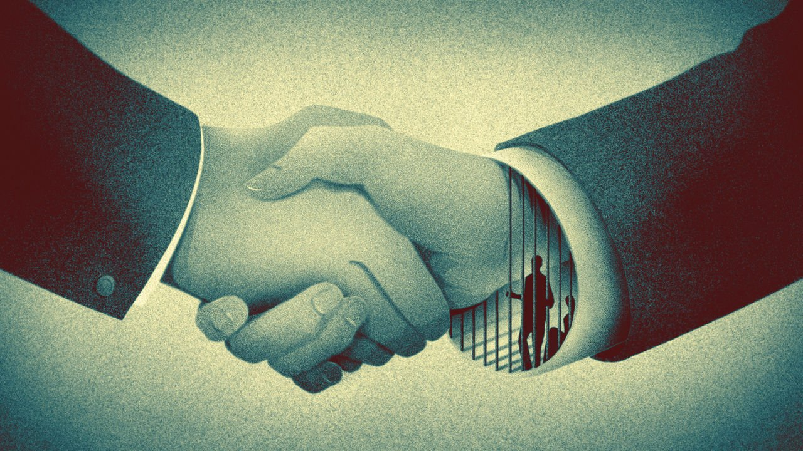

###### Hostage diplomacy

# Only America can break the deadlock between Canada and China 

##### The incarceration of two Canadians has paralysed relations between the two countries 

 

> Mar 8th 2021 


WHENEVER CANADA’S ambassador to China visits Michael Kovrig virtually in jail, the prisoner gives him a list of books he wants to read next. In January he asked for “The Trial” by Franz Kafka. Like the unhappy hero of that novel, Mr Kovrig, a Canadian former diplomat, has done nothing wrong. Yet he has been stuck in a cell in Beijing for 800 days. The true reason for his ordeal has never been stated openly by Chinese authorities. His fate, and that of another Canadian, Michael Spavor, depends on a case neither man had anything to do with: the detention in Canada of a Chinese businesswoman, .


The “”, as they are known in Canada, appear to be hostages. In December 2018 they were taken into custody and later charged with spying. Many assume this was in retaliation for the arrest of Ms Meng, who is the chief financial officer of Huawei, a Chinese telecoms firm, and also the daughter of its founder, Ren Zhengfei. Ms Meng and Huawei are accused of violating sanctions against Iran. The United States’ Department of Justice had sought her arrest so that she could be extradited to America. Ms Meng appeared in court on March 1st to begin the final round of her extradition hearing, which will end in May. Unlike the two Michaels, she is detained in comfort in a cushy house in Vancouver. She wears an electronic tag, but can see friends and go shopping.


Canada’s government faces a conundrum: how should it deal with a powerful country that refuses to play by the same rules? Its experience so far suggests that when it comes to hostage diplomacy, liberal democracies with moral scruples are at a disadvantage, for the obvious reason that they don’t take hostages.


Some Canadian ex-ministers and diplomats have lobbied Justin Trudeau, Canada’s prime minister, to defy the United States and release Ms Meng, bending the rule of law so that the two Michaels can return home. Mr Trudeau has refused, pointing out that to intervene on behalf of Ms Meng would show China that all it has to do to gain leverage over Canada is, as he put it, to arrest two “random Canadians”.


As a result, Mr Trudeau has been accused of weakness in the face of Chinese bullying. He did not retaliate when, after Ms Meng’s arrest, China imposed a de facto ban on imports of Canadian canola, pork, beef and soya. His government has not formally banned  from its 5G networks, as some other countries have. (China’s ambassador to Canada warned that a ban would bring “repercussions”.) Mr Trudeau resisted calls from parliament to follow America in labelling the persecution of the Uyghurs in Xinjiang a “genocide”.


Supporters of Mr Trudeau argue that he is dealing pragmatically with an impossible situation. They point out how, after a dip, China’s purchases of canola and other goods have recovered somewhat. Last year Canada’s overall exports to China increased by 7.1%, to C$26.2n ($20.7bn). Mr Trudeau’s minority Liberal government criticised China’s crackdown in Hong Kong and made it easier for Hong Kongers to come to Canada, angering the Chinese government. And he did not stand in the way of a unanimous vote in parliament to apply the “genocide” label to atrocities in Xinjiang; the government abstained and let Liberal party members vote as they wished.


In February Marc Garneau, Canada’s foreign minister, issued a declaration with the US secretary of state, Antony Blinken, and 56 other governments, denouncing the arbitrary detention of foreign citizens by states for political purposes. The statement did not mention China by name—another of Mr Trudeau’s calibrations. But the message was heard in Beijing. Hua Chunying, a spokeswoman for China’s foreign ministry, called the declaration a “despicable and hypocritical act”, and said it amounted to a “confession” by Canada that it had erred in detaining Ms Meng.


Chinese authorities have intimated that the fates of the two Michaels are intertwined with Ms Meng’s. In February Morgan Elliott, Huawei’s vice-president for government relations in Canada, almost said as much in a television interview. “Mr Ren, like any father, wants his daughter home, just as the families of Michael Kovrig and Michael Spavor want their family,” he said.


It is becoming increasingly clear that to get the two men home Canada will need America’s help. In Ottawa hope flickers that this will be more likely with Joe Biden as president instead of Donald Trump. In December the Wall Street Journal reported that America’s Justice Department was negotiating a possible settlement with Huawei’s lawyers that would free Ms Meng, perhaps with a hefty fine.


Those talks appear to have fizzled before Mr Trump left office, though they may resume. In February Mr Biden promised to work with Canada to get the two Michaels home. It is unclear, however, if America will pursue a legal settlement. “Human beings are not bartering chips,” Mr Biden said. Mr Kovrig’s Kafkaesque nightmare suggests otherwise.■

