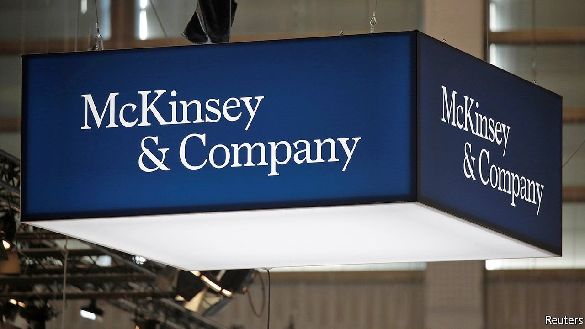
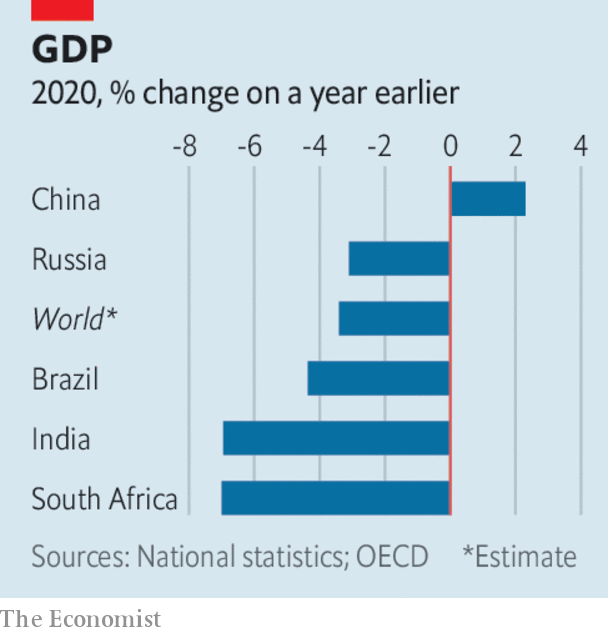

###### 

# Business this week 

#####  

 

> Mar 13th 2021 


Bob Sternfels was selected by the partners at McKinsey as their new global boss, following the defenestration of Kevin Sneader in the leadership ballot. Mr Sneader had tried to introduce more oversight of the firm’s consultancy work after several scandals dented its reputation, not least the advice it gave to Purdue Pharma on how best to push sales of OxyContin. Mr Sternfels says he is committed to continuing the reforms Mr Sneader started.


Oil prices rose sharply, in part because of an attempted drone attack on Saudi Arabia’s largest oil-export terminal by Iranian-backed Houthi rebels from Yemen. Other factors, such as a surprise agreement by OPEC to keep curbs on output in place until April, also helped drive up prices. Brent crude breached $70 a barrel for the first time since May 2019. See .


General Electric decided to sell its aircraft-leasing business, one of the biggest in the world, to AerCap, in a transaction worth $30bn. GE will retain a 46% stake in the newly combined company, which will have 2,000 planes, and another 500 on order, for rent to airlines. GE will use its proceeds from the deal to pay down its debt. The jet-leasing unit was the biggest remaining piece of GE Capital, the conglomerate’s troubled financial-services division. See .


American employers added 379,000 jobs to their payrolls in February. The bulk of the increase came from restaurants and bars hiring more workers, as states and cities begin to ease their lockdown restrictions on indoor dining. Warmer weather in southern states means more people can eat outside. Employment in leisure and hospitality is still down by a fifth from its pre-pandemic level.


The White House warned of an “active threat” from an attack by hackers on Microsoft Exchange email. It has emerged that tens of thousands of organisations that use the service may have been compromised. Microsoft has blamed state-backed hackers operating in China, which China denies.


Roblox had a successful debut on the New York Stock Exchange. The video-game platform, which has created a “metaverse” with its own currency and became wildly popular during lockdowns, saw its share price rise by 54% on the first day of trading in a direct listing. See .

Not so solid BRICS

 


South Africa’s economy shrank by 7% last year, the biggest contraction since at least 1946, according to official statistics. Output from construction was down by a fifth, and from manufacturing and mining by around 11%. Agriculture was the one bright spot, growing by 13%. The government imposed strict curbs on economic activity, including a ban on selling alcohol, to stop the spread of covid-19, but the country was in a mess before the pandemic. The official unemployment rate is 32.5%.


America and the European Union suspended tariffs that each has imposed on the other in a dispute over state aid to the aerospace industry. The suspension is a goodwill gesture from both sides that will last four months, as they hold talks on how to resolve their disagreements on the issue, which stretch back 16 years. Ursula von der Leyen, the president of the European Commission, described it as a “fresh start” for the American-European partnership, which came under a lot of strain during the Trump presidency.

Loss appetite


Deliveroo revealed more details of its financial performance, as it prepares for an IPO in London. Filings showed that even though the food-delivery service’s sales rose by more than half last year, it still made a substantial loss. Just Eat Takeaway.com, Deliveroo’s bigger rival, told a similar tale in its annual earnings: sales surged, but its pre-tax loss rose to €147m ($165m).


The share price of the London Stock Exchange Group plunged by 14%, after it revealed higher-than-expected costs related to its acquisition of Refinitiv, a financial-data provider, which push the financial benefits from the deal into the future.


John McAfee, the founder of the McAfee software-security company, and an adviser were charged in America with conspiracy to commit fraud by promoting certain cryptocurrencies on Twitter. The pair allegedly used “misleading statements” to conceal their true motive of making a profit. Mr McAfee is currently being held in Spain, where he faces extradition to America on separate tax-evasion charges.


Lego reported that both consumer sales and operating profit rose by a fifth last year. Despite lockdowns, it opened 134 new stores, including 91 in China. The toy company is expanding the tech aspect of its brands, investing in products that seamlessly blend physical and digital play. It recently launched a platform that allows children to make music videos.

