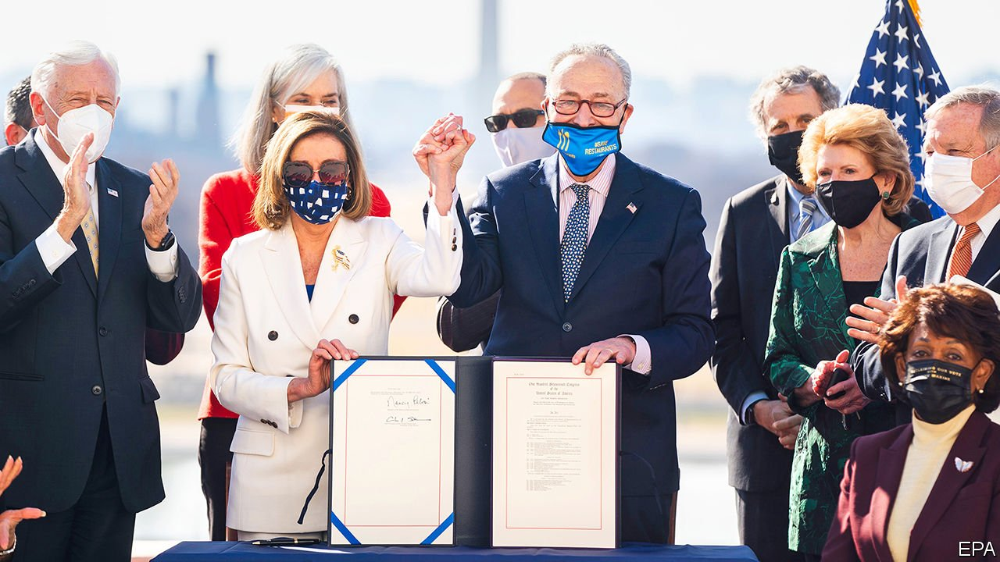

###### 

# Politics this week 

#####  

 

> Mar 13th 2021 


America’s House of Representatives gave the final approval to Joe Biden’s $1.9trn stimulus bill. The legislation will send direct payments of up to $1,400 to each American, extend a $300 per week top-up to unemployment benefit until September, and expand provisions for poorer households, among many other things. The OECD thinks the stimulus will turbocharge the American economy and add a percentage point to global growth. See .


Jury selection began in the trial of Derek Chauvin, a policeman accused of murdering George Floyd by kneeling on his neck. Finding an impartial jury could prove hard. Potential jurors are being asked whether they saw the video of the incident, which went viral.


A Brazilian supreme-court judge annulled two corruption convictions against a former president, Luiz Inácio Lula da Silva. Although Lula, of the left-wing Workers’ Party, could still be charged in another court, that looks unlikely. He is now expected to run again for president in 2022. See .


The lower house of Mexico’s congress voted to legalise marijuana for personal use, and to allow its commercial cultivation. The bill now goes back to the Senate.


Protests continued in Paraguay over the government's mishandling of the covid-19 pandemic. Many of the demonstrators called for the impeachment of Mario Abdo Benítez, the president. The resignation of the health minister failed to quell the anger. The country of 7m has received only 4,000 vaccine doses.


At least 98 people were killed and more than 600 injured in a series of explosions at an army barracks in Equatorial Guinea. The blasts seemed to have been caused by the careless storage of munitions, which caught fire after a farmer burned his fields to prepare them for planting.


John Magufuli, the president of Tanzania, was reportedly admitted to a hospital in Nairobi, Kenya’s capital, with covid-19. Mr Magufuli, who has not been seen in public for two weeks, has prevented his government from taking steps to slow the spread of the virus, or to vaccinate people against it, insisting that God would protect them.


Bashar al-Assad, the president of Syria, and his wife, Asma, tested positive for covid-19, according to his office. Syria has seen a sharp rise in cases. See .


Pope Francis made the first-ever papal visit to Iraq. The pontiff prayed among ruined churches in Mosul, the former stronghold of Islamic State, and held mass at a stadium in Erbil. It was his first international trip since the start of the pandemic.


Oprah Winfrey’s interview with Harry and Meghan (the Duke and Duchess of Sussex) received mixed responses. Older Britons sided with the royal family; younger people and Americans had more sympathy for the Sussexes. The monarchy’s response acknowledged the concerns Meghan raised about race; it noted that “while some recollections may vary”, they will be taken seriously and “addressed by the family privately”. See .


China's rubber-stamp parliament, the National People's Congress, ended its week-long annual meeting in Beijing. It approved a new five-year economic plan, which unusually did not set a target for average annual GDP growth. The plan called for a reduction in the amount of carbon dioxide that is emitted for each unit of GDP by 18% between 2021 and 2025. But this would be a smaller cut than in the previous five years. See .


The legislature also called for sweeping changes to Hong Kong's electoral system. These will include expanded powers for its Election Committee, a body stacked with Communist Party loyalists. Currently it chooses the territory's chief executive. In future it will also fill some seats in Hong Kong's Legislative Council. See .


The security services in the Philippines killed nine political activists in a series of raids on suspected sympathisers of a left-wing insurgent group. Two days beforehand Rodrigo Duterte, the president, had publicly urged police and soldiers to murder “communist rebels”.


South Korea and America agreed to a five-year deal on sharing the costs of deploying American forces in the country. South Korea will pay $1bn this year, 14% more than last year.


Malaysia's High Court ruled that non-Muslims could use the word “Allah” in publications such as Bibles, overturning a 35-year ban. Christian plaintiffs had argued that the word is simply the Malay for “God”.


Italy infuriated Australia by blocking a shipment of 250,000 doses of the AstraZeneca covid-19 vaccine. This was the first time that an EU member state has made use of new blocking powers recently approved by the EU in response to a row with Britain over shortages of the jab. See .


In Germany, two members of parliament from the ruling coalition, one from the Christian Democratic Union and one from its sister party in Bavaria, announced they were resigning, following news that they had profited from government deals to buy face-masks. This comes ahead of crucial state elections.

Coronavirus briefs


China launched a “passport” scheme through which its citizens can register their vaccination and testing status. It is not yet mandatory.


A year after quarantine measures were imposed on the whole country, Italy passed the milestone of 100,000 deaths from covid-19.


In Brazil a report warned that the country’s intensive care is close to being overwhelmed. Infections hit a new daily record.


America’s Centres for Disease Control said that it is now safe for fully vaccinated people to meet indoors in small groups without social distancing or masks. However, it still urges distancing and mask-wearing in public.


Pupils in England returned to school after a two-month lockdown. Despite concerns over testing and mask-wearing during classes there was little disruption.

