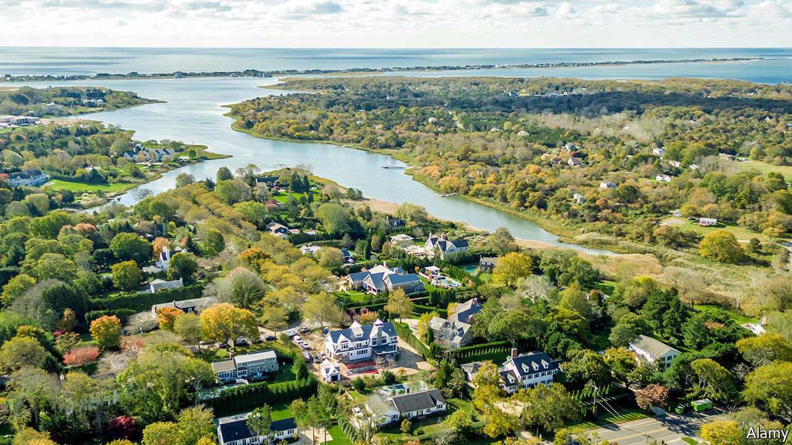

###### White shoes and slot machines

# Tribes of the Hamptons 

##### A proposed Native-American casino in the playground of affluent New York 

 

> Mar 13th 2021 


SAUNDERS, A HIGH-END real-estate firm, sold and rented $2.3bn worth of property in the Hamptons last year. Calvin Klein, the panjandrum of pants, sold his beach house there for $84.4m. Well-heeled New Yorkers go to the string of small towns on Long Island to throw frisbees on the beach and compare Picassos in their kitchens. They are not universally thrilled by the Shinnecock Nation’s plans to build a casino on their reservation in Southampton.


Jay Schneiderman, the town supervisor, is “totally opposed” to the planned site. “I cannot think of a worse location to build a casino,” he said. Congestion, already bad on the single road into the Hamptons, will get worse. Fred Thiele’s opposition was gentler. The state assemblyman acknowledges the Nation’s right to build on its sovereign land, but thinks it is nonetheless a bad idea. He expects opposition to grow, and not just among the gilded summer residents. The not-rich year-round residents, like teachers and landscapers, will oppose it, too. Some are worried about the environmental impact of the proposed casino. The tribe finds this thinking a bit precious. They are not the ones who built McMansions and a golf course on sacred land.


The existence of a 900-acre (364-hectare) Native American reservation 90 miles from Manhattan is not widely known. Though the folks who helicopter in to their summer homes may not realise it, the Shinnecocks have always been there. According to legend they are the children of a goddess who created land on the back of a giant turtle. The Nation now reckons building a casino on the turtle’s back would bring economic development.


It has good reason to think so. Median household income rose 34% between 1990 and 2010 for Native Americans living on reservations. Gaming, which expanded on reservations during this period, probably played a big role in that. About half of the 574 federally recognised tribes have some sort of gambling facility, ranging from casinos to bingo halls and slot machines at petrol stations.


“Gaming has become the economic lifeblood for many native and non-native communities,” says Jonodev Chaudhuri, former head of the National Indian Gaming Commission, a federal agency. It provides funding for social services and health programmes and has an economic impact beyond the reservation’s borders. A study by the American Gaming Association estimates that the positive economic impact is over $100bn a year (though, given the source, that is no great surprise).


In the wake of the epidemic, tribal leaders across the country are having discussions about diversifying income. Some are looking at renewable energy. The Shinnecock Nation has explored shellfish harvesting, smoke shops (tobacco sold on reservation land is exempt from state tax), a medical-cannabis outlet and roadside billboards. Casino money would help kick-start other ventures. “It takes money to make money,” reckons Miriam Jorgensen, of the University of Arizona’s Native Nations Institute. Most New Yorkers would at least agree with that. ■

