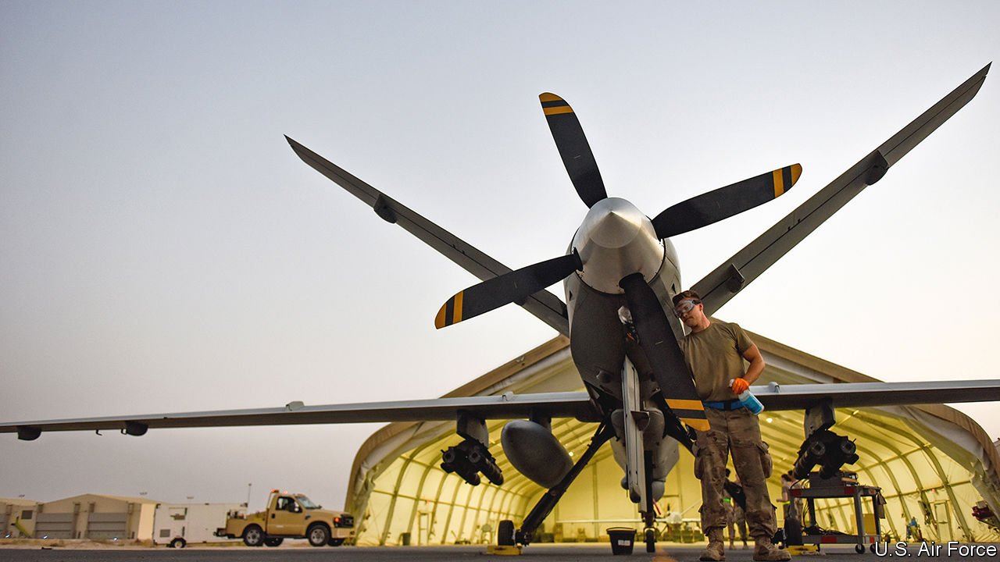

###### Plane expensive

# Why taking pilots out of planes has been more expensive than anticipated 

##### Contrary to expectations, America’s military drones have not saved money 

 

> Mar 13th 2021 


WHEN TOM CRUISE first appeared as Lieutenant Pete “Maverick” Mitchell, the rakish naval aviator of “Top Gun”, in 1986, the F-14 Tomcat fighter jet that he jinked around Soviet warplanes cost little over $50m. When he reappears in this year’s sequel, “Top Gun: Maverick”, he will fly a F/A-18E Super Hornet that approaches $60m. And if a geriatric Mr Cruise should be plucked from retirement to complete a trilogy, he might star in a stealthy F-35C that exceeds $90m.


The answer to such runaway costs was once thought to be drones. The idea was that remotely piloted aircraft were not just smaller and thus cheaper than their crewed equivalents, but that they would also allow air forces to save money by pruning personnel. But a new report by the Centre for Strategic and International Studies (CSIS), a think-tank in Washington, suggests that replacing humans with machines is not so simple.


Drones do require fewer people. Consider America’s fleet of planes for intelligence, surveillance and reconnaissance (ISR)—essentially, spotting things from the air. Crewed aircraft like the E-8, E-3 and RC-135 have average annual personnel costs of around $12m per plane. Though the comparison is imperfect, an MQ-9A Reaper, a drone that can perform similar missions, comes in at $3m per plane. That is not cheap—it is about the same as the personnel costs associated with an F-35 jet—but it is a saving.


The problem is that the savings tend to be wiped out because the drones rack up so many flying hours. Each of America’s Global Hawks, a surveillance drone that can conduct day-long sorties, flies an average of almost 1,400 hours annually—the equivalent of two months in the air. The U2 spy plane, a cold-war stalwart still in regular use, does less than half of that. During 2016-17, the last period for which complete figures are available, America’s ISR drones flew six times as many hours as every crewed ISR plane combined. Commanders’ “insatiable demand” for eyes in the sky has “prevented overall reductions in personnel and operating costs”, concludes CSIS.


That demand was evident in Iraq and Syria during the American-led war against Islamic State. A recent study by the RAND Corporation, another think-tank, notes that drones, by feeding back full-motion video, largely replaced the human targeters who in previous wars had been needed on the ground to guide air strikes. Yet precisely because drones generate so much intelligence, they require more humans to analyse it all—at least until artificial intelligence is good enough to do the job.


Doing away with the humans is hard. At present, keeping a single Predator or Reaper drone above a given target around the clock requires four drones, and thus 49 people in mission control and 59 more, most of them for maintenance, in the local “launch and recovery” area where the drone is operating. The current practice is to have one pilot per drone. Adopting a “one-to-many approach”, with a single pilot flying several aircraft at once, would be more efficient, notes CSIS—in other words, multi-taskers rather than mavericks.

