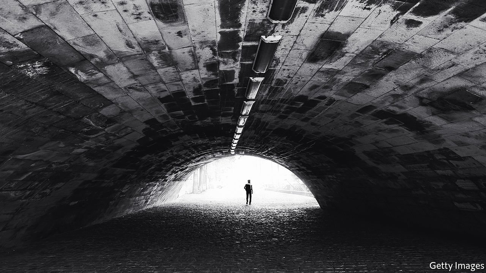

###### No man’s land

# A second novel from a bard of the refugee experience 

##### “The Committed” finds Viet Thanh Nguyen’s protagonist in Paris 

 

> Mar 20th 2021 


The Committed. By Viet Thanh Nguyen. Grove Press; 400 pages; $27. Corsair; £18.99


FEW CHARACTERS capture the bitterness of the refugee experience better than Vo Danh, the narrator of Viet Thanh Nguyen’s acclaimed debut novel “The Sympathizer” (published in 2015), who returns in this excoriating sequel. “Vo Danh” means anonymous or nameless in Vietnamese; in the madcap pages of “The Committed” he is simultaneously alive and dead, winding up as “a dead man whom others seem to think is still alive”.


Vo Danh’s tortured bid to resolve this existential plight takes him on a wild ride through the underworld of immigrant Paris in the aftermath of the Vietnam war, one of legions of “boat people” fleeing his homeland’s victorious communists. But Mr Nguyen’s follow-up to the book that won him a Pulitzer prize is less concerned with the charms of the City of Light than with the brutal legacy of colonialism.


This tall, nutty tale is almost a parody of the gangster genre (one character goes by the moniker “Le Cao Boi”). Vo Danh, psychologically shattered and prone to fits of weeping, falls in with a drug ring and begins selling hashish and heroin. Cartoonish tit-for-tat hostage-taking with a rival gang ensues. After the real-life drama of “The Sympathizer”, which covered the fall of Saigon and a botched counter-revolutionary plot by South Vietnamese officers, this story is smaller and seamier. It functions mainly as a pretext for the author’s zinging takedowns of the hypocrisy of imperial powers.


As a “man of two minds”, torn between France and Vietnam—and between old radical views and a growing repugnance for violence—Vo Danh is the ideal mouthpiece for Mr Nguyen’s indictment of both capitalism and communism. Each, he claims, winds up as a “Repressive State Apparatus”. In one of the most acerbic, amusing scenes, Vo Danh and the bouncer at the gang’s brothel, a Frenchman of Senegalese descent, bond over revolutionary theory, trading insights from Theodor Adorno, Aimé Césaire and especially Frantz Fanon’s “The Wretched of the Earth”.


Savage humour keeps the reader wincing yet entertained. The author eviscerates everything from Vietnamese culture to male objectification of women to the coloniser’s “beautiful battleship named La Mission Civilisatrice”. His greatest ire is reserved for the “endless, schmaltzy gratitude that host countries demanded of refugees who came from countries raped and bombed by the host countries”. The book is chock-full of one-liners: “Whitewashing the blood-soaked profits of colonisation was the only kind of laundering white men did with their own hands.”


In his first novel Mr Nguyen held a mirror up to America’s involvement in Vietnam. Now he has done something similar, if less convincingly, for the French. The Eiffel Tower is just a “Gallic erection”, Vo Danh concludes, “the French Empire simply exposing itself for all to see”. Not so different, in this disillusioned view, from the needle of the Washington Monument. ■

