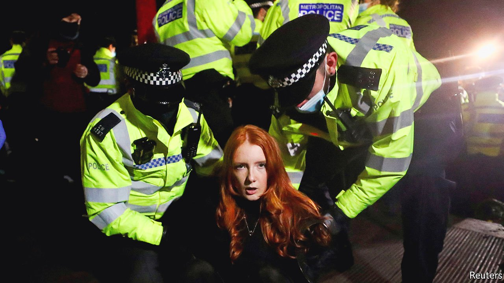

###### Protest

# Boris Johnson wants to restrict the right to protest 

##### An awkward coincidence draws attention to an illiberal bill 

 

> Mar 18th 2021 


FROM THE government’s point of view, the timing could not have been worse. On March 13th, hundreds of people gathered on Clapham Common in London to mourn Sarah Everard, a marketing executive, whose murder—for which a serving police officer has been charged—sparked an outpouring of anger and solidarity among women. The Metropolitan Police, which had declined to give the vigil’s organisers a permit on the grounds that it would breach lockdown rules, swooped in and arrested four people.


On March 16th, Parliament voted on the government’s Police, Crime, Sentencing and Courts bill—a rag-bag of measures which includes a clampdown on the right to protest. The government had hoped the bill would slide through Parliament unobserved, but the timing turned it into the centre of a controversy. As MPs debated the bill hundreds of protesters blocked Westminster Bridge to traffic.


The curbs on protest are aimed at movements which the government, dominated by social conservatives, abhors. Priti Patel, the home secretary, has described Extinction Rebellion (XR) as “eco-crusaders turned criminals” and protests organised by Black Lives Matter (BLM) as “dreadful”.


The government reckons that the Public Order Act 1986, drawn up in the era of trade-union marches, is ill-equipped to deal with these movements’ tactics. At present protests can be restricted only if they are likely to cause serious damage to property or disruption to communities. XR and BLM have a talent for spectacle. BLM’s supporters have removed and defaced statues. XR’s members climb on top of Tube trains and occupy bridges; music often forms part of their demonstrations. In November, Britain will host the COP26 international climate conference. Boris Johnson will not want to be upstaged by eco-warriors in front of a global audience.


If the bill is enacted, the maximum penalty for causing less than £5,000 worth of damage to a statue will rise from three months in jail to ten years. Protests can be restricted if the noise they create may be grounds for restricting them if it has a “relevant impact” on, or they cause “serious unease” to people nearby. Protests by a single person can be subject to restrictions.


Critics maintain that the rules amount to the silencing of protest. “If Priti Patel was heading up homeland security in the US in 1963, Martin Luther King would be whispering his ‘I Have A Dream’ speech in a parking lot outside DC, rather than relaying it to millions in front of the Lincoln Memorial,” says Raj Chada, a lawyer who specialises in protest law.


The proposals reveal the Conservative Party’s contradictions. Many MPs have defended freedom of speech, particularly that of right-leaning academics in left-wing universities. Yet they are more ambivalent about its cousin, freedom of assembly—and so are their voters. A YouGov poll found that 43% of Britons thought the Clapham vigil should not have gone ahead; 40% thought it should have. Among Tory voters the figures were 61% to 28%. “The problem is our Conservative coalition now includes a lot of working people,” says a Tory MP. “It’s not that they are philosophical collectivist authoritarians, aka fascists; it’s just that they are not putting up with this nonsense, and then that gets reflected in the policies.” Taking a tough line on law and order has the happy by-product of sowing divisions within Labour. The party’s membership tends to like protests. Its voters, a more traditional bunch, do not. 


There is some disquiet. In the second-reading debate Theresa May, a former hardline home secretary and prime minister, said that freedom depends on knowing the fine line between “popular and populist”. But the bill passed by a majority of 96.


Still, Britons are unlikely to put down their placards. The bill has succeeded in uniting disparate protest groups. A statement signed by 99 branches of XR, BLM and other groups pledged to “continue to unite and fight” against the government. The protests may have also made many more voters a little more aware of the importance of the liberties that the bill undermines. And will XR still descend on COP26 come November? “You bet,” says an XR spokesperson. ■

