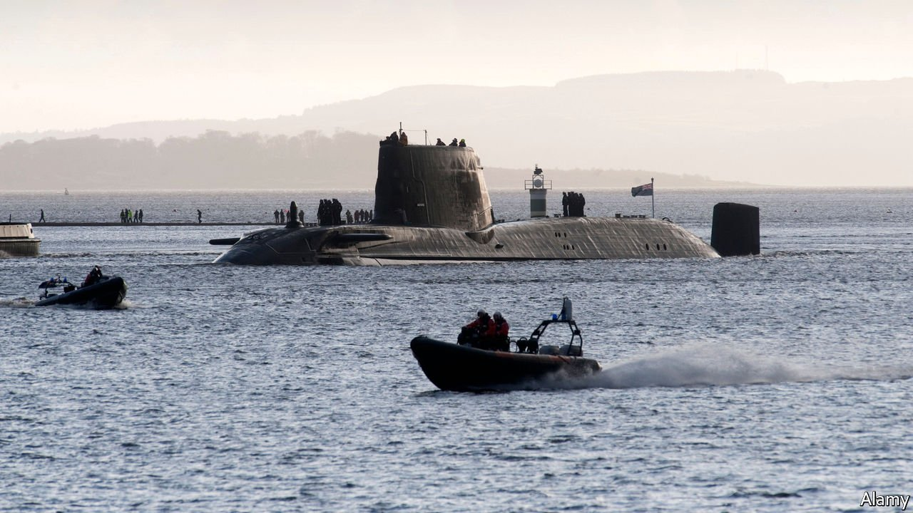
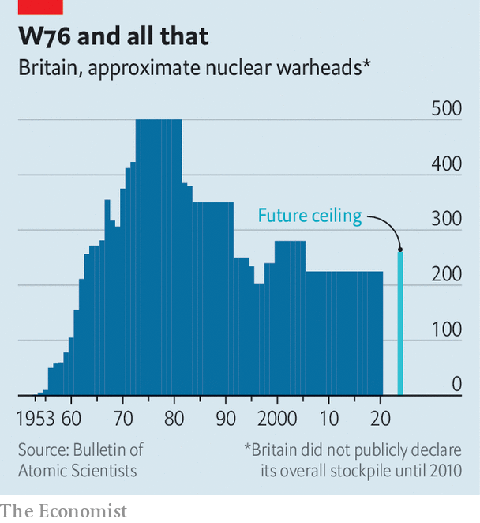

###### Stocking up

# Britain is adding nukes for the first time since the cold war 

##### Officials point to a growing nuclear threat from Russia and other rivals 

 

> Mar 18th 2021 


FOR DECADES Britain has boasted of its diminutive nuclear status. Of the five nuclear-armed powers recognised by the  (NPT), Britain’s arsenal is the smallest and the only one with a single means of delivery—submarines. Yet buried in its foreign and defence policy review on March 16th was a striking announcement: for the first time since the cold war, its stockpile will grow.


Successive British governments pruned the arsenal by more than half between the 1980s and 2000s, eager to show progress towards disarmament (see chart). In 2010 the government declared that Britain had fewer than 225 warheads, and would cut that to below 180 by the middle of this decade—a goal that was reaffirmed in 2015. That was thought sufficient to inflict unacceptable damage on Russia, the country’s main adversary.

 


Now, in response to “technological and doctrinal threats”, Britain is to raise the ceiling on its stockpile to 260 warheads. It will also stop publishing figures for the numbers of missiles and warheads carried aboard each submarine, to “complicate the calculations of potential aggressors”.


In theory, more Chinese warheads or better Russian ones ought not to make any difference to Britain’s nuclear needs. Britain keeps a submarine at sea at all times, in a practice known as continuous-at-sea deterrent, or CASD. The advantage of having your nuclear weapons hidden in the ocean, rather than on land, is that they are at little risk of being taken out by enemy ones, no matter how numerous or sophisticated those might be.


So why more warheads? One possibility is that Britain is worried about future improvements in Russian or Chinese missile defences that would mean fewer warheads getting through, thus requiring more to be fired in the first place to inflict the same level of damage. Another rationale is that Britain may wish to put more than one submarine to sea in future, hedging against the risk of a breakthrough in technology for anti-submarine warfare, or ensuring that it could target Russia and China, or North Korea, at the same time.


Another explanation might be that Russia’s nuclear posture has shifted over the past decade. Heather Williams of King’s College London points out that Russia is developing dual-capable weapons—missiles that can carry conventional or nuclear warheads—and lowering its nuclear threshold, meaning that it might use lower-yield, battlefield nuclear weapons earlier in a conflict.


To retaliate by destroying Moscow would be disproportionate. But if Britain, which commits its nuclear weapons to the defence of NATO, wanted to respond in kind—the yield of its own warheads, a variant of America’s W76, can be reduced—it would want to be sure of having sufficient remaining warheads for a subsequent and larger nuclear exchange.


Whatever the precise reasoning, the timing could hardly be worse. Britain’s move has prompted bafflement among most nuclear experts. It is unlikely to do much to boost deterrence, while doing real diplomatic harm. The NPT’s five-yearly review conference is five months away and the mood is mutinous. Many non-nuclear states are furious that nuclear-armed ones are doing little to slash their arsenals. China, India, Pakistan and North Korea have all been growing their forces.


The worry is that trust in the NPT may ebb away, weakening non-proliferation efforts. In recent decades, Britain has been a “leader in nuclear disarmament”, says Dr Williams. Its decision to change course after decades of steady reductions is a sign of the wider nuclear gloom.■

