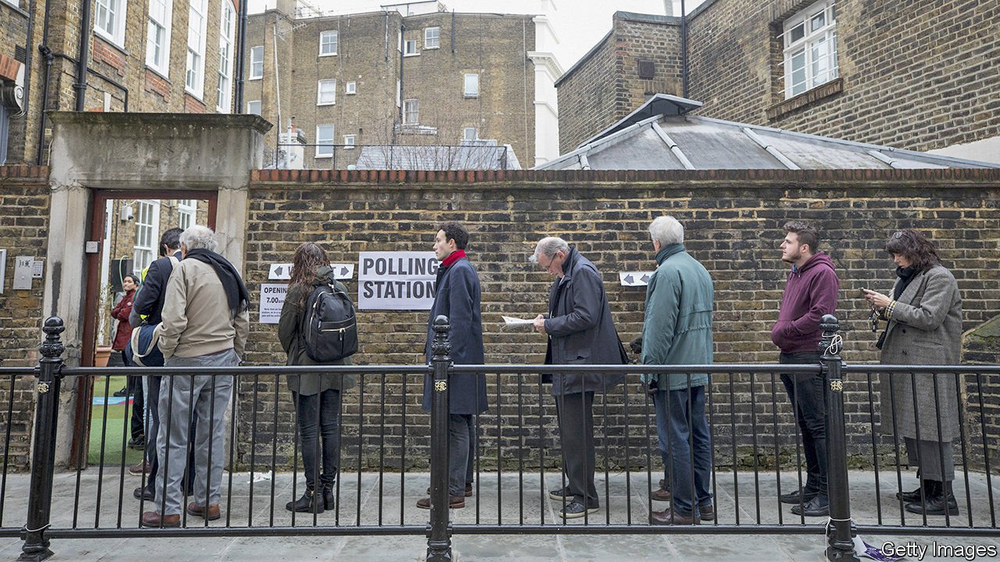
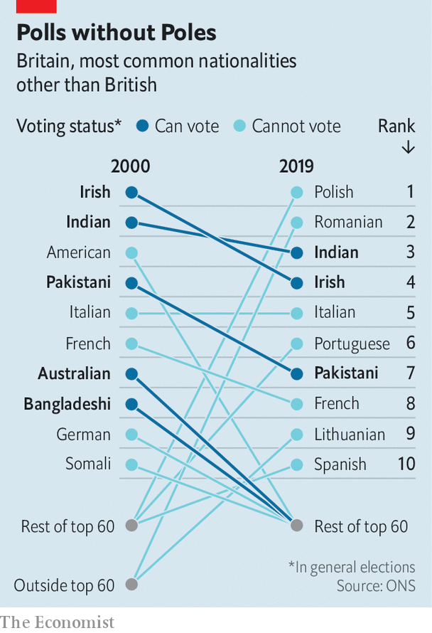

###### Ballot boxing

# Britain struggles to define who should get the vote 

##### Brexit could make the franchise even more baffling 

 

> Mar 20th 2021 


COUNCIL ELECTIONS rarely generate much excitement. Only about a third of those eligible to vote bother to do so. Yet an online rally ahead of this year’s local elections in May pulled in scores of enthusiastic 20-somethings. “This is so exciting,” boomed Antonia Boorman, one of the organisers. “I wish we could have some confetti.” The hoopla was intended to encourage citizens of other European countries who live in Britain to register for the ballot. “At the moment you can vote,” she reminded them. “It might be the last chance.”


Britain’s rules on political participation are, as Sir John Curtice, an elections expert at Strathclyde University, puts it, “all over the place”. Some, but not all, non-resident citizens get a vote in general elections, as do some, but not all, non-citizen residents.


As is often the case in Britain, this owes more to history than to logic. Britain’s empire explains the first exception to the citizenship rule. Parliament restricted the right of former imperial subjects to move to Britain following waves of immigration after the second world war, but did not alter the franchise, says Ruvi Ziegler of Reading University. As a result, citizens of any of the 53 mostly ex-colonies in the Commonwealth have the vote, so long as they are resident in Britain. Citizens of most other countries—like the 130,000-odd Americans in Britain—cannot vote.

 


The roughly 320,000 Irish citizens who live in Britain also qualify. This anomaly dates back to Irish secession in 1922. When Westminster set in law the constitutional position of the Irish republic in 1949, the government decided that giving the Irish the vote was the easiest option. “I do not pretend that the solution at which we arrived is completely logical,” conceded Clement Attlee, the prime minister.


Then there are non-resident citizens. British expats may vote in general elections, but only for the first 15 years they live abroad. The government accepts this time limit is arbitrary and plans to remove it.


Brexit will make things more complicated. All EU citizens have the right to vote in local and European (but not national) elections in whatever European country they live, regardless of nationality. For now this remains true for the 4m or so EU citizens in Britain, since the upcoming local elections were originally due to take place last year, when EU rules still applied for a “transition period”. Things may soon become less clear. Europeans can opt to apply for British citizenship, so long as they have lived in the country for six years and been granted permanent residency, guaranteeing them a vote in general as well as local elections. But many balk at the cost, which the Home Office has hiked from £200 in 2005 to £1,330.


Scotland and Wales, which have the power to set their own electoral rules, took the chance to simplify their franchises last year. All long-term residents, regardless of nationality, will have a vote in elections for local councillors and for the Scottish Parliament and Welsh Assembly. There are few signs that politicians at Westminster will take such a consistent approach. Having failed to persuade the EU to include reciprocal voting rights for expats in the Brexit deal, they have struck bilateral agreements guaranteeing the local-government franchise with Poland, Spain, Portugal and Luxembourg, raising the prospect that the roughly 800,000 Polish nationals in Britain might be able to choose their councillors, but not, for instance, the 300,000 or so Italians.


Cypriot and Maltese residents would get the vote anyway, as Commonwealth members, as of course would the Irish. “It’s arbitrary and deeply unfair,” says Maike Bohn of the 3 Million, a lobby group for EU citizens in Britain. That may be right, but the history of the franchise suggests that MPs are unlikely to go for consistency when they could plump for fudge. ■


For more coverage of matters relating to Brexit, visit our 

