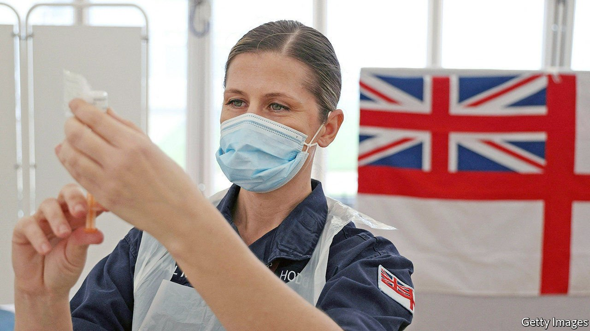

###### Covid-19

# Britain’s vaccine roll-out approaches a speed bump 

##### But will hopefully only reach it after all priority groups have received their first jab 

 

> Mar 20th 2021 


ON MARCH 17TH, 433,320 Britons received their first dose of covid-19 vaccine, nearly twice as many as the week before, taking the total to more than 25m, or nearly half of Britain’s adult population. It is the sort of news to which Britons are now accustomed.


With the pace of vaccination expected to accelerate over the next fortnight, the government is rushing towards its target of offering first doses to all those in the top nine priority cohorts—a group of 32m, which includes all over the age of 50—by the middle of April. That would be sufficient to prevent the vast majority of deaths. Yet in a rare piece of vaccine-related bad news, it emerged that Britain may limp over the line.


On the day it hit 25m first doses, the National Health Service (NHS) wrote to officials in England warning supply would be “significantly constrained” in the week beginning March 29th, and that things would be tight for a month. Vaccination centres were told not to book in anyone younger than 50 in April.


“We’re now getting into a world where second doses are going to chew into the progress we can make,” notes a scientist advising the government. Vaccination began on December 8th, but it was not until January that the roll-out really got going. Since the maximum gap between doses is three months, a rise in supply would have been required to keep first doses at the same pace in April.


This expected hurdle has been joined by unexpected supply problems. Britain is yet to receive doses from Moderna, and is yet to approve Novavax or Johnson &amp; Johnson’s vaccines, with their doses due later in the year. According to a senior NHS official, the plan was to use Pfizer mainly for second doses in April. The issue is that the health service will have fewer AstraZeneca doses than expected, reportedly because of a delayed consignment from India’s Serum Institute.


The health department, which is now home to the taskforce in charge of supply, insists that it will nevertheless meet its target of offering all British adults a vaccine by the end of July. Ministers will be desperate that things do not slip any further, with the roll-out a rare triumph in Britain’s covid-19 response. That may provide some solace to 40-somethings eager for a needle in their arm.


Dig deeper


All our stories relating to the pandemic and the vaccines can be found on our . You can also listen to , our new podcast on the race between injections and infections, and find trackers showing ,  and the virus’s spread across  and .

