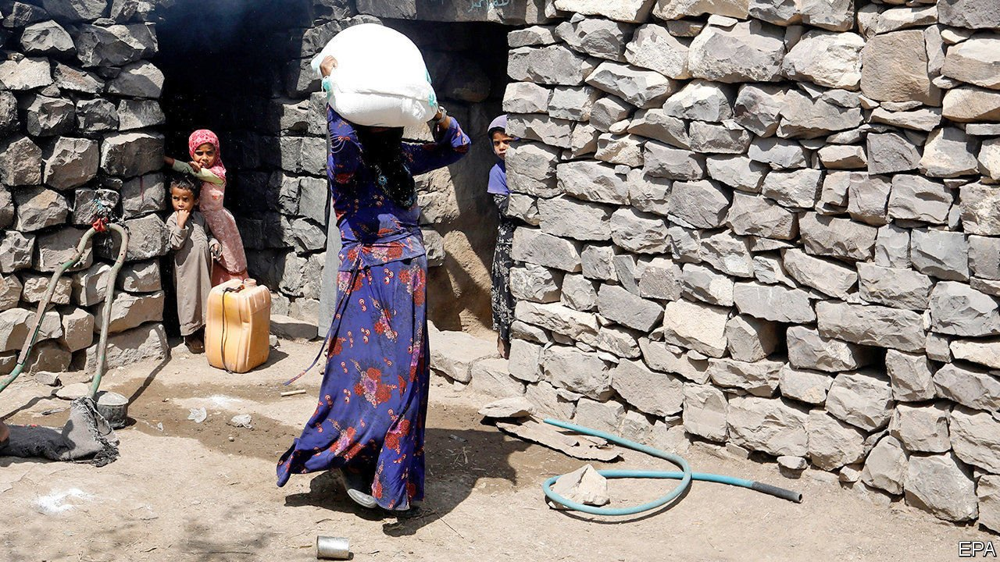

###### Chop, chop

# Cuts in Britain’s aid budget will be even harsher than expected 

##### The government says it’s a temporary measure, but that is hard to believe 

 

> Mar 20th 2021 


SHOCK RATHER THAN awe reverberated around Britain’s aid circles when a leaked government draft suggested that the government would give Yemen, site of today’s worst humanitarian disaster, half of what it got last year. Other countries in dire straits that would be even more drastically short-changed include Lebanon, Libya, Somalia, South Sudan and Syria. The cuts envisaged in such places are much deeper than those required by the government’s decision last year to spend 0.5% of gross national income (GNI) rather than the 0.7% enshrined in law.


In its review of foreign policy and security policy, published on March 16th, the government insists it will restore the 0.7% figure “when the fiscal situation allows”. But Andrew Mitchell, a former Tory aid minister, who has vigorously opposed the cuts, says that the likelihood of this government again fulfilling the 0.7% pledge once it has been dropped is “for the birds”.


One reason for the savagery of the cuts is that around two-thirds of the roughly £15bn ($21bn) spent last year on aid has already been promised to multilateral agencies such as those under the umbrella of the UN, the European Union and the World Bank. Breaking such pledges is legally tricky. On top of that, the impact of covid-19 on the economy would knock about £1.5bn off the aid budget, even if it still got 0.7% of GDP. So an array of projects that Britain has been funding bilaterally, especially in Africa, must take a disproportionate share of the chop. 


It is unclear how the cuts are being allocated. Aid specialists say that the recent merger of the Foreign Office with the Department for International Development has caused administrative chaos. Under the new mega-ministry, ambassadors are now in charge of dispensing the aid—and may simply be told they will have to work out how to dish it out from a smaller pocket.


Another Conservative former aid minister, Rory Stewart, who now teaches at Yale University, says the review shows that Britain is “in effect disengaging from many of our commitments in the Middle East and Africa, especially in areas of conflict”. The new policy is driven, he maintains, “by Brexiteers who don’t want to be involved in those kinds of countries.”

