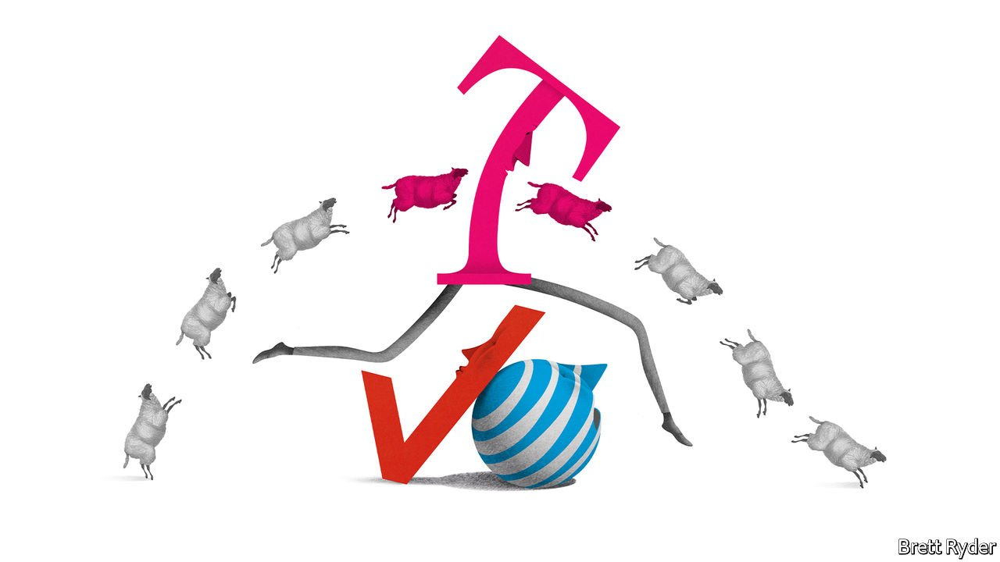

###### Schumpeter

# America’s drowsy telecom giants face a 5G wake-up call 

##### T-Mobile is leaving them standing 

 

> Mar 18th 2021 


FOR AN UPBEAT commentary on America’s telecoms market speak to Jonathan Chaplin of New Street Research, a boutique firm of financial analysts. He extols the virtues of the industry, at least compared with its “boring as hell” European counterpart. He relishes the returns and cash that it generates, much of which come pouring out in the form of dividends. Yet for a more sober assessment, you can also listen to the four-week-old baby nestled in Mr Chaplin’s arms. As the conversation with his father starts, Eiger (“after the mountain”) is restless and vocal. By the time the conversation turns to Verizon and AT&amp;T, the industry’s two lumbering behemoths, the boy is soundly asleep.


The two firms have long had that effect on people—and on each other. For companies at what is supposed to be the beating heart of the wireless revolution, “dumb and dumber”, as the former boss of T-Mobile, their bitter rival, mockingly dubbed them, make a snooze-inducing pair.


That is why their huge bets on superfast 5G spectrum in a recent auction ($52.9bn by Verizon, and $27.4bn by AT&amp;T) has generated a lot of buzz. The C-Band radio frequencies they bought, clustered between 3-4GHz, offer mobile connectivity about ten times quicker than 4G. The auction has turned America’s “race for 5G” from sloganeering into the real thing. Yet for all their money-slinging, neither firm appears able to stem the advance of T-Mobile. Moreover, they remain at risk of more profound disruption, both from scrappy new competitors and big tech. 


Their complacency was on display as all three companies unveiled their 5G strategies on consecutive days from March 10th to 12th. The body language was as revealing as the prepared remarks. Hans Vestburg, the Swedish boss of Verizon, wore a double-breasted suit as if to reiterate that his firm remains the industry’s pro-business, high-margin crème de la crème, claiming he was “thrilled” to have come out on top in the richest auction in the industry’s history. AT&amp;T’s dressed-down John Stankey took a more subdued approach, appearing less excited about 5G than his growth plans for HBO Max, the firm’s streaming service on which he has staked most of his future.


Mike Sievert, boss of T-Mobile, who took over from lion-maned John Legere last year, displayed some of his predecessor’s cockiness, albeit behind a Tigger-like grin. Yet he has earned it. Thanks to 2.5GHz radio-frequency spectrum obtained from T-Mobile’s merger with Sprint last year, as well as a small chunk acquired in the C-Band auction, the company will have substantially greater 5G coverage than both Verizon and AT&amp;T, and may be up to two years ahead of them in deploying it to vast numbers of customers. As Mr Chaplin says, the advantage T-Mobile enjoys in the 5G era may be akin to that which Verizon and AT&amp;T had through previous wireless iterations up to and including 4G. He expects it to last for at least the next five years.


T-Mobile has been one of the great turnaround stories in American business and again it has upgraded its forecasts. Though it borrowed aggressively to acquire Sprint, it claims that higher-than-expected cost savings from the combination will help it fund its 5G expansion plans, as well as enabling it to return up to $60bn to shareholders in 2023-25. Verizon and AT&amp;T have less flexibility. The C-Band auction has increased balance-sheet strains on both firms (making them, ignominiously, America’s two biggest borrowers in the corporate-bond market), while their hefty dividends provide further drag. Between them they need to spend an extra $16bn-18bn to deploy the spectrum they acquired at auction. AT&amp;T in particular appears to be constrained in its 5G ambitions unless it can flog more of its WarnerMedia assets—or cut the dividend.


Further breathing down their necks is Dish, a satellite provider that promises to build a new 5G network from scratch in America starting this year. It will deploy OpenRAN technology, a non-proprietary architecture that combines off-the-shelf telecoms hardware with lots of computer code, enabling a do-it-yourself approach. It will cost at least $10bn, part of which Dish saved by sitting out the C-Band auction. But Mr Chaplin reckons that once its network is built, it will cost substantially less to operate than those of Verizon and AT&amp;T, eventually giving it an opportunity to undercut them. He calls this the “Dish bomb”. It is still years away. But it is coming. 


When it explodes, neither Verizon nor AT&amp;T will be able to claim that they have been caught unawares. For years, the firms have talked about the seismic implications of 5G, though mostly as a marketing ploy to disguise their own declining growth, rather than as an urgent call to action. Some sceptics still doubt that customers want the high speeds that it offers. But they are fewer in number these days. The covid-19 pandemic has highlighted how vital connectivity has become in everything from working from home to home-schooling, downloading and uploading videos and shopping. This extends to wireless communication.

Up the North Face


But it is businesses, rather than consumers, where the excitement is most immediately palpable. Besides the potential of 5G for telesurgery, self-driving cars, robotics and so on, other uses of artificial intelligence—video surveillance employing facial recognition, for instance—require instantaneous data processing. For this, companies will need local data centres connected via superfast 5G as well as remote clouds for storing data. Verizon and AT&amp;T, whose corporate relationships remain important parts of their businesses, realise this. But so do cloud providers like Amazon, Microsoft and Google, who are not keen to cede control of the data-handling business. If these tech giants muscle into telecoms, the race for 5G may quickly become supersonic. By then, a less-little Eiger will no doubt find it scintillating. Whether Verizon and AT&amp;T will relish the experience is another matter. ■

