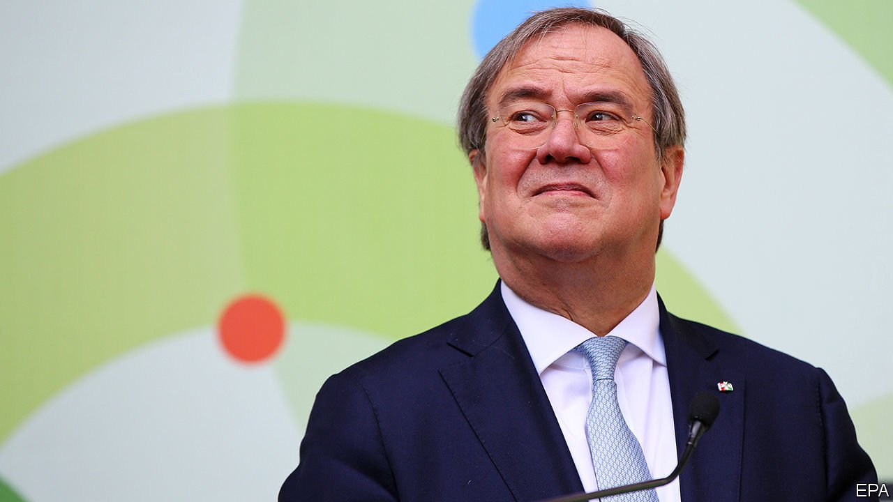
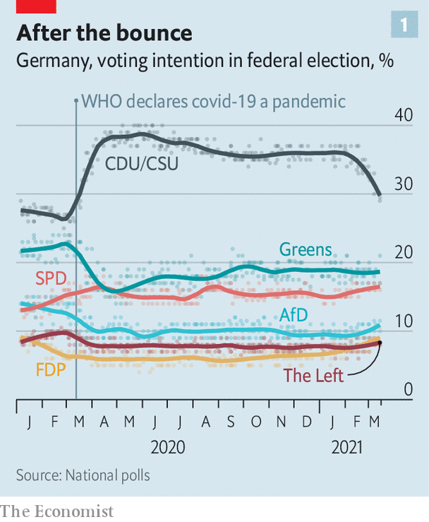
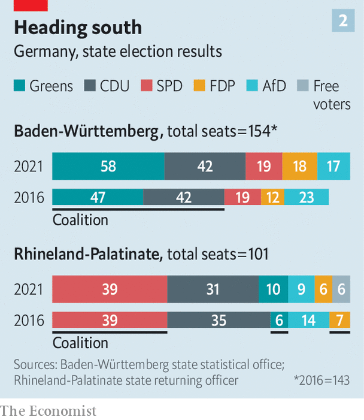

###### The sleepwalker

# Germany’s Christian Democrats are losing patience with their leader 

##### Armin Laschet has made a dismal start 

 

> Mar 18th 2021 


THE EXCUSES were plentiful as Germany’s centre-right Christian Democrats (CDU) slumped to two of their worst-ever state-election defeats on March 14th. The party was up against popular incumbents in Green-led Baden-Württemberg and in Rhineland-Palatinate, run by the Social Democrats (SPD). The CDU’s state chapters had chosen weak candidates. And anyway Armin Laschet (pictured), the party’s leader, had said before the votes that state elections have their own character. National politics is another matter entirely.


All true. Yet there is no disguising the malaise that has descended on Germany’s ruling party. Bad enough on their own, the election results contributed to a broader sense that the CDU has lost its way. Six months ahead of a general election after which Angela Merkel, the chancellor, will step down, the party that has run Germany for over 15 years is suddenly confronting the prospect that it could leave government at the same time that she does.


Long bereft of ideas, for most of the Merkel era the CDU has relied on two other qualities for its electoral appeal. One is competence. The four governments led by Mrs Merkel brought Germany through a series of crises barely scarred. Unemployment and debt remained low, and the country’s export-led growth model looked robust. The state largely passed tricky tests such as a huge influx of migrants in 2015-16. The bland managerialism of the CDU, and Mrs Merkel in particular, gave voters permission to switch off from politics.

 


The government’s steady handling of the pandemic’s first phase reinforced that idea. Mrs Merkel’s ratings, and those of her party, soared, even as its SPD coalition partner flatlined (see chart 1). Yet the situation is becoming rockier as Germany enters its third covid-19 wave. Vaccination was slow even before the controversial decision on March 15th to suspend the AstraZeneca jab. A plan to ease the lockdown settled in early March, even as recorded cases were rising, is in disarray; having just reopened, parts of Germany are now shutting down yet again. The despair of customer-facing businesses has been compounded by bureaucratic hold-ups in distributing aid. 


On top of that a series of scandals has centred on MPs from the CDU and the Christian Social Union (CSU), its Bavarian sister party, who lined their pockets through mask-procurement deals. It has left a nasty stench, has punctured party morale, and may have further to run. Fully 88% of voters are dissatisfied with the vaccine roll-out. The number who say the CDU/CSU is best placed to manage Germany’s problems has plummeted. In a matter of weeks the party’s “covid bonus” in the polls has almost evaporated. 


The Merkel era’s other great appeal to voters was its aura of inevitability. The CDU/CSU has led German coalition governments for 51 of the republic’s 71 post-war years, retaining support even as political fragmentation ate away at the SPD, its traditional rival. Germany had long seemed on course for a CDU/CSU-led coalition with the Greens after September’s election. But as the people have drifted away from what CDU stalwarts call “the last people’s party”, the notion of a government without the conservatives has gained traction. A “traffic-light” coalition of the SPD, Greens and the liberal Free Democrats (FDP)—of the sort likely to stay in office in Rhineland-Palatinate—is the talk of the day, though it remains unlikely at federal level. But once the party stops looking invincible, more voters will be tempted by alternatives.


Not much of this is directly the fault of Mr Laschet, who has been in charge of the CDU for scarcely two months. His immediate priority was to unite the wings of a party bitterly divided between his centrism and the more robust conservatism of Friedrich Merz, whom he narrowly defeated for the leadership in January. But so far Mr Laschet has signally failed to provide the leadership so many in his party crave. He was slow to respond to the corruption scandals. He brushed off complaints that he was missing in action after the state elections with a tin-eared argument that it was the job of the CDU secretary-general to respond. And though his brand of amiable moderation chimes with the public mood, he has shown no interest in offering a vision for post-Merkel Germany. “The only explanation I can see is that he doesn’t have any ideas,” says one despairing CDU MP. Even supporters profess exasperation. 

 


At some point in the seven weeks between Easter and Pentecost (these are Christian Democrats, after all) Mr Laschet and Markus Söder, the CSU leader and Bavaria’s premier, will decide which of them is to lead the two parties into the election. Mr Söder is a savvy politician who has built a national reputation while insisting his ambitions do not run beyond his state’s borders. Yet although just 16% of CDU voters back Mr Laschet for the candidacy, even frustrated CDU MPs think their leader will probably get the nod. Some quietly wonder why Mr Söder would want to swap a comfortable perch in Munich for the stress of leading a demoralised party into an uncertain election. 


Indeed, the last campaign of the Merkel era promises to be its liveliest. The Greens, almost certain to enter government in one coalition or another, are fizzing with ideas. The FDP, enjoying a modest recovery, has finally found a distinctive voice in the pandemic. Even the long moribund SPD has rediscovered a taste for power, animated by the prospect of booting the conservatives into opposition. Traditional voter blocs have broken down. “Even if we write the best manifesto in the world, it won’t be easy for us,” says Katja Leikert, a CDU MP. 


Yet for all its woes, the CDU/CSU is still odds-on to lead Germany’s next government. Optimists tell a story of a summer campaign in which a reunified ruling party exploits a public mood buoyed by a belatedly successful vaccination campaign and a rebounding economy. Mr Laschet remains the favourite to succeed Mrs Merkel at the helm of the EU’s largest country. But his chances would be that much better if he could explain why he deserves the job. ■

