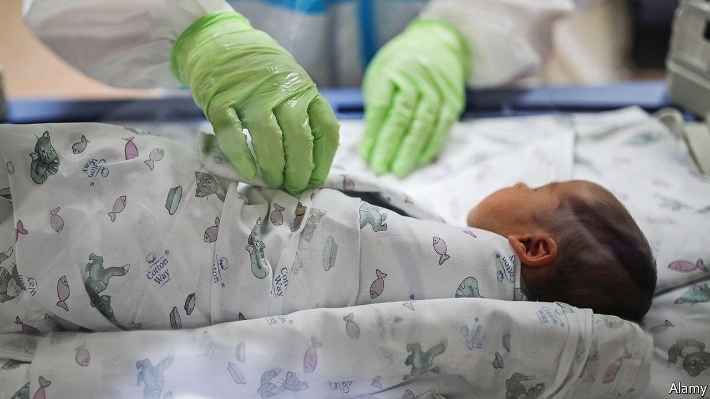

###### Panic womb

# Russia’s liberal surrogacy rules are under threat 

##### Conservatives fret that surrogate parents may be gay or foreign 

 

> Mar 18th 2021 


RUSSIA IS ONE of the few places where commercial surrogacy is entirely legal (along with Ukraine, Georgia and some American states). Foreigners can pay a Russian woman for the use of her womb. Each year Russian surrogate mothers give birth to hundreds, perhaps thousands, of babies (estimates vary wildly). And in contrast to America, the service is cheap. Nine months of gestation plus labour can be bought for around $20,000. But in the next few months or so, Russia’s parliament looks set to ban the practice, at least if the customers are foreign. “Russia is not an incubator,” says Irina Yarovaya, a deputy speaker of the Duma, Russia’s parliament.


The apparent trigger for this proposed change was the death of a baby boy who was born to a surrogate mother on behalf of a Filipino family last year. The baby was nursed in a rented flat outside Moscow and died while recovering from an operation on his brain. When the police entered the flat, they found three other babies being nursed for different Filipino families. These included three-month-old twins belonging to Fredenil Hernaez Castro, a member of the Philippines’ parliament.


The police decided that they had stumbled upon a trafficking ring. Doctors who worked for the fertility clinics where the children had been born were arrested. So were a translator and a courier who had organised some of the documents. A lawyer who had made the arrangements was charged with child-trafficking but left the country before being arrested. The babies were sent to an orphanage, instead of their lawful Filipino parents.


Russian television channels launched a campaign of alarm, not about cops putting babies in orphanages, but about surrogacy itself. They claimed that certain reproductive specialists were in fact criminal outfits, bent on stealing embryos and faking documents. They warned that surrogate children might be brought up by same-sex couples.


A government investigative committee seized medical records from reproductive clinics in Moscow. It claimed that surrogacy services could legally be provided only to single women and heterosexual couples. (There is no such rule.) The authorities threatened to prosecute single men who have hired surrogates, and to take away their children. Several gay men fled Russia to avoid losing their children and their freedom.


Many countries ban surrogacy because they fear that poor women will be exploited—that they are not capable of deciding for themselves whether the fee is worth the labour. Some activists liken surrogacy to prostitution (which they also think should be illegal). In Russia, by contrast, pro-government conservatives see the debate as an opportunity to bash gays. “If we do not engage in sexual education of our children, then the LGBT sex-instructors of NATO will do it for us,” said one talk-show guest recently. (NATO, a western alliance that Russia views with suspicion, has nothing to do with sex education in schools.)


Russia’s president, Vladimir Putin, often vows to defend traditional family values. It is a potent rallying cry. Last year he held a referendum to change the constitution. The main aim was to allow himself to stay in power beyond 2024, but it was bundled with dozens of populist measures, including a constitutional ban on gay marriage. “As far as ‘parent number one’ and ‘parent number two’ go…as long as I’m president this will not happen. There will be dad and mum,” said Mr Putin. Voters had to say yes or no to the whole constitutional package. It passed easily. ■

