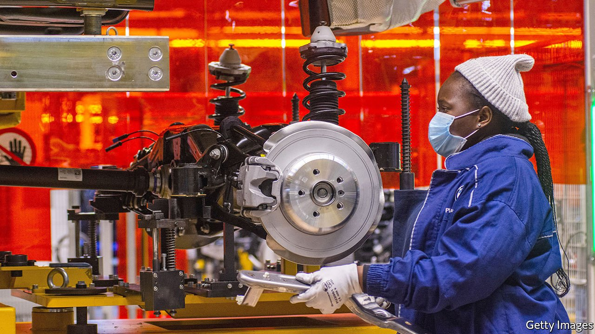

###### Frontier factories

# The right way for Africa to promote manufacturing 

##### The prospects are better than previously thought 

 

> Mar 20th 2021 


FEW BUILDINGS symbolise the rise and fall of manufacturing in South Africa better than the old General Motors plant in Gqeberha (previously Port Elizabeth). During apartheid the factory was sheltered from international competition by sanctions and tariffs. Now its vast silvered assembly halls stand bare. It was closed in 2017, an emblem of South Africa’s car industry, which shed almost one in four jobs between 2009 and 2017. That is typical of a wider decline of manufacturing across the continent. In 1975-2014 manufacturing’s share of GDP in sub-Saharan Africa fell from 19% to 11%.


This collapse has plenty of causes. In countries such as Zambia, firms were nationalised and run into the ground by bureaucrats. In resource-rich places such as Nigeria exports of oil or other commodities led to an overvalued local currency, making it cheaper to import things than make them. As much of the continent opened up to imports in the 1990s, manufacturers struggled to hold their own against hyper-competitive Chinese firms with the scale to drive down costs.


In 2015 Dani Rodrik, an economist at Harvard, wrote of “premature deindustrialisation” in Africa. The continent seemed to be missing out on an important means of boosting productivity and creating jobs. The ladder that hundreds of millions of Asians had climbed up out of poverty had been taken away just as Africans were putting a foot on the first rung, some feared. Since by around 2035 there will be more young people joining the workforce in Africa than in the rest of the world combined, it matters whether this idea is right.


Thankfully, newer data suggest it is not. Sub-Saharan Africa’s manufacturing slump bottomed out in the 2000s. Since 2010 the number of workers in African factories has . So has factory output. Worries about deindustrialisation now look as if they are premature.


Many African leaders are eager to promote manufacturing, partly to avoid dependence on volatile commodities and partly because their countries have found it so frustratingly hard to import medical supplies quickly enough during the pandemic. To get the best results, they should start by learning from past failures. That means avoiding nationalising companies, subsidising national champions or raising import barriers to cosset home-grown industries. Many leaders are wisely embracing a continent-wide free-trade agreement that came into force this year. It offers hope: a mattress-maker in landlocked Rwanda is more likely to grow by winning orders in next-door Congo than in far-off Japan.


Yet it is not enough for African governments to do no harm. Companies also need reliable power, educated workers and good infrastructure to improve productivity. Since hard choices are inevitable, governments should pick investments that diversify away from commodities. This would mean building ports with roads to industrial areas rather than to mines in the middle of nowhere. Some governments are giving tax incentives to companies in a bid to break into prestigious industries like carmaking. They might do better to focus on easier targets, such as processing food for local stomachs, or making dull products like packaging for neighbouring countries.


If infrastructure and governance improve, more firms may choose to build factories in Africa to make components for global supply chains using parts from local suppliers. Industrialisation in Africa will not look the same as it did in Asia. Circumstances are different, and technology has moved on. But the notion that Africa has missed out on manufacturing seems to be mistaken. With better policies, its firms can find a path. ■

