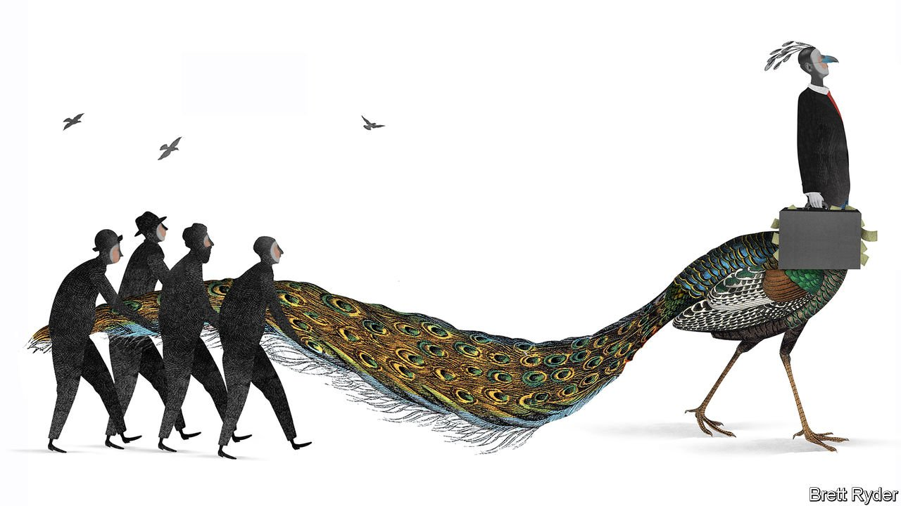
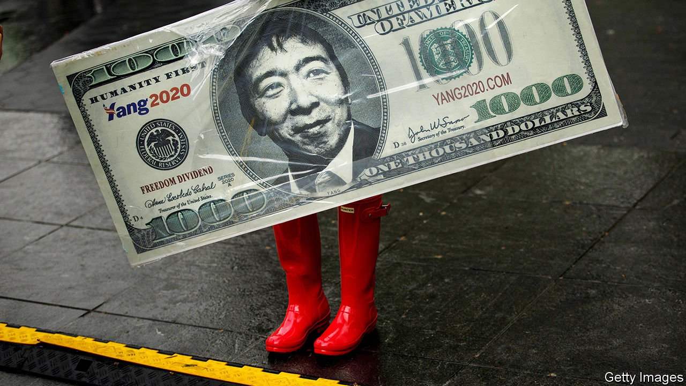
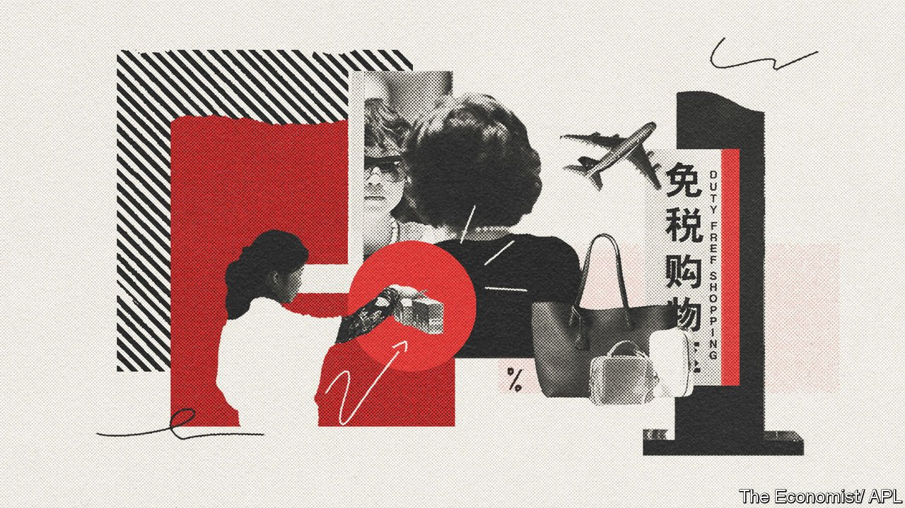

###### On the Sussexes, language, McKinsey, UBI, duty free, beards

# Letters to the editor 

##### A selection of correspondence 

 

> Mar 20th 2021 


That interview


Your report on Oprah Winfrey’s interview with Meghan and Harry made the assertion that “Being a royal is about serving an institution. It does not work for those who crave individual attention” (“”, March 13th). The queen and the Duchess of Cambridge (Kate Middleton) were held up as examples of royals who have excelled at suppressing their opinions for the sake of the household. Princess Diana and Meghan were accused of failing to understand the “job”, unwilling to forgo their individuality for the greater good of the country.


It appears that The Economist applies these rigid expectations of selflessness only on female royals. Lest we forget, Prince Charles spectacularly failed to “subsume individual needs in those of the institution” when he had an affair with Camilla Parker Bowles. It seems that while princes can be acceptably divisive, it is up to the ladies to placate the public.


BETH SHAFFER-MCCARTHY

Naperville, Illinois


Most media missed the contradiction in the Sussexes interview with Oprah. The transcript shows that Meghan implied the notorious skin-tone question was asked about their son when she was pregnant. Harry, on the other hand, quite clearly says the conversation about “what will the kids look like” happened “right at the beginning”. This makes a difference, from what might have been an attack on a mother and her unborn child, to an impolite and insensitive question in what might have been a wide-ranging chat about married life.


KIERAN SHEEDY

London


It is quite unfair to say that Queen Elizabeth “has not said a single interesting thing in public in her 70 years on the throne”. I can think of several. In particular, in a message to the American people shortly after the terrorist attacks of September 11th 2001 she said, very memorably, that grief is the price we pay for love.


BILL KNIGHT

London

The misfortune of others


I read the letter from Zsuzsanna Schiff about the lack of an English equivalent of Schadenfreude (, March 6th). May I introduce the word epicaricacy to her. It is rarely used, but I hope this revelation does not destroy her faith in the “compassionate nature” of English people.


JAMES WIGMORE

Farnham, Surrey

 


The smuggest guys


was right to point out McKinsey's ethical shortcomings, which have been decades in the making (March 6th). As a junior consultant in the mid-1990s, I was lectured on the vital importance of probity, only to see Rajat Gupta, the man who led the firm at the time, locked up for insider trading. Yet dishonesty and hypocrisy aren't necessarily barriers to commercial success. McKinsey's greatest threat may instead be its increasing irrelevance. Having been subjected to more than 25 years' worth of alumni newsletters, articles and lectures, I cannot recall a single valuable idea in the fields of technology, media and education in which I work. The online world is now replete with influential networks of expertise and genuinely insightful analysts; very few of them have much to do with the big consultancies.


TIMO HANNAY

London


Schumpeter’s claims about the workings of McKinsey were sensationalist and unfounded. No one is suggesting that the advice it gave to Purdue Pharma was a good idea. But McKinsey has thousands of clients across every industry and is incredibly decentralised. Many companies and governments have turned to the management consultancy during the pandemic. Its public image may have taken a beating, but its clients still appreciate the intellectual candour of its consultants. In truth, McKinsey isn’t hired when there is an easy answer, which can make it unpopular. The majority of its projects improve the lives of most people, so it is disingenuous to focus on a small number of problematic cases.


DYLAN MOORE

Redwood City, California

 


Populist Rome and America


You discussed experiments with universal basic income schemes (“”, March 6th). Arguments for such payments stretch back longer than you think, to late republican Rome. The “grain dole” was introduced as part of a massive plan of public spending championed by Gaius Gracchus, a populist, becoming a feature of Rome’s increasingly violent and partisan politics.


Here was a hegemonic power, triumphant after a final military victory against its mortal foe (Carthage) but plagued by periodic foreign wars thereafter, with an increasingly corrupt Senate, ever greater disparities of wealth and poverty, acrimonious debates about the scope of citizenship, and the use of mob violence as a tool of political power. Let’s hope that the current experiment in republican government manages a course correction before it suffers the same fate.


GAVIN MARSHALL

Vancouver, Canada

 


Come fly with me


Your recent article calling for an end to duty-free shopping at airports will win praise from absolute purists in revenue departments, but few others (“”, February 27th). Duty free will be a vital cornerstone for the post-pandemic recovery of the wider travel industry. Airports must be given every opportunity to stand on their own feet and maximise revenue. Government support, while welcome, is no long-term answer. A diverse and integrated passenger experience, which includes duty free, will meet passenger demands and put travel hubs in the right place to survive and thrive.


SARAH BRANQUINHO

President

Duty Free World Council

Paris


My local grocery store sells my house scotch for $14.99 plus tax. LAX duty free sells the same bottle for $25. It may be “tax free”, but it certainly produces hefty profits.


OLOF HULTLos Angeles


Many travellers like myself are simply trying to get from A to B, and find themselves stuck for hours waiting for a delayed connection. What we need are a comfortable chair, a decent bookstore and a hamburger. What we get is row upon row of shops selling overpriced handbags, jewellery and souvenirs. If we got rid of duty free the space made available could be devoted to businesses that cater to the basic creature comforts of the passenger.


DAVID BREWER

Puslinch, Canada

 


Historic whiskers


“” (March 6th) noted that face masks may stop the spread of viruses. It strikes me that large beards may play the same role. In hunter-gatherer societies bearded males roamed far and wide and made contact with other communities. Could it be that beards evolved as de facto masks, protecting males from airborne pathogens? Might a hairy face mask be effective at protecting humans today? Some beardy research would be interesting.


DAVID LASLEY

Dudelange, Luxembourg

