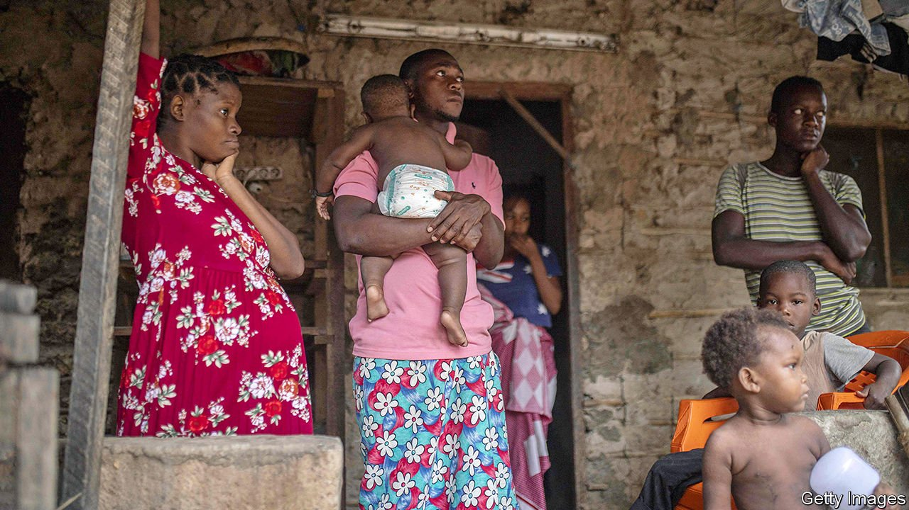
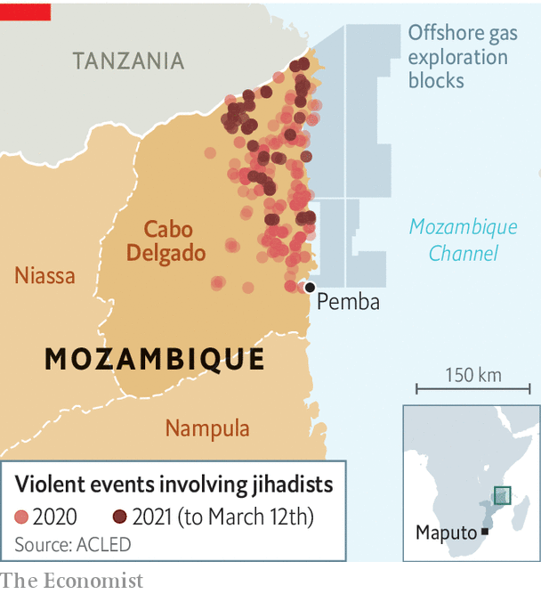

###### Cabo Delgado, cape of despair

# America designates a new branch of Islamic State in Mozambique 

##### The label obscures the complexity of the conflict 

 

> Mar 18th 2021 


SINCE A CONFLICT began in 2017 in Cabo Delgado, a province in north-eastern Mozambique, about 2,700 people have died, nearly 670,000 have fled their homes and more than 900,000 are short of food. No one disputes the scale of the horror. But an argument rages as to what motivates the insurgents: jihadism or local grievances? The answer is probably both.


The rebels are usually known as Ansar al-Sunna (or al-Shabab, like the unrelated Somali group). They evolved from a radical Muslim sect and have links throughout east Africa. They have found Cabo Delgado a fertile recruiting ground. The province is politically neglected and its residents are locked out of economic opportunities by a network of powerful crooks, politicians and businessmen.


On March 10th the American government linked the insurgency to the jihadists of Islamic State (IS or ISIS), relabelling the group “ISIS-Mozambique” and its members as “designated global terrorists”. As a result, anyone who deals with them risks running afoul of American law. The State Department also named the group’s leader as Abu Yasir Hassan, a Tanzanian aged about 40. It claimed to have evidence linking the Mozambican outfit to the core leadership of IS in Syria and Iraq. The designation reflects growing international concern about the jihadist threat in Mozambique, and fears that the government is out of its depth.

 


Last year was especially bloody, with 433 attacks by jihadists. This was more than in the two previous years combined, reckons Cabo Ligado, a monitoring service. Some 80% of clinics are shut, says an experienced aid worker. “In my 26 years with UNHCR I have seldom seen so many scared looks,” says Valentin Tapsoba of the UN‘s refugee agency. On March 2nd Amnesty International, a global watchdog, detailed what it described as “war crimes”. The insurgents, its report said, have carried out “horrific” abuses, including abductions and beheadings.


Amnesty also pointed the finger at the government. It claimed that the army and police have been involved in extra-judicial killings and torture. It accused Dyck Advisory Group, South African-based mercenaries employed by the government, of firing guns and dropping hand grenades into crowds. The company said it will hire outside lawyers to look into its activities.


In recent months President Filipe Nyusi has tried to get a grip on the situation. In November Mozambique and Tanzania said they would work more closely to stem the flow of fighters across their border. In January Mr Nyusi appointed a new army chief to head operations, but he died of covid-19 in February. On March 11th the president fired his army and air-force chiefs, as well as several other senior officers. The security forces have also armed various anti-jihadist militias. Who is in charge remains something of a mystery.


Mr Nyusi may feel he is running out of time. He wants the proceeds of the huge gas projects off the coast of Cabo Delgado to flow before his tenure is due to end in 2024. That will be touch and go. ExxonMobil, an American energy giant, has postponed a decision on whether to invest $30bn in its project. Total, a French oil company, withdrew staff after insurgents came close to its base of operations at the turn of the year. It wants to see a 25km security cordon before they get back to work.


The vacuum is worrying other governments. South Africa “stands ready” to help with intelligence-sharing, naval support or military training, suggested Naledi Pandor, its foreign minister, in September. Portugal and France, as well as the European Union, have offered help. American special forces will be training troops for the next two months. Various mercenary firms are trying to muscle in.


Even as men with guns prepare to go into Cabo Delgado, independent witnesses are being kept out. The government has pressed the Bishop of Pemba into leaving the regional capital, and expelled Tom Bowker, a British journalist. It has denied visas to UN staff. These moves suggest that it is worried about what outsiders may find, from further possible war crimes to the corrupt and dysfunctional governance that has fuelled the insurgency. ■

