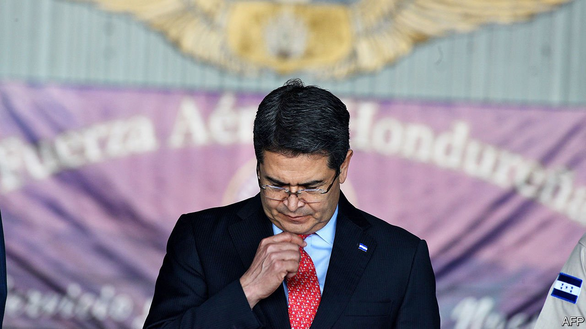

###### Over the line

# A court case rocks the president of Honduras 

##### Juan Orlando Hernández has been accused in New York of taking bribes 

 

> Mar 18th 2021 


JUAN ORLANDO HERNÁNDEZ has had a tricky few weeks. A trial in New York of Geovanny Fuentes, an alleged drug-trafficker, included accusations that JOH, as the president of Honduras is known, accepted bribes in exchange for helping cocaine reach the United States. On March 16th a witness said he saw Mr Hernández take two bribes in 2013, before he became president. A few days earlier a former cartel leader testified that he paid Mr Hernández $250,000 for protection from arrest. In documents filed by US prosecutors, who do not name Mr Hernández but refer to details which identify the Honduran president, he was quoted as saying he wanted to “shove the drugs up the noses of the gringos”. (Mr Hernández has not been charged and denies all allegations against him.)


It is not the first time Mr Hernández has been allegedly linked to narco crimes. In a trial in 2019 that convicted his brother Tony Hernández, a former lawmaker, of drug trafficking, he was mentioned and accused of taking at least $1m from Joaquín “El Chapo” Guzmán, a notorious Mexican drug lord. (His brother is due to be sentenced on March 23rd in the United States; prosecutors are seeking life imprisonment.) But these new allegations come at a volatile time. In November voters will elect Mr Hernández’s successor and 128 members of congress. Debates about corruption and drug money will dominate the campaign, thinks Lester Ramírez of the Association for a More Just Society, a non-profit.


Some of those likely to emerge as presidential candidates from primaries on March 14th, for which results are still pending, look little better. Yani Rosenthal, the likely nominee for the main opposition Liberal Party, recently finished a three-year jail term in the United States for laundering cash for the cartel from which Mr Hernández allegedly accepted bribes. Nasry Asfura, the mayor of the Honduran capital, Tegucigalpa, and the favourite for the ruling National Party, is facing a preliminary hearing for charges of abuse of authority, fraud, embezzlement of public funds, falsification of documents and money-laundering. Meanwhile Libre, a left-wing party, is likely to field Xiomara Castro, the wife of Manuel Zelaya, a former president. He has also been accused of accepting bribes in the trial of Mr Fuentes. (He too denies the charges against him.)


According to Hugo Noé Pino, a former finance minister, drug money and corruption have infiltrated every level of Honduran politics. “It is not just people paying others but those linked to drug dealers and organised crime participating in elections,” says Mr Ramírez. Last year Mr Hernández failed to revive an anti-corruption body after it investigated some lawmakers. He and his allies have a majority in congress and he holds sway over the Supreme Court and the election body.


Hondurans are getting fed up. The country of 10m can hardly afford bad governance on top of endemic violence and poverty, plus the devastation caused by the pandemic and two hurricanes last year. Many people have already fled the country, hoping to get to the United States; more are likely to follow. Those who remain deserve a better roster of politicians.■

