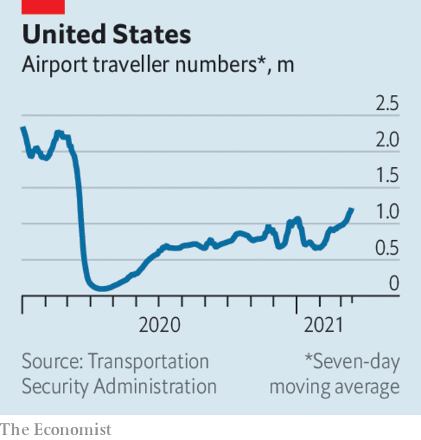

###### 

# Business this week 

#####  

 

> Mar 20th 2021 


Uber announced that it would comply with a recent  in Britain which found that its 70,000 or so drivers in the country are employees, not contractors. This means they will be entitled to the minimum wage, holiday pay and a pension in Britain, the first country where Uber has accepted such conditions. The status of workers in the gig economy is being reviewed in other cases around the world. Courts increasingly agree that it is the drivers who are being taken for a ride.

Will VW overthrow the king?


Competition in the electric-car market accelerated, as Volkswagen set out plans to standardise electrification technology across all aspects of its vehicles and to scale up production worldwide. It is also to build six battery factories in Europe alone. vw aims to deliver 1m electric or hybrid cars this year, bringing it closer to Tesla in sales, and eventually possibly snatching Elon Musk’s crown. Tesla’s CEO said this week that henceforth his job title is “technoking”.


The Chinese government escalated its criticisms of the country’s big internet companies. Xi Jinping, the president, chaired a meeting which concluded that some platforms “are growing in an inappropriate manner”. In another sign that officials think the industry is too powerful, state television aired allegations of tech malpractice, including a claim that Alibaba’s internet browser carried misleading ads. The browser was promptly pulled from app stores.


, China’s dominant search engine, which has also aroused the ire of the country’s regulators, is aiming to raise more than $3bn from its forthcoming secondary listing of shares in Hong Kong, according to reports.


Stripe, a payments-processing platform for e-commerce websites, was valued at $95bn after its latest round of financing. That makes the startup more valuable than Facebook and Uber when they were still unlisted firms.


Striving to make women feel safer when they use its dating app, Tinder said it would integrate Garbo, a service that checks people’s backgrounds, into its platform this year. Garbo, run not for profit, was founded by Kathryn Kosmides, a former victim of abuse.

 


There were more signs that air travel in America is picking up. Figures from the Transportation Security Administration showed it had screened around 1.3m travellers a day over several days for the first time in a year. Numbers are still down by half compared with 2019. With the industry optimistic about summer bookings, the shares of America’s four biggest carriers hit their highest prices in a year.


Emmanuel Faber was ousted as chairman and chief executive of Danone, following a campaign by activist investors unhappy at the performance of the French food company’s share price. Mr Faber is one of the most vocal advocates of sustainable capitalism. When Danone changed its legal status last year to become a purpose-driven company, he declared that Milton Friedman’s statue had been toppled. Following Mr Faber’s overthrow, it is not so clear that Friedman’s famous dictum, that the sole purpose of a company is to increase shareholder value, is in fact dead. 


The Federal Reserve said the American economy, and inflation, will grow at a much quicker pace this year than it had forecast. At its meeting on March 11th, the European Central Bank committed to speed up its purchase of bonds over the next three months in response to the euro zone’s insipid economic recovery and rising borrowing costs.


As it tries to catch up some of the ground it lost to Ericsson and Huawei in the roll-out of 5G, Nokia said it would cut up to 10,000 jobs in order to “reset” its future capabilities. The Finnish maker of network equipment has been gradually reducing its workforce from a peak of 132,000 in 2010.


Members of the Sackler family increased the amount they will pay under the OxyContin settlement to $4.3bn. The family still own Purdue Pharma, which made the addictive painkiller and needs to settle the claims against it in order to leave bankruptcy protection.


Greggs, a British purveyor of cheap-but-cheerful sandwiches and snacks, reported its first annual loss since becoming a public company in 1984. The retailer, which has bucked the trend of high-street closures through canny marketing, most notably of its vegan sausage roll, plans to bounce back from the pandemic by opening 1,000 new shops in the coming years.

Carpet burn


Changes to the official basket of goods and services that make up Britain’s consumer-price index reflected the pandemic. In come hand sanitisers, hand weights and loungewear. Out go ground coffee, white-chocolate bars and Axminster and Wilton carpets, flooring that went out of fashion in the 1980s.

