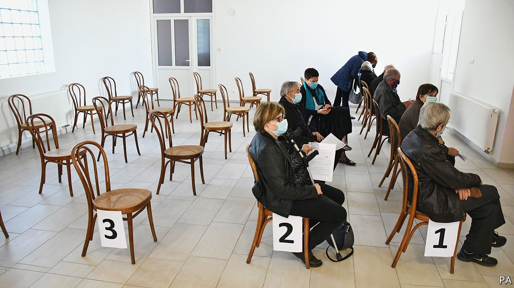

###### 

# Politics this week 

#####  

 

> Mar 20th 2021 


At least 16 EU countries, including Germany, France, Italy and Spain,  of AstraZeneca’s covid-19 vaccine, following reports that a handful of people had developed blood-clots after receiving it. Several regulators, including the World Health Organisation, said that the risks of not getting jabbed far outweighed those of getting jabbed. Experts predicted that the delay would cost lives and needlessly undermine confidence in both the AstraZeneca vaccine and vaccines more generally. 


Germany’s ruling  performed badly in two important state elections, Baden-Württemberg and Rhineland-Palatinate. The results are a blow to the party’s new leader, Armin Laschet, and a sign that Germans are unimpressed by the government’s handling of the covid crisis. 


A  in the  Netherlands appears to have given Mark Rutte, the centre-right prime minister, a chance to form a new government, though assembling a coalition will be complicated. D66, a pro-European liberal party, did surprisingly well, as did the populist right.


Britain published a review of defence and foreign policy. One surprise was a reversal of the decision taken a decade ago to reduce the  from 225 to 180 warheads by the mid-2020s. Britain will now increase its arsenal to 260 by the middle of the decade, the first escalation since the peak of the cold war, when Britain had over 500. Official figures about operational stockpiles and deployed warheads will no longer be published.


Police in Bolivia arrested Jeanine Áñez, the president of a recent interim government, and other officials, accusing them of plotting a coup against Evo Morales. Mr Morales resigned as president in November 2019 amid accusations of fraud in his re-election. The charges against Ms Áñez are probably a retribution for the similar charges her government filed against officials from Mr Morales's party.


, the president of Tanzania, died at the age of 61, after weeks of speculation that he was being treated for covid-19. Mr Magufuli had ordered his government not to vaccinate people against the virus, nor to take steps to limit its spread, insisting that God had cleansed the country of it. 


Gunmen on motorcycles killed at least 58 people in northern Niger, near the border with Mali. Jihadists have been active in the region.


Regional forces from Ethiopia’s Amhara state took control of parts of Tigray, which is next door. The occupation could add fuel to a civil war between the federal government and Tigray’s ousted rulers. It may also increase tensions around other disputed internal borders in the country, which is a federation of ten ethnically based states.


Police in Uganda again arrested a popular opposition leader known by his stage name, Bobi Wine. Hundreds of people have been detained since a disputed presidential election earlier this year that was won by Yoweri Museveni, who has ruled since 1986.


A new interim government in Libya was sworn in, replacing two rival administrations. Its main task is to prepare the war-torn country for elections in December. Libya descended into conflict after the last nationwide elections, in 2014.


A found that the government was wrong to ban same-sex marriages. But it stopped short of overturning the policy, saying instead that parliament should be given time to legislate on the matter.


The  that has seized power in Myanmar declared martial law in the country's two biggest cities, in an effort to curb protests. Soldiers have shot dead more than 200 people. China, meanwhile, urged Myanmar to protect Chinese-owned factories after several were set on fire during unrest in Yangon. Anti-government protesters accuse China of supporting the military takeover, which China denies. 


A gunman killed eight people at three massage parlours in . Six of the dead were Asian-American women. Pundits speculated that the shooter might have had a racial motive, but he told police he was a sex addict and wanted to remove a source of temptation. Police said it was too early to draw any conclusions about the crime. 


In Texas eight unauthorised immigrants were killed when their car crashed during a police chase. Migrants are once again heading in large numbers to the US-Mexican border and trying to enter America. Republicans blame Joe Biden’s relaxation of Donald Trump’s strict . 


More Democrats, including Chuck Schumer, the leader of the Senate, called on Andrew Cuomo to resign as governor of New York amid allegations of sexual harassment. Mr Cuomo said he would not bow to “cancel culture”.


Team New Zealand won the 36th America’s Cup. The oldest trophy in international sport featured high-tech sailing boats racing at up 50 knots (over 90kph). New Zealand’s deft handling of the pandemic allowed the contest to go ahead, but only a few teams took part, thanks to covid-19.

Coronavirus briefs


Schools, shops and restaurants were ordered to close across half of Italy, including Milan and Rome, as a new wave of cases emerged.


Britain’s National Health Service warned of a crunch in  next month, a potential setback to the country’s successful inoculation programme. 


Brazil's president, Jair Bolsonaro, replaced his health minister for the third time during the pandemic. Mr Bolsonaro continued to rail against lockdowns. Only around 5% of the population have been vaccinated.


The prime minister of Papua New Guinea said that a quarter of the population may have contracted . Neighbouring Australia, which is providing vaccines, is worried that the virus might spread across the maritime border. So are other Pacific countries, many of which have weak health services. 

